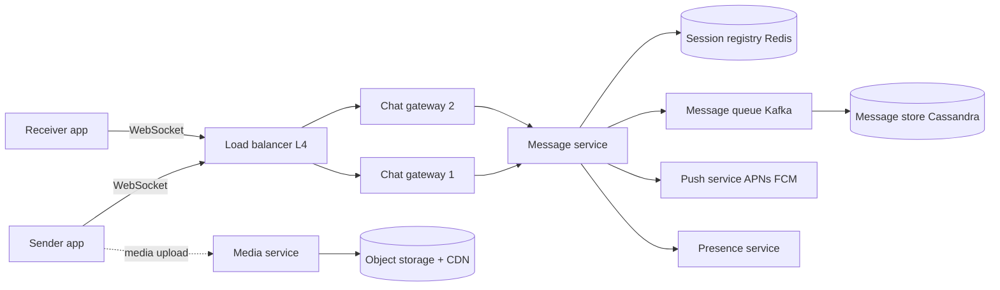
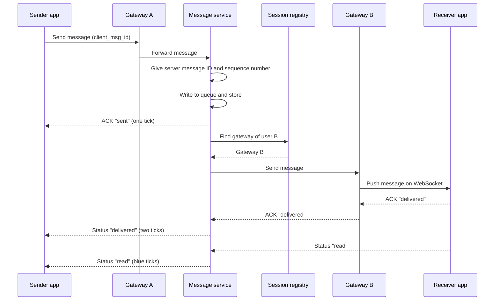
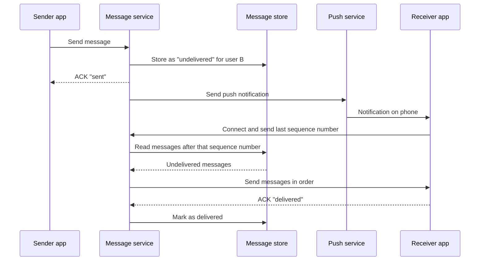
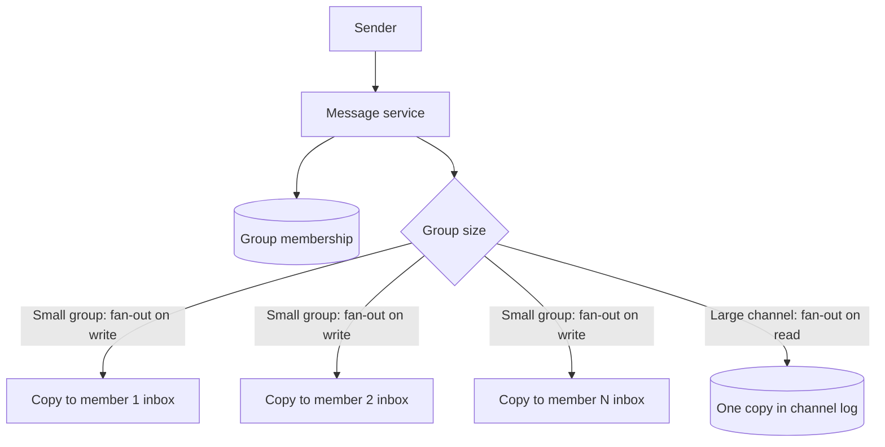

# Design a Real-Time Chat Service (WhatsApp)

## 1. Summary

A chat service sends a message from one user to one or more users. The delivery must be fast. The typical target is less than 200 ms between two online users. "Zero latency" is not possible. Network distance and processing always add some delay. The design makes this delay as small as possible.

## 2. Requirements

### Functional requirements

- Send and receive one-to-one messages.
- Send and receive group messages.
- Show delivery status: sent, delivered, read.
- Keep messages for users that are offline. Deliver them when the users connect.
- Show online status and "last seen" time.
- Send media (images, video, documents).

### Non-functional requirements

- Low latency: less than 200 ms for online users.
- High availability: 99.99% or more.
- Message order must be correct in each chat.
- No message loss.
- End-to-end encryption.

## 3. Load estimate

| Item | Value |
|------|-------|
| Daily active users | 500 million |
| Messages per user per day | 40 |
| Messages per day | 20 billion |
| Average messages per second | approx. 230,000 |
| Peak messages per second | approx. 1 million |
| Open connections at peak | approx. 200 million |

One gateway server can hold approximately 500,000 to 1 million open connections. Thus, the system needs some hundreds of gateway servers.

## 4. High-level architecture



## 5. Components

| Component | Function |
|-----------|----------|
| Client app | Opens a persistent connection. Encrypts and decrypts messages. Keeps a local database. |
| Load balancer (L4) | Sends each new TCP connection to a gateway. It does not end the WebSocket. |
| Chat gateway | Holds open WebSocket connections. Sends data between clients and the message service. |
| Session registry | Records which gateway holds the connection of each user. Redis is a typical choice. |
| Message service | Gives each message an ID. Stores the message. Finds the receiver gateway. Sends the message. |
| Message queue | Keeps messages durable. Separates the write path from the storage path. |
| Message store | Keeps message history and undelivered messages. A wide-column database is a typical choice. |
| Push service | Sends a notification to a phone when the app is not connected. |
| Presence service | Records online status and "last seen" time. |
| Media service | Receives media files. Stores them in object storage. Returns a URL for the message. |

## 6. Why the system uses WebSocket

| Method | Latency | Server load | Use |
|--------|---------|-------------|-----|
| Short polling | High | Very high | Do not use. |
| Long polling | Medium | High | Use as a fallback only. |
| WebSocket | Low | Low | Use for chat. |
| Server-Sent Events | Low | Low | Server to client only. Not sufficient for chat. |

A WebSocket connection stays open. The server can send data to the client at any time. Thus, the client does not ask the server for new messages.

WhatsApp uses a custom protocol based on XMPP over a persistent TCP connection. The principle is the same.

## 7. Message flow: both users online



### Procedure

1. The sender app gives each message a unique `client_msg_id`.
2. The gateway sends the message to the message service.
3. The message service gives the message a server ID and a sequence number for the chat.
4. The message service writes the message to durable storage.
5. The message service sends a "sent" acknowledgment to the sender.
6. The message service finds the gateway of the receiver in the session registry.
7. The gateway sends the message to the receiver app.
8. The receiver app sends a "delivered" acknowledgment.

## 8. Message flow: receiver offline



The server does not keep a message for a long time after delivery. WhatsApp deletes delivered messages from its servers. The client device keeps the history.

## 9. Group messages



- For small groups (WhatsApp limit is approx. 1,000 members), use fan-out on write. The server sends one copy to each member.
- For very large channels, use fan-out on read. The server stores one copy. Members read from the channel log.
- With end-to-end encryption, the sender encrypts the message one time with a group key (Signal "Sender Keys"). The server then sends the same encrypted data to each member.

## 10. Message order

- The server gives each message a sequence number for each chat.
- The client sorts messages by this sequence number. The client does not use the device clock.
- Partition the message queue by `chat_id`. Then one partition holds all messages of one chat in order.
- The client uses `client_msg_id` to find and remove duplicate messages.

## 11. Data model

```text
Table: messages
Partition key : chat_id
Clustering key: sequence_no (descending)
Columns       : message_id, sender_id, type, encrypted_body, media_url, created_at

Table: user_inbox (undelivered messages)
Partition key : user_id
Clustering key: sequence_no
Columns       : chat_id, message_id

Table: message_status
Partition key : message_id
Columns       : user_id, status (sent | delivered | read), updated_at
```

Cassandra or HBase is a good choice. The write rate is very high. The read pattern is "the last N messages of one chat."

## 12. Presence

1. The client sends a heartbeat every 30 seconds.
2. The presence service writes `user_id -> last_heartbeat` in Redis with a TTL.
3. If the TTL ends, the user is offline.
4. Send presence changes only to contacts that have the chat open. This decreases traffic.

## 13. Methods to decrease latency

- Keep the connection open. Do not open a new connection for each message.
- Put gateways in many regions. Connect each user to the nearest region.
- Send the "sent" ACK after the durable write. Do not wait for delivery.
- Use a small binary protocol (for example, Protocol Buffers). Do not use large JSON.
- Keep the session registry in memory.
- Send media through a CDN. Send only the media URL in the message.

## 14. Failure handling

| Failure | Action |
|---------|--------|
| Gateway stops | The client connects again to a different gateway. The client sends its last sequence number. The server sends the missing messages. |
| Message service stops | The queue keeps the messages. A different instance continues the work. |
| Network stops during send | The client sends the message again with the same `client_msg_id`. The server removes the duplicate. |

## 15. Trade-offs

- **WebSocket vs polling:** WebSocket gives low latency. But each connection uses server memory.
- **Fan-out on write vs read:** Fan-out on write gives fast reads. But it uses more writes for large groups.
- **Server storage:** If the server deletes delivered messages, privacy is better. But multi-device sync becomes more difficult.

## 16. Interview follow-up questions

1. How do you support one user on many devices?
2. How do you show "typing..." status without high load?
3. How do you scale the session registry to 200 million users?
4. How does end-to-end encryption change the server design?
5. How do you deliver a message when the gateway of the receiver changes during delivery?
