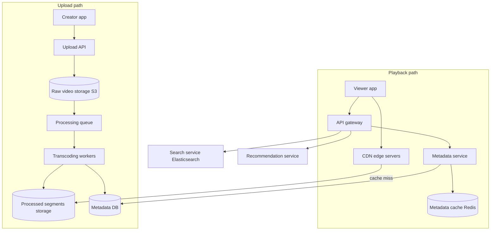
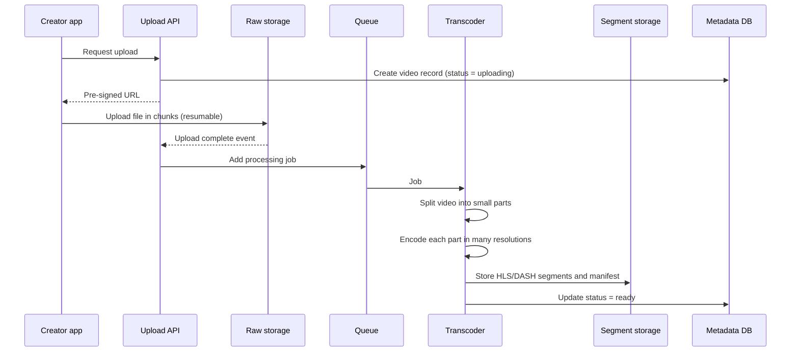
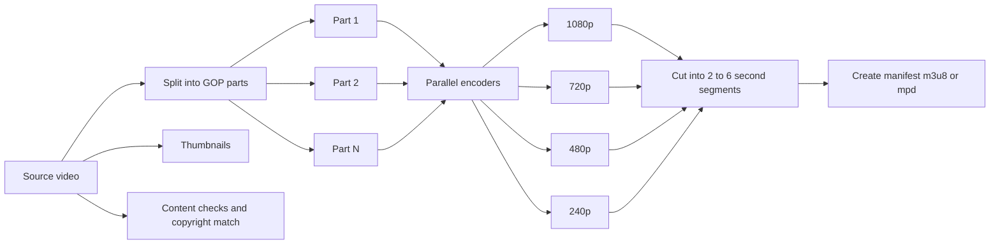
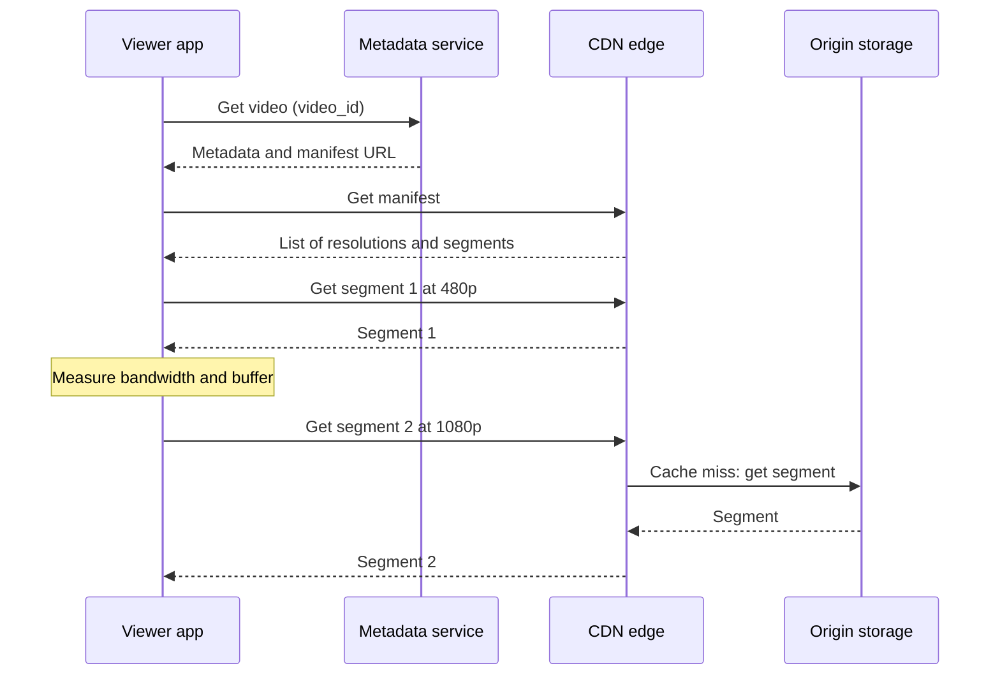

# Design a Video Streaming Platform (YouTube)

## 1. Summary

A video platform has two main paths. The upload path receives, processes, and stores videos. The playback path sends video to viewers with low start time and few pauses. A Content Delivery Network (CDN) does most of the playback work.

## 2. Requirements

### Functional requirements

- Upload videos.
- Watch videos on different devices and network speeds.
- Search videos.
- Show video metadata: title, description, views, likes, comments.
- Recommend videos.

### Non-functional requirements

- Playback starts in less than 2 seconds.
- Few pauses for buffering.
- High availability for playback.
- Upload processing can be slow (minutes). It is not a real-time task.
- Very high read load. Reads are much more than writes.

## 3. Load estimate

| Item | Value |
|------|-------|
| Daily active users | 1 billion |
| Videos watched per user per day | 5 |
| Video views per day | 5 billion |
| Hours of video uploaded per minute | 500 |
| Storage for each processed minute (all formats) | approx. 1 GB |
| New storage per day | approx. 720 TB |

The read-to-write ratio is very high. Thus, the design must make reads cheap. The CDN is the most important component.

## 4. High-level architecture



## 5. Upload path



### Procedure

1. The client asks the upload API for a pre-signed URL.
2. The client uploads the file directly to object storage. The file does not go through the API servers.
3. The client uploads the file in chunks. If the network stops, the client sends only the missing chunks.
4. The storage sends an event when the upload is complete.
5. The processing system starts the transcoding job.

## 6. Transcoding

Transcoding changes one source video into many formats and resolutions.



- The system splits the video into parts. Many workers encode the parts at the same time. This makes processing faster.
- The system uses a DAG (Directed Acyclic Graph) of tasks. Some tasks can run in parallel: thumbnails, audio, video encoding, and content checks.
- Codecs: H.264 for wide support. VP9 and AV1 for smaller files.

## 7. Playback path and adaptive bitrate



### Adaptive bitrate (ABR)

- The player measures the network speed and the buffer level.
- If the network is fast, the player requests a higher resolution for the next segment.
- If the buffer becomes low, the player requests a lower resolution.
- The player starts with a low resolution. This gives a fast start time.

The protocols are HLS (HTTP Live Streaming) and MPEG-DASH. Both use normal HTTP. Thus, normal CDNs can cache the segments.

## 8. CDN strategy

- Store popular videos at edge servers near the viewers.
- Keep less popular videos ("long tail") in regional or origin storage.
- Put video in the CDN before demand if you expect high demand (for example, a new music video).
- YouTube uses its own CDN (Google Global Cache). It puts cache servers inside the networks of internet providers.

## 9. Data model

```text
Table: videos (SQL or distributed SQL)
video_id, uploader_id, title, description, status, duration,
manifest_url, thumbnail_url, created_at

Table: video_stats (counters, write-heavy)
video_id, view_count, like_count

Table: comments (wide-column store)
Partition key: video_id
Clustering key: created_at
```

## 10. View counts

A view count gets a very high write rate.

1. Write view events to a queue (Kafka).
2. Combine the events in a stream processor (Flink).
3. Write the total to the database at intervals.
4. Accept a small delay. The count does not have to be exact in real time.

## 11. Trade-offs

- **Many resolutions:** More resolutions give better playback. But they use more storage and processing.
- **Pre-encode vs on-demand encode:** Encode popular videos in all formats. Encode rare formats only when a viewer requests them.
- **Segment length:** Short segments let ABR change quickly. But they cause more HTTP requests.

## 12. Interview follow-up questions

1. How do you support live streaming? (Use shorter segments, low-latency HLS, or WebRTC.)
2. How do you decrease cost for videos that few people watch?
3. How do you resume an upload of a 10 GB file?
4. How do you find copyright content (Content ID)?
5. How do you design the recommendation system at a high level?
