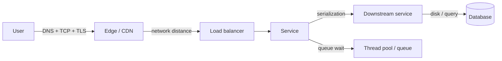
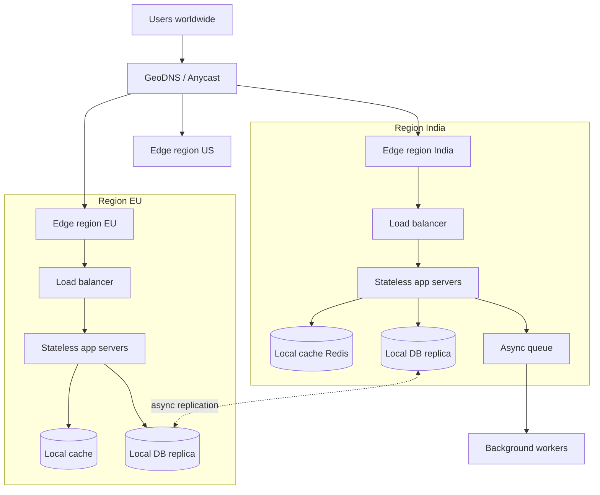
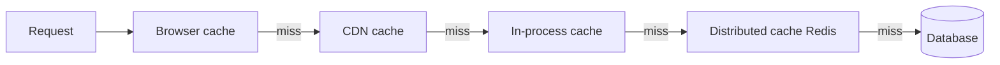

# Design Methods for Low-Latency Distributed Systems

## 1. Summary

A distributed system cannot have zero latency. Light in fiber takes approximately 5 ms for each 1,000 km. Each network hop and each disk read adds more time. The correct goal is "predictable low latency." This document gives methods to decrease average latency and tail latency (p99, p99.9).

In an interview, say this clearly at the start. It shows that you understand physical limits.

## 2. Latency numbers to know

| Operation | Approximate time |
|-----------|------------------|
| L1 cache read | 1 ns |
| Main memory read | 100 ns |
| Read 1 MB from memory | 250 µs |
| SSD random read | 100 µs |
| Network round trip in one data center | 0.5 ms |
| Network round trip, Mumbai to Singapore | 60 ms |
| Network round trip, India to US East | 200 ms |
| Disk seek (HDD) | 10 ms |

**Rule:** Memory is fast. The network between regions is slow. Thus, put data near the user and in memory.

## 3. Where latency comes from

Latency sources:

1. Network distance and number of round trips.
2. Connection setup (DNS, TCP handshake, TLS handshake).
3. Queue wait time when servers are busy.
4. Disk and database reads.
5. Serialization (for example, large JSON).
6. Garbage collection pauses.
7. Calls in sequence that can run in parallel.

## 4. Reference architecture

## 5. Methods

### 5.1 Move data and compute near the user

- Use a CDN for static content.
- Use edge functions (for example, Cloudflare Workers) for simple logic.
- Deploy services in many regions. Send users to the nearest region with GeoDNS or Anycast.

### 5.2 Use caches at each layer

- Use cache-aside for most reads.
- Set a TTL on each cache entry.
- Prevent a "cache stampede." Let only one request load a missing key. Other requests wait for that result.

### 5.3 Replicate data and choose the consistency level

- Use read replicas near users.
- Strong consistency across regions adds a round trip between regions. This is slow.
- Use eventual consistency when the business accepts it.
- Use the PACELC model: during normal operation, choose between latency (L) and consistency (C).

### 5.4 Remove work from the request path

- Do only the necessary work before the response.
- Send other work (emails, analytics, search index updates) to a queue.
- Return the response before the background work is complete.

### 5.5 Decrease round trips

- Keep connections open (HTTP keep-alive, connection pools, HTTP/2, HTTP/3).
- Use TLS session resumption.
- Send calls in parallel when they do not depend on each other.
- Combine many small requests into one batch.

### 5.6 Control tail latency

| Method | Description |
|--------|-------------|
| Hedged requests | Send the request to a second server if the first server does not reply after the p95 time. Use the first reply. |
| Timeouts | Set a timeout on each call. Do not wait without limit. |
| Load shedding | Reject requests when the server is overloaded. This keeps latency low for accepted requests. |
| Backpressure | Tell upstream services to slow down when queues become full. |
| Circuit breaker | Stop calls to a failing service. Return a fallback result. |

### 5.7 Make each service fast

- Use binary formats (Protocol Buffers, gRPC).
- Use indexes on database queries.
- Tune garbage collection, or use languages with low GC pauses for hot paths.
- Keep hot data in memory.

## 6. Latency budget example

Target: 200 ms p99 for an API.

| Step | Budget |
|------|--------|
| Network from user to edge | 30 ms |
| Edge to service | 10 ms |
| Authentication (cached) | 5 ms |
| Business logic | 20 ms |
| Parallel calls to 3 services | 50 ms |
| Database read (indexed) | 20 ms |
| Serialization and response | 15 ms |
| Spare | 50 ms |

Give each team a budget. Monitor each budget.

## 7. Measure latency correctly

- Measure percentiles (p50, p95, p99, p99.9). Do not use only the average.
- Use distributed tracing (OpenTelemetry, Jaeger) to find the slow step.
- Measure from the client side as well as the server side.

## 8. Trade-offs

- **Cache vs freshness:** More caching gives lower latency. But data can be old.
- **Replication vs consistency:** Local replicas give fast reads. But writes can conflict.
- **Hedged requests vs load:** Hedged requests decrease tail latency. But they increase total load by a small amount.

## 9. Interview follow-up questions

1. Why does p99 latency matter more than average latency?
2. How do you keep strong consistency for payments and low latency for reads?
3. How do you find the cause of a latency increase in production?
4. What is the difference between latency and throughput?
5. How does a fan-out to 100 services change the p99 latency?
