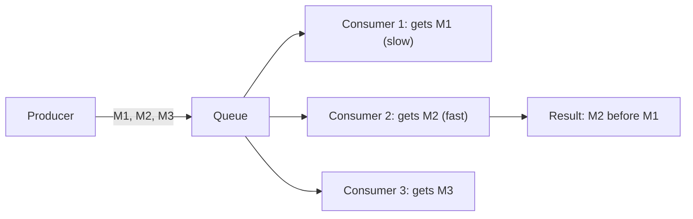
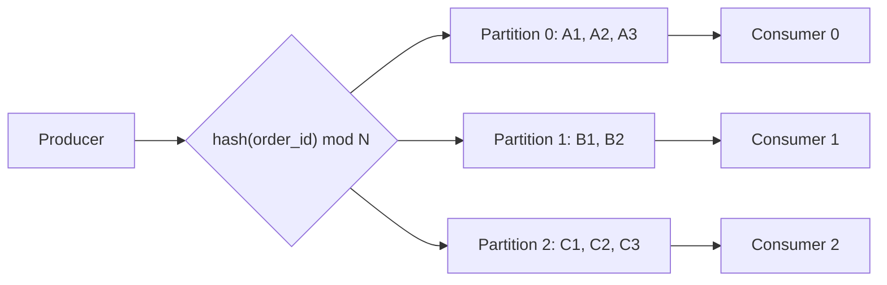
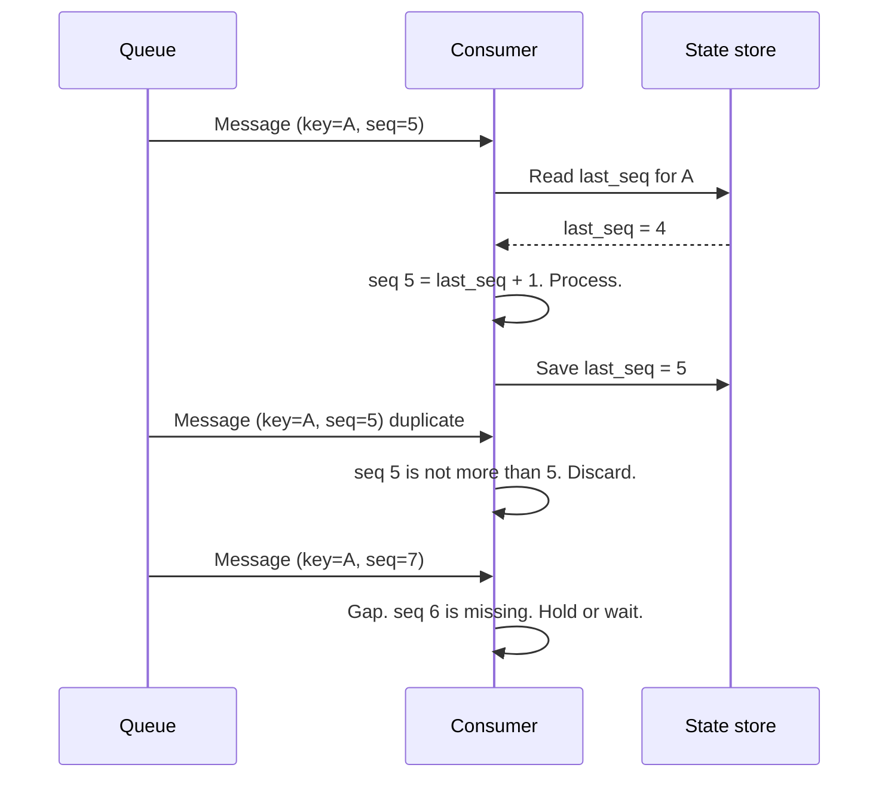
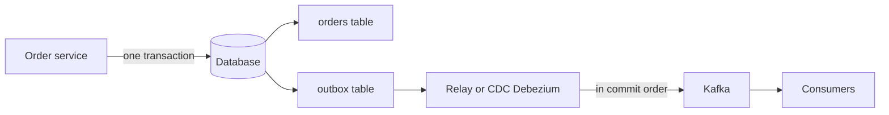

# Design for Message Order in Queues

## 1. Summary

Many systems must process messages in the correct order. Examples: bank transactions, order status changes, and chat messages. A distributed queue does not keep a global order by default. This document explains how to keep the order and process each message correctly.

**Important:** A global order for all messages is slow and does not scale. Most systems need order only for each key (for example, each account or each order). Design for order per key.

## 2. Why order breaks

Order breaks for these reasons:

1. Many consumers process messages in parallel.
2. A retry sends a failed message again after newer messages.
3. Many producers send messages at the same time.
4. Network delays change the arrival order.
5. Messages go to different partitions.

## 3. Solution: partition by key

### Procedure

1. Choose the ordering key (for example, `account_id`).
2. Send all messages with the same key to the same partition.
3. Give each partition to one consumer only.
4. Process the messages in each partition one at a time.

Result: messages for one key stay in order. Different keys process in parallel. Thus, the system still scales.

### Implementation in common tools

| Tool | Method |
|------|--------|
| Apache Kafka | Use a message key. Kafka sends the same key to the same partition. One consumer in a group reads one partition. |
| AWS SQS FIFO | Use `MessageGroupId`. SQS keeps order in each group. Use `MessageDeduplicationId` to remove duplicates. |
| RabbitMQ | Use one queue with one consumer for each key range. Or use the consistent-hash exchange. |
| Azure Service Bus | Use sessions (`SessionId`). |
| Google Pub/Sub | Use ordering keys. |

## 4. Safe producer settings (Kafka)

- Set `enable.idempotence=true`. The broker then removes duplicates from producer retries.
- Set `acks=all`. The broker confirms the write after all in-sync replicas have the message.
- Keep `max.in.flight.requests.per.connection` at 5 or less with idempotence. This keeps order during retries.

## 5. Sequence numbers

The producer adds a sequence number to each message for each key.

The consumer uses the sequence number to:

- Find and discard duplicates.
- Find gaps (missing messages).
- Hold a message until the previous message arrives.

## 6. Idempotent consumers

Most queues give "at-least-once" delivery. Thus, a consumer can get the same message two times. Make each consumer idempotent. The result of two runs must be the same as the result of one run.

### Procedure

1. Give each message a unique `message_id`.
2. Start a database transaction.
3. Write the `message_id` to a "processed messages" table with a unique constraint.
4. Apply the business change in the same transaction.
5. Commit the transaction.
6. Commit the queue offset.

If step 3 fails because the ID exists, the consumer skips the message.

## 7. Transactional outbox pattern

Problem: the service writes to the database and also sends a message. One of these two operations can fail. Then the data is not consistent.

### Procedure

1. Write the business data and the event to the outbox table in one transaction.
2. Use a relay process or Change Data Capture to read the outbox table.
3. Send the events to the queue in commit order.
4. Mark each event as sent.

## 8. Retries without loss of order

A failed message must not let later messages for the same key go first.

| Strategy | Order | Throughput | Use |
|----------|-------|------------|-----|
| Blocking retry | Kept | Lower: the partition stops | Use for short, temporary errors. |
| Retry topic | Broken for that key | High | Use when order is not important. |
| Park the key | Kept for that key | High | Hold all later messages for the failed key. Process other keys. |
| Dead letter queue (DLQ) | Depends on the method | High | Use for messages that always fail. Send an alert. |

Recommended method: retry a small number of times with backoff. Then park the key and send the message to a DLQ. Send an alert to the operations team.

## 9. Exactly-once processing

- True "exactly-once delivery" across systems is not practical.
- Get an "exactly-once effect" with this formula: **at-least-once delivery + idempotent processing**.
- Kafka transactions give exactly-once for "read from Kafka, process, write to Kafka" flows.

## 10. Global order (only when necessary)

If the business needs one total order for all messages:

- Use one partition. This limits throughput to one consumer.
- Or use a single sequencer service that gives a global sequence number. This sequencer can become a bottleneck.
- Or use a consensus log (Raft, for example etcd) for low-volume, critical events.

## 11. Trade-offs

- **More partitions:** More partitions give more parallel work. But you cannot easily change the key-to-partition map later.
- **Blocking retry:** Blocking keeps order. But one bad message stops its partition.
- **Hot keys:** One very active key can overload one partition. Split the key (for example, `account_id + sub_key`) only if order across the parts is not necessary.

## 12. Interview follow-up questions

1. How do you keep order when you increase the number of partitions?
2. What happens to order during a consumer group rebalance?
3. How do you process a payment exactly one time?
4. How do you handle a hot partition?
5. What is the difference between Kafka and RabbitMQ for ordered processing?
