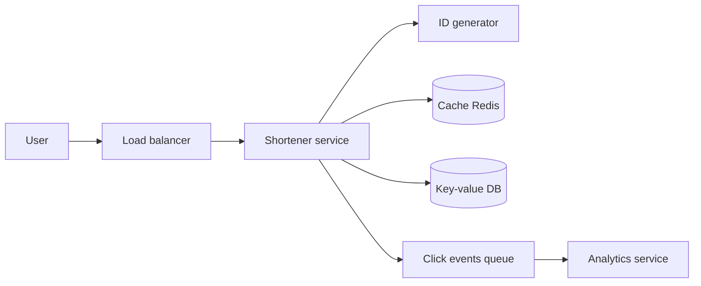
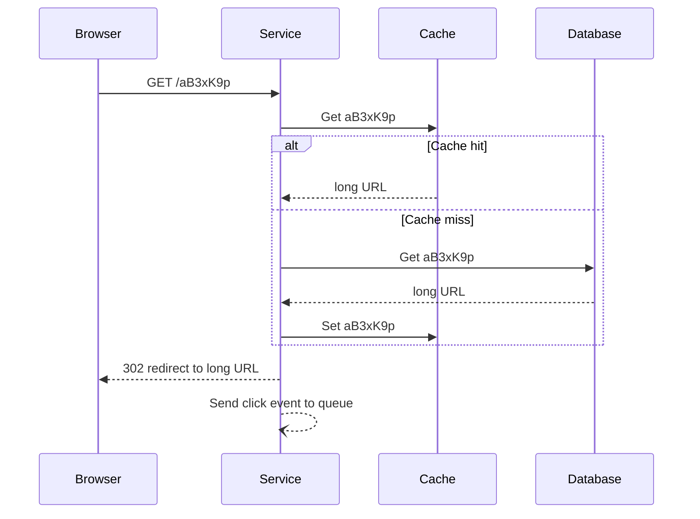

# Design a URL Shortener (TinyURL, Bitly)

## 1. Summary

A URL shortener changes a long URL into a short code. When a user opens the short URL, the service redirects the user to the long URL. The system has many more reads than writes.

## 2. Requirements

### Functional requirements

- Create a short URL from a long URL.
- Redirect a short URL to the long URL.
- Optional: custom alias, expiry date, click statistics.

### Non-functional requirements

- Redirect latency less than 50 ms.
- High availability.
- Short codes must not be easy to guess (optional).

## 3. Load estimate

| Item | Value |
|------|-------|
| New URLs per month | 100 million |
| Read-to-write ratio | 100:1 |
| Redirects per second | approx. 4,000 average |
| Storage for 5 years | 6 billion URLs × 500 bytes = 3 TB |

A 7-character Base62 code gives 62^7 = 3.5 trillion codes. This is sufficient.

## 4. High-level architecture



## 5. Code generation methods

| Method | Description | Problem |
|--------|-------------|---------|
| Hash (MD5, SHA-256) and take 7 characters | Simple | Collisions. You must check the database. |
| Counter + Base62 | Unique, no collisions | Codes are easy to guess. The counter needs coordination. |
| Pre-generated key service | A service creates unused keys before demand | More components. |
| Snowflake ID + Base62 | Unique without a central counter | Codes are longer. |

Recommended: a distributed counter. Each server gets a range of numbers (for example, 1,000,000 numbers) from ZooKeeper or a database. The server converts each number to Base62.

## 6. Redirect flow



- **301 (permanent):** The browser caches the redirect. Server load is less. But you lose click statistics.
- **302 (temporary):** Each click goes to the server. You get statistics.

## 7. Data model

```text
Table: urls
short_code (primary key), long_url, user_id, created_at, expires_at
```

A key-value store (DynamoDB, Cassandra) is a good choice. The access pattern is "get by key."

## 8. Interview follow-up questions

1. How do you stop two users from getting the same custom alias?
2. How do you delete expired URLs?
3. How do you stop abuse (spam and malware URLs)?
