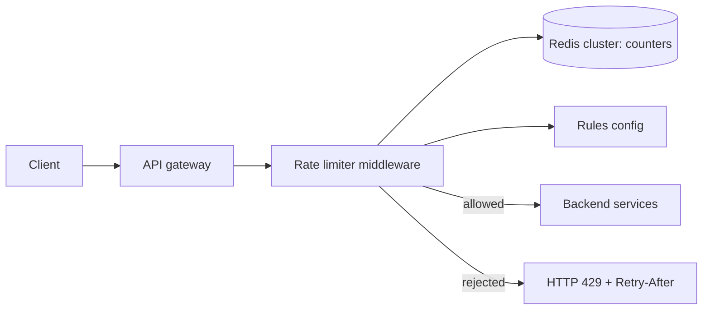
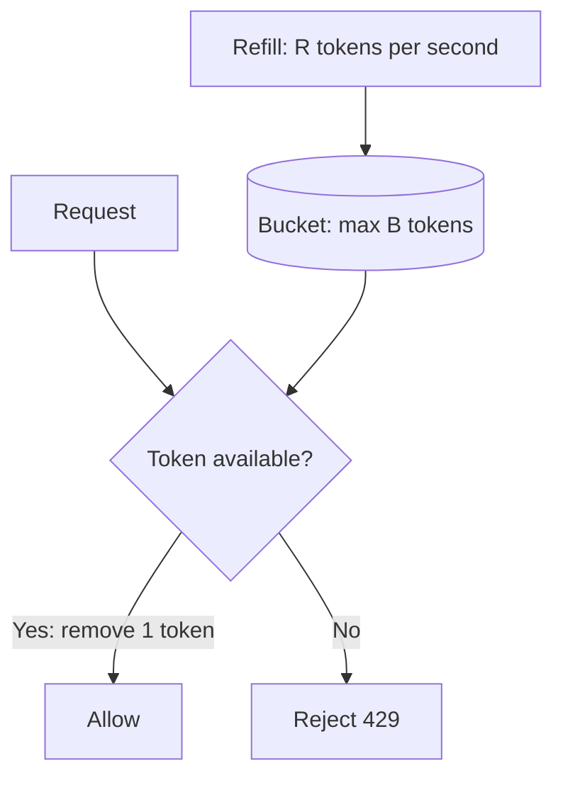

# Design a Distributed Rate Limiter

## 1. Summary

A rate limiter controls how many requests a client can send in a time period. It protects services from overload and abuse. In a distributed system, many servers must share the same count.

## 2. Requirements

- Limit requests by user, by IP address, or by API key.
- Support different rules (for example, 100 requests per minute).
- Add less than 5 ms of latency.
- Return HTTP 429 when a client is over the limit.
- Continue to work if the rate limiter store fails (fail open or fail closed by configuration).

## 3. Architecture

## 4. Algorithms

| Algorithm | How it works | Advantage | Disadvantage |
|-----------|--------------|-----------|--------------|
| Fixed window | Count requests in each fixed minute. | Simple. Low memory. | A burst at the window edge can double the rate. |
| Sliding window log | Keep a timestamp for each request. | Exact. | High memory. |
| Sliding window counter | Combine the current and previous window counts with a weight. | Good accuracy. Low memory. | Approximate. |
| Token bucket | Add tokens at a fixed rate. Each request uses one token. | Allows short bursts. | Two values to tune. |
| Leaky bucket | Process requests from a queue at a fixed rate. | Smooth output. | Bursts wait in the queue. |

Recommended: token bucket. AWS, Stripe, and many API gateways use it.

## 5. Token bucket

### Procedure

1. Read `tokens` and `last_refill_time` for the key.
2. Calculate the new tokens: `elapsed × rate`.
3. Add the new tokens. Do not go more than the bucket size.
4. If `tokens ≥ 1`, remove one token and allow the request.
5. If not, reject the request.
6. Save the new values.

Do steps 1 to 6 in one Redis Lua script. Then the operation is atomic. Two servers cannot use the same token.

## 6. Distributed problems

- **Race conditions:** Use atomic Redis scripts.
- **Latency:** Keep a small local counter. Sync with Redis at intervals. This is less exact but faster.
- **Many regions:** Use a local limit in each region. Or accept approximate global limits.

## 7. Interview follow-up questions

1. Where do you put the rate limiter: client, gateway, or service?
2. What happens if Redis is not available?
3. How do you give different limits to free and paid users?
