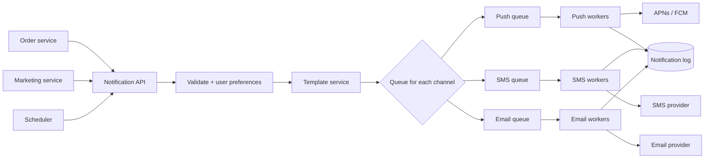

# Design a Notification System

## 1. Summary

A notification system sends messages to users through many channels: mobile push, SMS, email, and in-app. It must be reliable, must not send duplicates, and must respect user preferences.

## 2. Requirements

- Support push (APNs, FCM), SMS, email, and in-app channels.
- Support real-time and scheduled notifications.
- Respect user settings and opt-out.
- Do not lose notifications. Do not send duplicates.
- Limit the number of notifications for each user.

## 3. Architecture

## 4. Flow

1. A service sends a notification request with an `idempotency_key`.
2. The API checks the key. If the key exists, the API discards the request.
3. The API reads the user preferences and the device tokens.
4. The template service creates the message text.
5. The API puts one job in the queue for each channel.
6. Workers send the job to the third-party provider.
7. Workers write the result to the notification log.
8. If the send fails, workers retry with exponential backoff.
9. After the maximum retries, workers send the job to a dead letter queue.

## 5. Important design points

- **Separate queues for each channel:** A slow SMS provider does not delay push notifications.
- **Priority:** Use a high-priority queue for OTP and security messages. Use a low-priority queue for marketing.
- **Rate limit for each user:** Do not send too many notifications to one user.
- **Provider failover:** Configure a second SMS or email provider.
- **Tracking:** Record sent, delivered, opened, and clicked events.

## 6. Interview follow-up questions

1. How do you send one notification to 10 million users?
2. How do you prevent duplicate notifications after a worker crash?
3. How do you respect user time zones for scheduled notifications?
