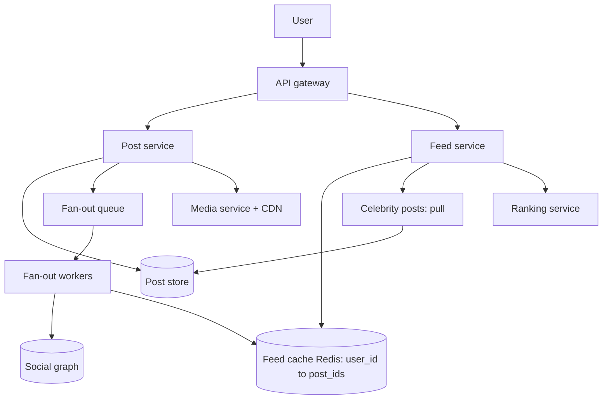

# Design a News Feed (Facebook, Instagram, X)

## 1. Summary

A news feed shows posts from the people that a user follows. The main problem is fan-out. One post from a celebrity can go to millions of feeds.

## 2. Requirements

- Create a post (text, image, video).
- Show the feed of a user in order (time or rank).
- Feed load time less than 500 ms.
- Support users with millions of followers.

## 3. Fan-out models

| Model | How it works | Advantage | Disadvantage |
|-------|--------------|-----------|--------------|
| Fan-out on write (push) | When a user posts, write the post ID to the feed cache of each follower. | Fast feed reads. | Slow and costly for celebrities. |
| Fan-out on read (pull) | When a user opens the feed, read the posts of all followed users. | Cheap writes. | Slow feed reads. |
| Hybrid | Push for normal users. Pull for celebrities. Merge at read time. | Balanced. | More complex. |

Recommended: the hybrid model.

## 4. Architecture

## 5. Feed read flow

1. Read the list of post IDs from the feed cache of the user.
2. Read recent posts from the celebrities that the user follows.
3. Merge the two lists.
4. Send the list to the ranking service.
5. Read the post details and author details from caches.
6. Return one page of results with a cursor.

## 6. Important design points

- Store only post IDs in the feed cache. Store post content one time in the post store.
- Keep only the latest 500 to 1,000 post IDs for each user.
- Do not fan out to inactive users. Build their feed when they return.
- Use cursor pagination (not offset). New posts do not change the page content.

## 7. Interview follow-up questions

1. How do you remove a deleted post from millions of feeds?
2. How do you rank the feed?
3. How do you show new posts in real time?
