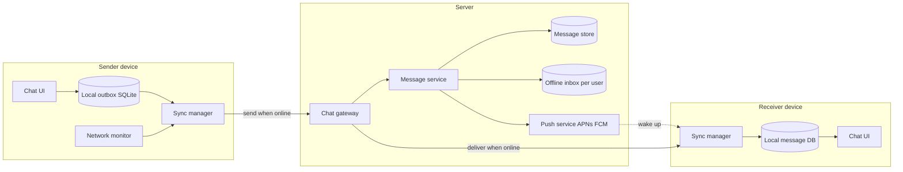
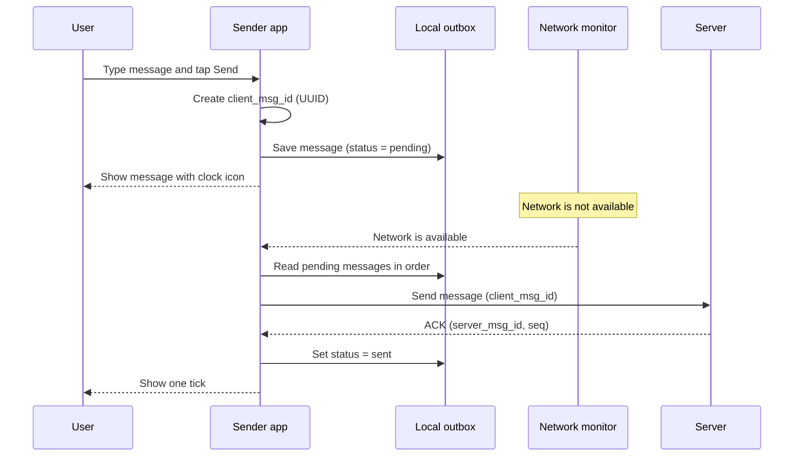
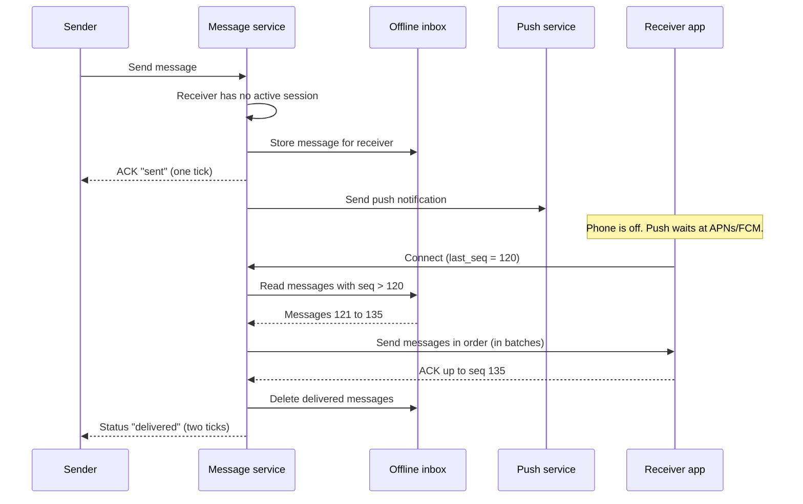
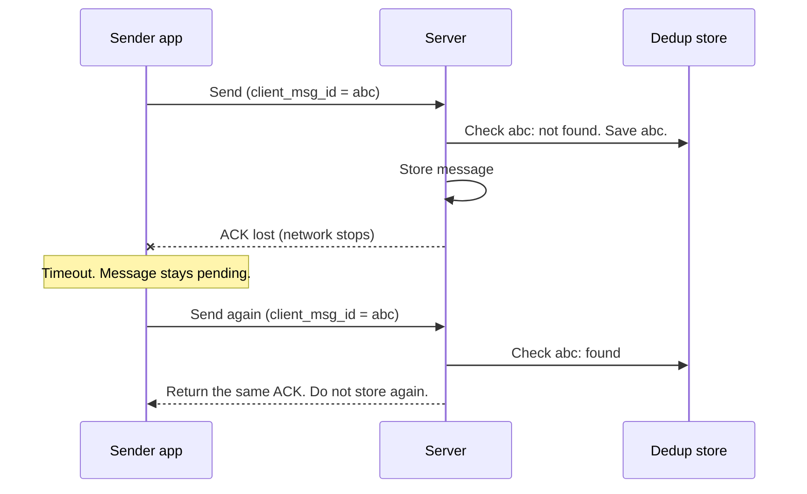
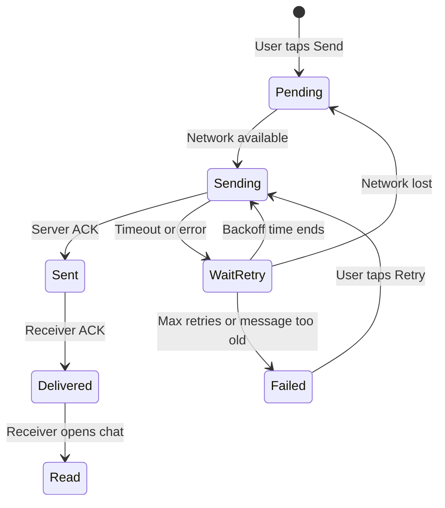
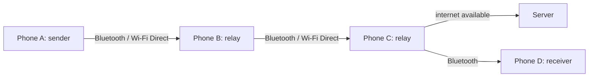

# Design Offline Messaging (Message Delivery During Network Failure)

## 1. Summary

A messaging service must work when the network fails. The network can fail at the sender, at the receiver, or between them. The design uses one principle: **store and forward**. Each side keeps the message in durable storage until the next side confirms it. Then no message is lost, and the system delivers it when the network is available again.

This design extends `01-chat-service-whatsapp.md`.

## 2. Failure cases

| No. | Case | Example |
|-----|------|---------|
| 1 | Sender is offline | The sender is in a lift or on a flight. |
| 2 | Receiver is offline | The phone of the receiver is off. |
| 3 | Network is unstable | The connection stops and starts many times (2G, train journey). |
| 4 | Connection stops during send | The server gets the message, but the ACK does not reach the sender. |
| 5 | Server component fails | A gateway or a region stops. |
| 6 | No internet for a long time | A disaster area or a remote location. |

## 3. Requirements

### Functional requirements

- The user can write and "send" a message when the device is offline.
- The system sends the message automatically when the network is available.
- The receiver gets all missed messages when it connects.
- The sender sees the correct status: pending, sent, delivered, read.

### Non-functional requirements

- No message loss.
- No duplicate messages.
- Correct order in each chat.
- Low battery and data use during sync.

## 4. High-level architecture



## 5. Components

| Component | Location | Function |
|-----------|----------|----------|
| Local outbox | Sender device | Keeps each unsent message in durable storage. The message stays until the server confirms it. |
| Local message DB | Each device | Keeps the chat history. The UI reads from this database, not from the network. |
| Network monitor | Each device | Finds changes in network status. It starts the sync manager when the network is available. |
| Sync manager | Each device | Sends the outbox. Gets missed messages. Retries with backoff. |
| Message service | Server | Gives each message a sequence number. Removes duplicates. Stores messages. |
| Offline inbox | Server | Keeps messages for users that are offline. |
| Push service | Server | Wakes the receiver app with a notification. |

## 6. Case 1: sender is offline



### Procedure

1. Save the message in the local outbox before you send it.
2. Show the message in the UI immediately with a "pending" icon.
3. When the network is available, send the pending messages in creation order.
4. Delete the message from the outbox only after the server ACK.
5. If the send fails, keep the message in the outbox. Try again later.

**Important:** The UI reads from the local database. Thus, the app works offline. This is the "offline-first" or "local-first" design.

## 7. Case 2: receiver is offline



### Procedure

1. If the receiver is offline, store the message in the offline inbox.
2. Send a push notification. APNs and FCM keep the notification until the device is online.
3. When the receiver connects, the receiver sends its last sequence number.
4. Send all messages after that number, in batches and in order.
5. Delete messages from the inbox only after the receiver ACK.
6. Set a retention time for the inbox (for example, 30 days). After this time, delete undelivered messages and tell the sender.

## 8. Case 3 and 4: unstable network and lost ACK

The connection can stop after the server gets the message but before the sender gets the ACK. The sender does not know if the send was successful. Thus, the sender sends the message again.



### Rules

- **Idempotency:** Each message has one `client_msg_id`. The server stores each ID one time. A retry gets the original ACK.
- **Exponential backoff with jitter:** Wait 1 s, 2 s, 4 s, 8 s, up to a maximum (for example, 60 s). Add a random value. Then many devices do not reconnect at the same time.
- **Resumable uploads:** Send media in chunks. After a failure, send only the missing chunks.
- **Small batches:** On a slow network, send small batches. Then one failure does not cause a large retry.
- **Heartbeat:** Send a heartbeat to find a "half-open" connection that looks open but does not work.

## 9. Retry logic on the client



## 10. Message order after reconnect

- The server gives the sequence number. The client does not use the device clock for order, because the clock can be wrong.
- The sender sends the outbox in creation order, one chat at a time.
- The receiver sorts by server sequence number.
- If the receiver finds a gap (for example, 121, 122, 125), it requests the missing messages.
- If two users send at the same time while offline, the server decides the final order. Both clients then show the server order.

## 11. Status updates while offline

Delivery and read receipts are also messages. They use the same outbox.

1. The receiver reads a message offline.
2. The app saves a "read" receipt in the outbox.
3. The app sends the receipt when the network is available.
4. Combine receipts. Send "read up to seq 135", not one receipt for each message.

## 12. Case 5: server component fails

| Failure | Action |
|---------|--------|
| Gateway stops | The client connects to a different gateway. The client sends `last_seq`. The server sends the missing messages. |
| Message service stops | The queue keeps the messages. A different instance continues. |
| Region stops | DNS sends clients to a different region. The message store replicates data between regions. |
| Push service fails | The client gets messages at the next connection or at a background sync. |

## 13. Background sync on the device

- **Android:** Use WorkManager with a "network connected" constraint.
- **iOS:** Use Background App Refresh and silent push notifications.
- **Web:** Use the Service Worker Background Sync API.

The operating system decides when the app can run. Thus, push notifications are important to wake the app.

## 14. Case 6: no internet (optional advanced topic)

Some apps work with no internet. Examples: Bridgefy, Briar, and Apple "Find My".



- Phones form a mesh network. Each phone stores the message and sends it to nearby phones.
- This is a "delay-tolerant network" (DTN). Delivery can take minutes or hours.
- Use end-to-end encryption. Relay phones must not read the message.
- Set a hop limit and a TTL. This prevents messages from moving without end.
- SMS fallback is another option when mobile data fails but the voice network works.

## 15. Data model

```text
Client table: outbox
client_msg_id (PK), chat_id, body, status (pending | sending | failed),
retry_count, created_at

Client table: messages
server_msg_id, client_msg_id, chat_id, seq, sender_id, body, status

Client table: sync_state
chat_id, last_seq

Server table: offline_inbox
Partition key : user_id
Clustering key: seq
Columns       : chat_id, message_id, expires_at

Server table: dedup
client_msg_id (PK), server_msg_id, seq, expires_at (TTL 7 days)
```

## 16. Trade-offs

- **Local storage:** An offline-first app gives a good user experience. But it uses device storage and needs sync logic.
- **Inbox retention:** Long retention increases delivery success. But it increases server storage and privacy risk.
- **Retry interval:** Fast retries deliver sooner. But they use more battery and can overload the server after an outage.
- **Batch size:** Large batches are efficient on good networks. Small batches are safer on bad networks.

## 17. Interview follow-up questions

1. How do you prevent duplicates when the ACK is lost?
2. How do 10 million clients reconnect at the same time after an outage without overloading the server ("thundering herd")?
3. How do you sync one account on a phone and a laptop when both were offline?
4. What happens if a user edits or deletes a message that is still in the outbox?
5. How long do you keep undelivered messages on the server, and why?
