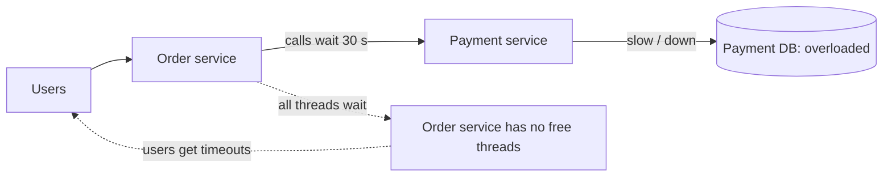
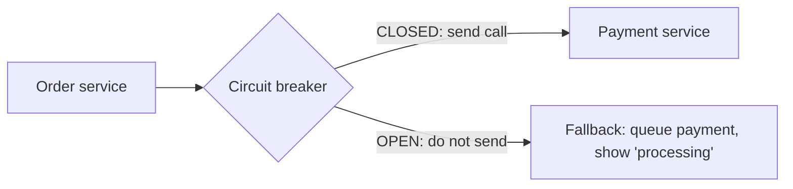
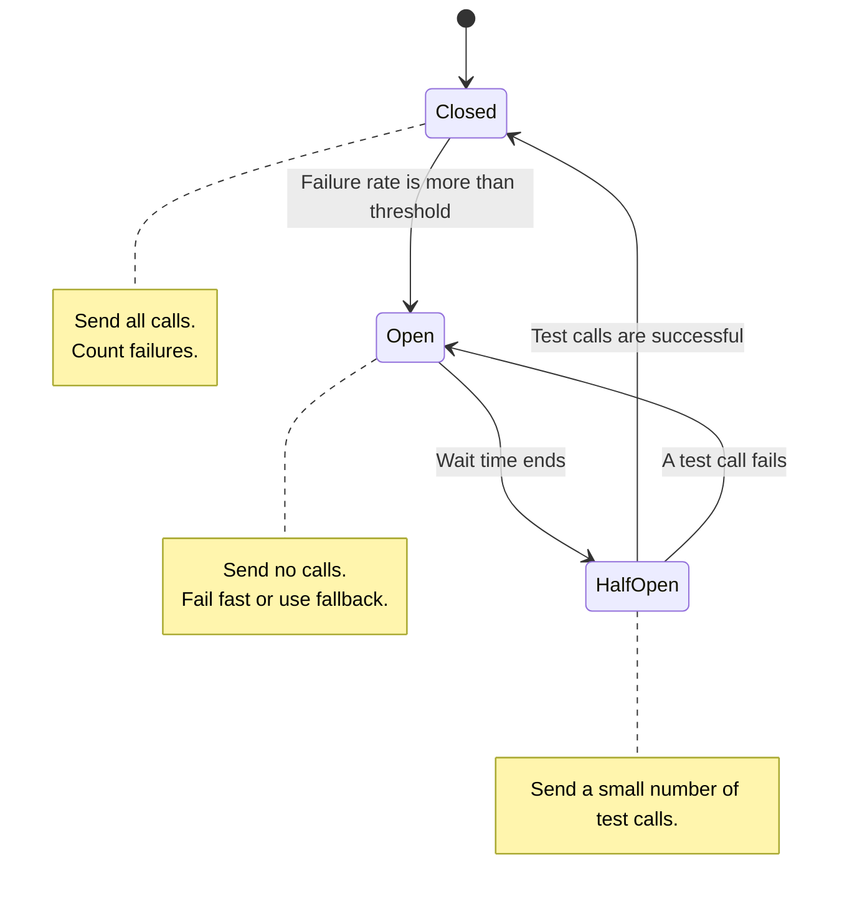
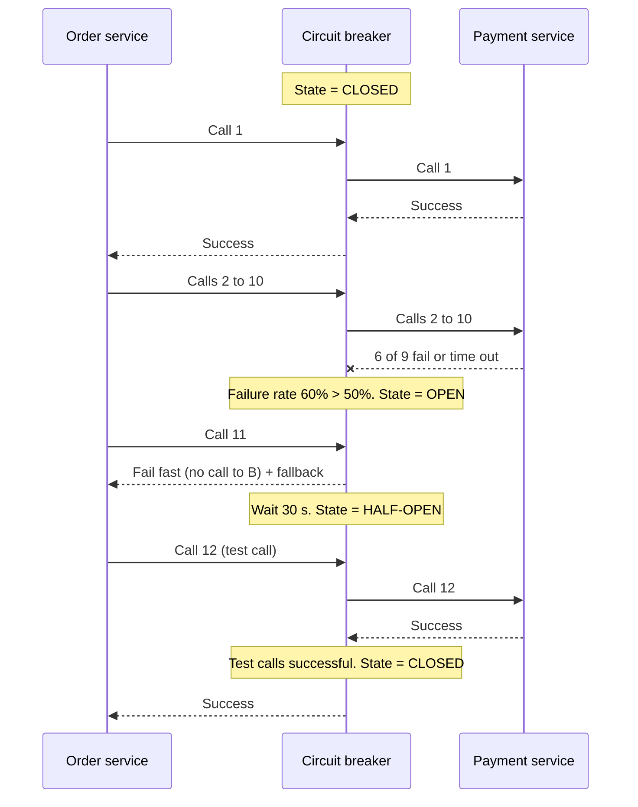
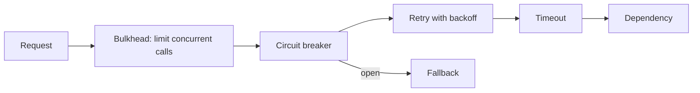

# Circuit Breaker Pattern

## 1. Summary

A circuit breaker protects a service when one of its dependencies fails. It stops calls to the failing dependency for a short time. During that time, it returns an error or a fallback result immediately. This prevents a slow or failing service from causing failures in other services.

The name comes from an electrical circuit breaker. When the current is too high, the breaker opens and stops the current. This protects the wiring.

## 2. The problem: cascading failure



1. The payment database becomes slow.
2. The payment service waits for the database. Its requests take 30 seconds.
3. The order service waits for the payment service. All its threads or connections become busy.
4. The order service cannot accept new requests, also for features that do not use payment.
5. The failure moves to more services. This is a **cascading failure**.

Retries make this problem worse. Each retry adds more load to the service that is already overloaded.

## 3. Solution: a circuit breaker



The circuit breaker sits between the caller and the dependency. It monitors the result of each call. When the failure rate is too high, it stops calls.

## 4. The three states



| State | Behavior | Next state |
|-------|----------|------------|
| **Closed** | Normal operation. The breaker sends all calls. It records success and failure. | Goes to **Open** when the failure rate is more than the threshold (for example, 50%). |
| **Open** | The breaker sends no calls. It returns an error or a fallback immediately. | Goes to **Half-open** after the wait time (for example, 30 s). |
| **Half-open** | The breaker sends a small number of test calls (for example, 5). It rejects other calls. | Goes to **Closed** if the test calls are successful. Goes to **Open** if a test call fails. |

## 5. Call flow over time



## 6. Configuration values

| Setting | Description | Typical value |
|---------|-------------|---------------|
| Failure rate threshold | Percentage of failed calls that opens the breaker. | 50% |
| Slow call threshold | A call that takes more than this time counts as slow. | 2 s |
| Slow call rate threshold | Percentage of slow calls that opens the breaker. | 80% |
| Minimum number of calls | The breaker does not calculate a rate before this number of calls. This prevents an open state after 1 failure in 2 calls. | 20 |
| Sliding window | The breaker calculates the rate on the last N calls (count-based) or the last N seconds (time-based). | 100 calls or 60 s |
| Wait duration in open state | Time before the breaker goes to half-open. | 30 s |
| Permitted calls in half-open | Number of test calls. | 5 |

### What counts as a failure

- Count: timeouts, connection errors, HTTP 5xx, HTTP 429.
- Do not count: HTTP 4xx client errors (for example, 400 or 404). The caller caused these errors. The dependency is healthy.

## 7. Fallback options

When the breaker is open, the caller must do something useful. Choose a fallback for each use case.

| Fallback | Example |
|----------|---------|
| Cached data | Show the last known product price from the cache. |
| Default value | Show general recommendations, not personal recommendations. |
| Queue for later | Put the payment request in a queue. Tell the user "Payment is processing." |
| Reduced feature | Hide the "reviews" section of the product page. |
| Clear error | Return HTTP 503 with a `Retry-After` header. |

## 8. Use with other resilience patterns



| Pattern | Function |
|---------|----------|
| **Timeout** | Stops a call that takes too long. Without a timeout, the breaker cannot see slow calls as failures. |
| **Retry** | Sends a failed call again for temporary errors. Use a small number of retries with backoff. |
| **Circuit breaker** | Stops all calls when failures continue. It prevents retries from overloading the dependency. |
| **Bulkhead** | Gives each dependency a separate thread pool or connection limit. One slow dependency cannot use all resources. |
| **Fallback** | Gives a useful result when the call fails or the breaker is open. |

**Order:** Put the retry inside the circuit breaker. Then the breaker counts the result after all retries. When the breaker is open, no retries occur.

## 9. Where to put the circuit breaker

| Location | Example | Advantage | Disadvantage |
|----------|---------|-----------|--------------|
| In the application (library) | Resilience4j (Java), Polly (.NET), opossum (Node.js) | Fine control. Fallback can use business logic. | Each service must implement it. |
| In the service mesh (sidecar) | Istio, Envoy, Linkerd ("outlier detection") | No code changes. Same rules for all services. | Fallback logic is limited. |
| In the API gateway | Kong, AWS API Gateway, Spring Cloud Gateway | Protects the backend from external traffic. | Does not protect calls between internal services. |

## 10. Example: Node.js with opossum

```typescript
import CircuitBreaker from 'opossum';

async function chargePayment(order: Order): Promise<PaymentResult> {
  const res = await fetch('https://payments.internal/charge', {
    method: 'POST',
    body: JSON.stringify(order),
    signal: AbortSignal.timeout(2000), // Timeout: 2 s
  });
  if (res.status >= 500) throw new Error(`Payment error ${res.status}`);
  return res.json();
}

const breaker = new CircuitBreaker(chargePayment, {
  timeout: 2000,                 // A call longer than 2 s is a failure
  errorThresholdPercentage: 50,  // Open at 50% failures
  volumeThreshold: 20,           // Minimum calls before the breaker can open
  rollingCountTimeout: 60000,    // Sliding window: 60 s
  resetTimeout: 30000,           // Wait 30 s in open state, then half-open
});

breaker.fallback((order: Order) => {
  paymentQueue.add(order);       // Queue for later
  return { status: 'PROCESSING' };
});

breaker.on('open', () => logger.warn('Payment breaker OPEN'));
breaker.on('halfOpen', () => logger.info('Payment breaker HALF-OPEN'));
breaker.on('close', () => logger.info('Payment breaker CLOSED'));

// Use
const result = await breaker.fire(order);
```

## 11. Example: a simple implementation in TypeScript

Interviewers sometimes ask you to write a circuit breaker. This version uses a count-based window.

```typescript
type State = 'CLOSED' | 'OPEN' | 'HALF_OPEN';

class SimpleCircuitBreaker<T> {
  private state: State = 'CLOSED';
  private failures = 0;
  private calls = 0;
  private openedAt = 0;
  private halfOpenSuccesses = 0;

  constructor(
    private action: () => Promise<T>,
    private failureRate = 0.5,
    private minCalls = 10,
    private openMs = 30_000,
    private halfOpenTrials = 3,
  ) {}

  async call(): Promise<T> {
    if (this.state === 'OPEN') {
      if (Date.now() - this.openedAt < this.openMs) {
        throw new Error('Circuit is OPEN');       // Fail fast
      }
      this.state = 'HALF_OPEN';
      this.halfOpenSuccesses = 0;
    }

    try {
      const result = await this.action();
      this.onSuccess();
      return result;
    } catch (err) {
      this.onFailure();
      throw err;
    }
  }

  private onSuccess() {
    if (this.state === 'HALF_OPEN') {
      this.halfOpenSuccesses++;
      if (this.halfOpenSuccesses >= this.halfOpenTrials) this.reset();
      return;
    }
    this.calls++;
  }

  private onFailure() {
    if (this.state === 'HALF_OPEN') return this.trip();
    this.calls++;
    this.failures++;
    if (this.calls >= this.minCalls && this.failures / this.calls >= this.failureRate) {
      this.trip();
    }
  }

  private trip() {
    this.state = 'OPEN';
    this.openedAt = Date.now();
  }

  private reset() {
    this.state = 'CLOSED';
    this.failures = 0;
    this.calls = 0;
  }
}
```

**Note:** This version does not limit concurrent calls in half-open state. A production version must allow only N test calls at the same time and use a sliding window.

## 12. Distributed systems points

- **State is local by default.** Each instance of the caller has its own breaker. This is normally correct. Each instance sees its own network path.
- **Shared state** (for example, in Redis) lets all instances open together. But it adds a network call and a new dependency. Use it only when necessary.
- **One breaker for each dependency,** and sometimes for each endpoint. A slow `/reports` endpoint must not block a fast `/status` endpoint.
- **Monitoring:** Send state changes to metrics and alerts. An open breaker is an important signal.

## 13. Trade-offs

- **Low threshold:** The breaker opens quickly and protects the system. But it can open for short, normal problems.
- **High threshold:** Fewer false opens. But the system has more damage before the breaker opens.
- **Long wait time:** The dependency gets more time to recover. But users wait longer for the feature.
- **Fallback quality:** A good fallback hides the failure. But old cached data can be wrong.

## 14. Interview follow-up questions

1. What is the difference between a retry and a circuit breaker? Why do you need both?
2. Why do you need a minimum number of calls before the breaker can open?
3. Should the circuit breaker state be shared between instances?
4. What is the bulkhead pattern, and how does it work with a circuit breaker?
5. How do you test a circuit breaker? (Use fault injection or chaos testing, for example, Chaos Monkey or Toxiproxy.)
6. Where did you use a circuit breaker in a real project, and what fallback did you use?
