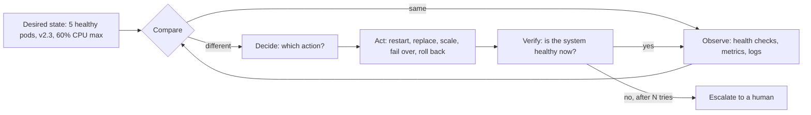
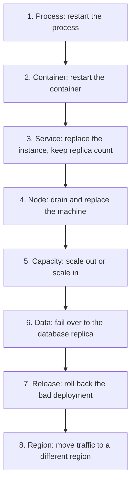
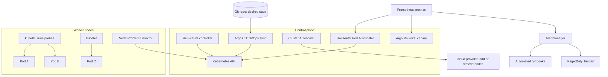
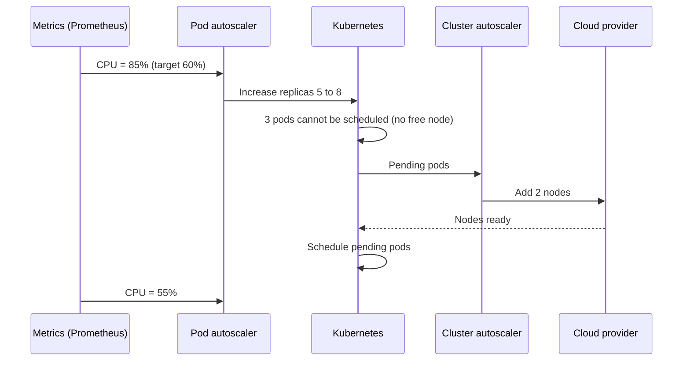
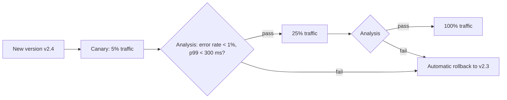
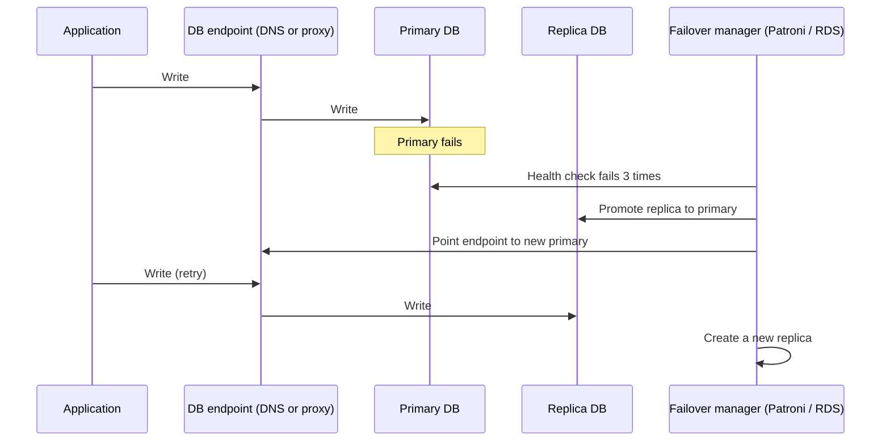

# Design Self-Healing (Auto-Healing) Infrastructure

## 1. Summary

Self-healing infrastructure finds failures and repairs them automatically, with no human action. It uses one main idea: a **control loop**. The system compares the actual state with the desired state. When the two states are different, the system takes action to make them the same.

Self-healing does not prevent failures. It decreases the time to repair (MTTR). It also decreases the number of alerts that wake up engineers.

## 2. The control loop



### The four steps

1. **Detect.** Find the failure with health checks, metrics, and logs.
2. **Decide.** Choose the correct repair action for this failure.
3. **Act.** Do the repair action automatically.
4. **Verify.** Check the result. If the repair fails, try a different action or call a human.

## 3. Healing layers

Repair each failure at the lowest possible layer. A low-layer repair is fast and has a small blast radius.



| Layer | Failure | Repair action | Tools |
|-------|---------|---------------|-------|
| Process | Process crashes | Restart the process | systemd, PM2, supervisord |
| Container | Container stops or does not respond | Restart the container | Kubernetes liveness probe, Docker restart policy |
| Service | Pod or instance is lost | Create a new instance | Kubernetes ReplicaSet, Deployment |
| Node | Machine becomes unhealthy | Drain the node. Create a new node. | AWS Auto Scaling Group, GKE node auto-repair, Karpenter |
| Capacity | Load is too high | Add instances | Kubernetes HPA, Cluster Autoscaler, AWS ASG scaling policies |
| Data | Primary database fails | Promote a replica | AWS RDS Multi-AZ, Patroni, MongoDB replica set, Kafka leader election |
| Release | New version causes errors | Roll back automatically | Argo Rollouts, Flagger, Spinnaker |
| Configuration | Manual change causes drift | Apply the correct configuration again | Argo CD self-heal, Flux, Terraform |
| Region | Full region fails | Move traffic to a healthy region | Route 53 health checks, Global Load Balancer |

## 4. Reference architecture on Kubernetes



## 5. Detection: health checks

Detection is the most important part. A bad health check causes wrong repairs.

### Three types of probes

| Probe | Question | Action on failure |
|-------|----------|-------------------|
| **Liveness** | Is the process alive and not stuck? | Restart the container. |
| **Readiness** | Can the instance accept traffic now? | Remove the instance from the load balancer. Do not restart. |
| **Startup** | Has the application finished startup? | Do not run other probes until startup is complete. |

### Kubernetes example

```yaml
apiVersion: apps/v1
kind: Deployment
metadata:
  name: order-service
spec:
  replicas: 3                      # Desired state: 3 pods
  selector:
    matchLabels: { app: order-service }
  template:
    metadata:
      labels: { app: order-service }
    spec:
      containers:
        - name: app
          image: registry/order-service:2.3.0
          resources:
            requests: { cpu: 250m, memory: 256Mi }
            limits:   { memory: 512Mi }
          startupProbe:
            httpGet: { path: /health/startup, port: 8080 }
            failureThreshold: 30   # 30 x 5 s = 150 s maximum startup time
            periodSeconds: 5
          livenessProbe:
            httpGet: { path: /health/live, port: 8080 }
            periodSeconds: 10
            failureThreshold: 3    # Restart after 3 failures
          readinessProbe:
            httpGet: { path: /health/ready, port: 8080 }
            periodSeconds: 5
            failureThreshold: 2    # Stop traffic after 2 failures
```

### Rules for health check endpoints

- **Liveness must check only the process itself.** Do not check the database in the liveness probe. If the database fails, Kubernetes restarts all pods. The restarts do not repair the database, and they cause more load.
- **Readiness can check critical dependencies.** If the database is not available, the pod stops getting traffic. It does not restart.
- **Keep checks fast and cheap.** A health check must not cause load.
- **Detect "stuck" states.** For example, the liveness endpoint can check that the event loop or worker thread made progress in the last 30 seconds.

## 6. Capacity healing: autoscaling



```yaml
apiVersion: autoscaling/v2
kind: HorizontalPodAutoscaler
metadata:
  name: order-service
spec:
  scaleTargetRef: { apiVersion: apps/v1, kind: Deployment, name: order-service }
  minReplicas: 3
  maxReplicas: 30
  metrics:
    - type: Resource
      resource:
        name: cpu
        target: { type: Utilization, averageUtilization: 60 }
  behavior:
    scaleDown:
      stabilizationWindowSeconds: 300   # Wait 5 min before scale-in. This prevents flapping.
```

## 7. Release healing: automatic rollback

Many production incidents start with a deployment. An automatic rollback repairs these incidents quickly.



### Procedure

1. Deploy the new version to a small part of the traffic.
2. Compare the error rate and latency with the old version.
3. If the metrics are good, increase the traffic in steps.
4. If the metrics are bad, send all traffic back to the old version.
5. Send an alert to the team with the analysis result.

## 8. Configuration healing: GitOps

- Git holds the desired state of all infrastructure and applications.
- Argo CD or Flux compares the cluster with Git every few minutes.
- If an engineer changes the cluster manually, the tool applies the Git state again ("self-heal").
- To change the system, change Git. Thus, each change has a review and a history.

## 9. Automated runbooks

Some failures need a specific action. Write the runbook as code. Start the code from an alert.

| Alert | Automated action |
|-------|------------------|
| Disk usage more than 90% | Delete old logs and temporary files. Increase the volume size if necessary. |
| Certificate expires in 7 days | Renew the certificate (cert-manager). |
| Memory leak: memory grows without limit | Restart the pods one at a time. Create a ticket for the team. |
| Queue backlog grows | Add consumer instances (KEDA). |
| Node has a kernel or disk error | Cordon and drain the node. Replace it. |
| Database connection pool is full | Restart the application with the leak. Increase the pool limit for a short time. |

Tools: AWS Systems Manager Automation, Azure Automation, StackStorm, Rundeck, PagerDuty Runbook Automation, Kubernetes operators.

## 10. Data healing: database failover



- Use synchronous replication if you cannot lose any write. This adds write latency.
- Use a consensus system (etcd, ZooKeeper) to choose the new primary. This prevents "split brain" (two primaries at the same time).
- The application must retry failed writes and reconnect after failover.

## 11. Safety controls

Automation can make an incident worse. Use these controls.

| Risk | Control |
|------|---------|
| Restart loop | Use exponential backoff between restarts (Kubernetes CrashLoopBackOff does this). |
| Too many repairs at the same time | Limit the rate of repair actions. Repair one node or one pod at a time. |
| Repair removes too much capacity | Use a PodDisruptionBudget. Keep a minimum number of healthy pods. |
| Repair hides a real problem | Record each repair action. Create a ticket if the same repair occurs many times. |
| Wrong diagnosis | Use more than one signal before a large action (for example, failover). |
| Automation fails | After N failed tries, stop and call a human. |

```yaml
apiVersion: policy/v1
kind: PodDisruptionBudget
metadata:
  name: order-service-pdb
spec:
  minAvailable: 2             # Always keep 2 pods running during repairs
  selector:
    matchLabels: { app: order-service }
```

## 12. Design rules for applications

The infrastructure can heal only applications that support it.

- **Stateless services.** Keep state in a database or cache. Then any instance can replace any other instance.
- **Fast startup.** A new instance must be ready in seconds.
- **Graceful shutdown.** Handle `SIGTERM`. Finish current requests. Then stop.
- **Idempotent operations.** A retry after a failure must not cause a duplicate result.
- **Resilience patterns.** Use timeouts, retries, and circuit breakers (see `10-circuit-breaker.md`).
- **Immutable infrastructure.** Replace a broken server. Do not repair it manually.

## 13. Verify with chaos engineering

You must test the self-healing system. If you do not test it, you do not know if it works.

1. Write a hypothesis. Example: "If one node stops, the service continues with no errors."
2. Inject a failure in a controlled way. Start in a test environment.
3. Measure the result.
4. Fix the gaps that you find.
5. Repeat the test regularly. Then move to production with a small blast radius.

Tools: Chaos Monkey, LitmusChaos, Chaos Mesh, AWS Fault Injection Service, Gremlin.

## 14. Metrics to measure success

| Metric | Meaning |
|--------|---------|
| MTTD (mean time to detect) | Time from failure to detection. |
| MTTR (mean time to repair) | Time from failure to full recovery. |
| Auto-remediation rate | Percentage of incidents repaired without a human. |
| Repeated repairs | Number of times the same repair occurs. A high number shows a root cause to fix. |
| Pages per week | Number of alerts that call an engineer. |

## 15. Trade-offs

- **Automation vs control:** More automation gives faster repair. But a bug in the automation can cause a large incident.
- **Sensitive checks vs stable system:** Sensitive health checks find failures fast. But they can cause unnecessary restarts.
- **Extra capacity vs cost:** Spare instances make repairs fast. But they cost money when not in use.
- **Self-heal vs root cause:** Automatic restarts hide problems. Always record repairs and fix the root cause.

## 16. Interview follow-up questions

1. What is the difference between a liveness probe and a readiness probe?
2. Why must a liveness probe not check the database?
3. How do you prevent the automation from restarting all instances at the same time?
4. How do you prevent split brain during a database failover?
5. How do you decide if a failure needs an automatic repair or a human?
6. How do you test that the self-healing system works?
