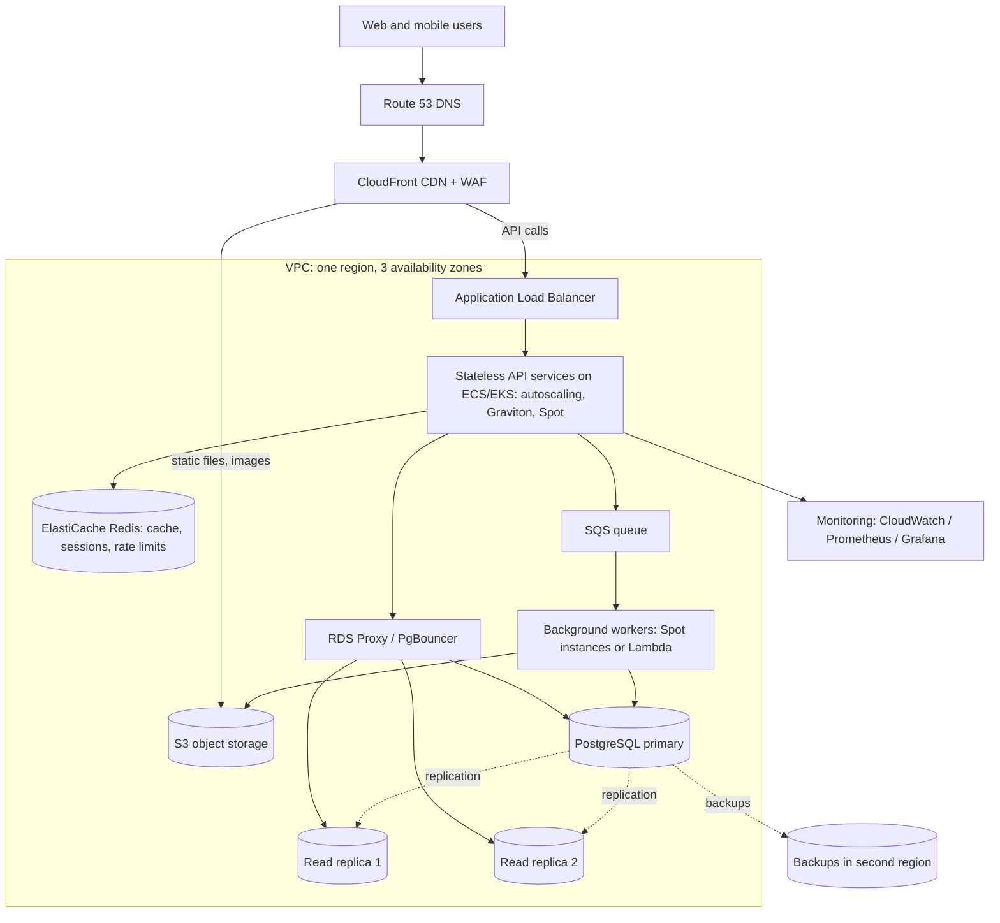
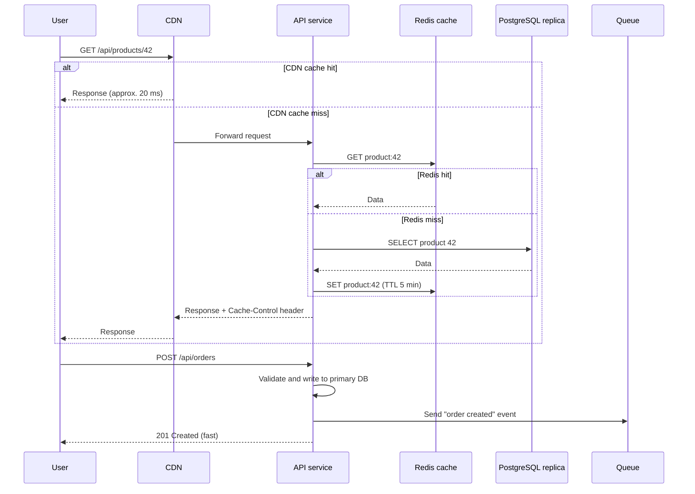
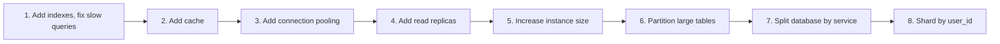
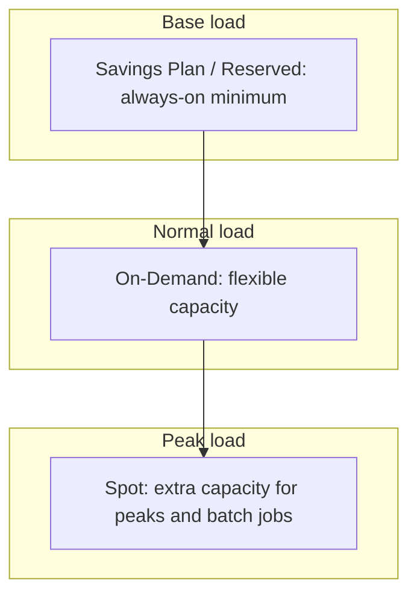
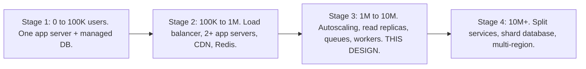

# Design a Scalable and Cost-Effective System for 5 Million Users

## 1. Summary

This design serves 5 million users with high availability and low cost. The main ideas are simple:

- Send most traffic to the CDN and the cache. Then the servers and the database get a small part of the load.
- Keep the application servers stateless. Then you can add or remove servers at any time.
- Scale automatically with the load. Do not pay for peak capacity all day.
- Use managed services. They decrease the operations work of the team.

The example uses AWS. The same design works on Azure and GCP with equivalent services.

## 2. First step: clarify "5 million users"

In an interview, ask this question first. The answer changes the design a lot.

| Meaning | Typical load | Design impact |
|---------|--------------|---------------|
| 5 million registered users | approx. 1 million daily active users | Medium scale. One region is sufficient. |
| 5 million daily active users | approx. 500,000 peak concurrent users | Large scale. Needs strong caching and read replicas. |
| 5 million concurrent users | Very high load | Very large scale. Needs sharding and many regions. |

This document uses **5 million registered users** as the main case. Section 12 explains the changes for the larger cases.

## 3. Requirements

### Functional requirements

- Users register, log in, and use a typical web and mobile application (read content, write content, upload images).

### Non-functional requirements

- Availability: 99.9% or more (less than 45 minutes of downtime each month).
- API latency: p95 less than 300 ms.
- Scale automatically for traffic peaks (for example, 3 times the normal load).
- Low cost: pay for the used capacity, not for idle capacity.

## 4. Load estimate

| Item | Calculation | Value |
|------|-------------|-------|
| Registered users | Given | 5,000,000 |
| Daily active users (DAU) | 20% of registered | 1,000,000 |
| Requests per user per day | Assumption | 50 |
| Requests per day | 1M × 50 | 50 million |
| Average requests per second | 50M / 86,400 | approx. 600 RPS |
| Peak requests per second | 3 to 5 × average | approx. 3,000 RPS |
| Requests to origin after CDN | 40% of peak | approx. 1,200 RPS |
| Database reads after cache | 10% of origin reads | approx. 100 to 200 QPS |
| Database writes | 10% of requests | approx. 100 to 300 WPS |
| User data | 5M × 10 KB | 50 GB |
| Media storage | 5M × 20 MB | 100 TB (object storage) |

**Conclusion:** This load is moderate. One region with good caching can serve it. A small number of servers is sufficient. Do not over-engineer the design with sharding or microservices on day one.

## 5. High-level architecture

## 6. Components

| Component | Function | Cost-saving choice |
|-----------|----------|--------------------|
| DNS (Route 53) | Sends users to the CDN. Does health checks. | Very low cost. |
| CDN (CloudFront) | Serves static files and images from edge locations. Caches public API responses. | Removes 50% to 80% of the load from the servers. CDN data transfer is often cheaper than direct server transfer. |
| WAF | Blocks attacks and bots. Rate limits abusive clients. | Bots can be a large part of traffic. Blocking them saves compute cost. |
| Load balancer (ALB) | Distributes requests across healthy servers in 3 zones. | One shared ALB with path-based routing for many services. |
| API services | Run the business logic. They keep no state. | Autoscaling, ARM (Graviton) instances, and a mix of On-Demand and Spot capacity. |
| Redis cache | Keeps hot data, sessions, and counters in memory. | Decreases database size and cost. |
| Connection pooler | Shares a small number of database connections across many app instances. | Prevents a need for a larger database instance. |
| PostgreSQL | Stores the main data. Primary for writes. Replicas for reads. | Use one primary and add replicas only when necessary. Use reserved instances. |
| S3 | Stores images, files, and backups. | Lifecycle rules move old files to cheaper storage classes. |
| SQS + workers | Do slow tasks outside the request (emails, image resize, reports). | Workers on Spot or Lambda. Pay only when there is work. |

## 7. Request flow

## 8. Scaling each layer

### 8.1 Application layer

1. Keep services stateless. Store sessions in Redis or use JWT tokens.
2. Run at least 2 instances in each availability zone.
3. Scale on CPU (target 60%) and request count.
4. Set a minimum number for normal load and a maximum number for cost protection.
5. Use scheduled scaling for known peaks (for example, 9:00 AM or a sale event).

**Sizing example:** One Node.js container with 1 vCPU serves approximately 500 to 1,000 simple API requests per second. 1,200 RPS at the origin needs approximately 4 to 6 containers at peak. Run 6 to 10 containers for headroom and zone failures.

### 8.2 Cache layer

- Cache read-heavy data: product details, user profiles, configuration, feed pages.
- Target a cache hit rate of 90% or more.
- Set a TTL on each key. Delete the key when the data changes.
- Use a Redis cluster with one replica for failover.

### 8.3 Database layer

Scale the database in this order. Go to the next step only when necessary.

For 5 million registered users, steps 1 to 4 are normally sufficient. A single PostgreSQL primary can process thousands of simple writes per second.

### 8.4 Asynchronous work

Move work out of the request path when the user does not need the result immediately:

- Send emails and notifications.
- Resize and compress images.
- Generate reports and exports.
- Update search indexes and analytics.

This makes API responses faster. It also lets workers use cheap Spot capacity, because a queue retries a job if a Spot instance stops.

## 9. Availability

| Failure | Protection |
|---------|------------|
| One server fails | Load balancer health checks remove it. Autoscaling replaces it. |
| One availability zone fails | Servers, cache, and database run in more than one zone. |
| Database primary fails | Multi-AZ failover promotes the standby in approximately 1 to 2 minutes. |
| Bad deployment | Canary or blue-green deployment with automatic rollback. |
| Region fails | Backups and infrastructure code in a second region ("pilot light"). Recovery time: hours. |
| Traffic spike or attack | CDN, WAF, rate limits, and autoscaling. |

A full active-active multi-region design is not cost-effective at this scale. Use it only if the business needs very high availability (99.99%+) or users are in many continents.

See `11-self-healing-infrastructure.md` and `10-circuit-breaker.md` for more details.

## 10. Cost optimization

### 10.1 Main methods

| Method | Typical saving | Note |
|--------|----------------|------|
| CDN for static content and cacheable API responses | Large decrease in servers and data transfer | The best first step. |
| Autoscaling with a low minimum | 30% to 50% of compute | Do not pay for peak capacity at night. |
| ARM instances (AWS Graviton) | Approx. 20% better price-performance | Node.js, Java, Python, and Go run well on ARM. |
| Spot instances for stateless and batch work | Up to 70% to 90% of compute for that part | Keep a base of On-Demand capacity. Spot instances can stop with 2 minutes notice. |
| Savings Plans or Reserved Instances for the base load | Approx. 30% to 60% | Commit only for the minimum load that you always use. |
| Right-sizing | 10% to 30% | Check CPU and memory use monthly. Decrease oversized instances. |
| S3 lifecycle rules | Large saving on old files | Move old files to Infrequent Access or Glacier. |
| Cache before the database | Smaller database | A database is usually the most expensive single component. |
| Log and metric retention limits | Often a large hidden cost | Keep detailed logs for 7 to 14 days. Sample debug logs. |
| Keep traffic in one zone where possible | Decreases data transfer cost | Cross-zone and cross-region transfer costs money. |
| Turn off non-production environments at night | Approx. 60% of non-prod cost | Use schedules for dev and test environments. |

### 10.2 Compute capacity mix

### 10.3 Approximate monthly cost (order of magnitude)

These numbers are rough estimates for planning and interview discussion only. Prices change by region and over time. Use the AWS Pricing Calculator for a real estimate.

| Component | Approximate monthly cost (USD) |
|-----------|--------------------------------|
| API compute (6 to 10 containers, mixed pricing) | 500 to 1,500 |
| PostgreSQL (primary + standby + 2 replicas) | 1,500 to 3,000 |
| Redis cluster | 300 to 800 |
| CDN + data transfer | 1,000 to 4,000 (depends on media size) |
| S3 storage (100 TB with lifecycle rules) | 1,500 to 2,500 |
| Load balancer, WAF, DNS, queues | 200 to 500 |
| Monitoring and logs | 300 to 1,000 |
| **Total** | **approx. 5,000 to 13,000** |

This gives a cost of approximately USD 0.001 to 0.003 for each registered user each month. Media storage and data transfer are usually the largest variable costs.

## 11. Growth stages

Do not build the final architecture on day one. Grow the system in stages.

Start with a **modular monolith**. Split a module into a separate service only when it needs separate scaling or a separate team. Microservices add network calls, operations work, and cost.

## 12. Changes for larger loads

| If the load is | Add these changes |
|----------------|-------------------|
| 5 million daily active users | More replicas. Larger Redis cluster. Split read-heavy services. Consider a second region for latency. |
| 5 million concurrent users | Shard the database by `user_id`. Use many regions with GeoDNS. Use WebSocket gateways for real-time features. Use a distributed database (Aurora, DynamoDB, CockroachDB, Cassandra) for large tables. |
| Very large write load | Use a queue (Kafka) to absorb write peaks. Write to the database in batches. |

## 13. Monitoring

Monitor these signals for each service (the "four golden signals"):

1. **Latency:** p50, p95, p99.
2. **Traffic:** requests per second.
3. **Errors:** error rate by endpoint.
4. **Saturation:** CPU, memory, database connections, queue length.

Also monitor **cost** as a metric. Set a budget alert. Tag each resource with the service name and the team name. Then you can see which service costs the most.

## 14. Trade-offs

- **Monolith vs microservices:** A monolith is cheaper and simpler at this scale. Microservices give independent scaling but cost more to operate.
- **Spot vs On-Demand:** Spot is very cheap. But AWS can take it back. Use it only for work that can stop and restart.
- **Single region vs multi-region:** One region costs much less. But a full region failure causes hours of downtime.
- **Caching vs freshness:** Long TTLs decrease cost. But users can see old data.
- **Managed vs self-hosted:** Managed services cost more per hour. But they need fewer engineers to operate. Engineer time is usually the larger cost.

## 15. Interview follow-up questions

1. How do you find the first bottleneck when traffic increases 10 times?
2. When do you shard the database, and how do you choose the shard key?
3. How do you handle a traffic spike 20 times the normal load (for example, a flash sale)?
4. How do you decrease the cloud bill by 30% without decreasing reliability?
5. How do you keep user sessions when servers scale in and out?
6. How do you decide between a monolith and microservices?
