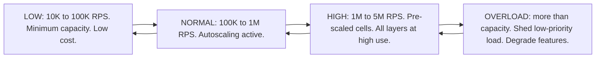
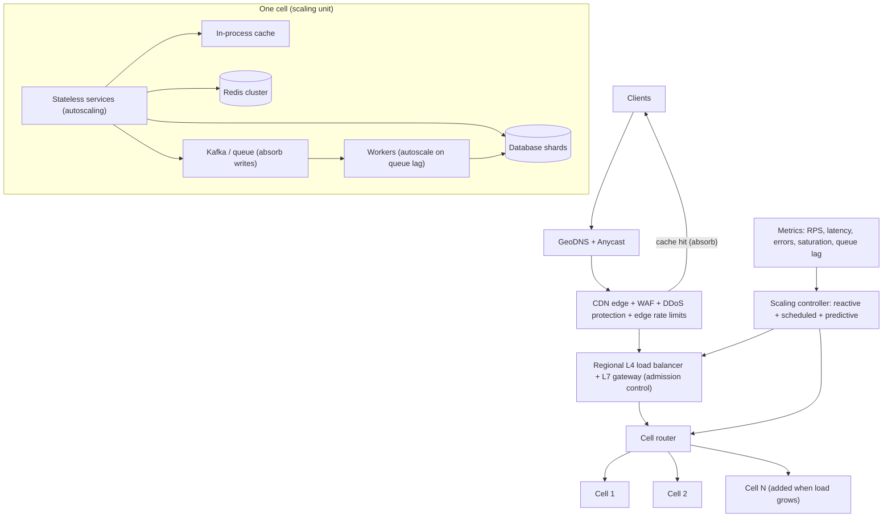
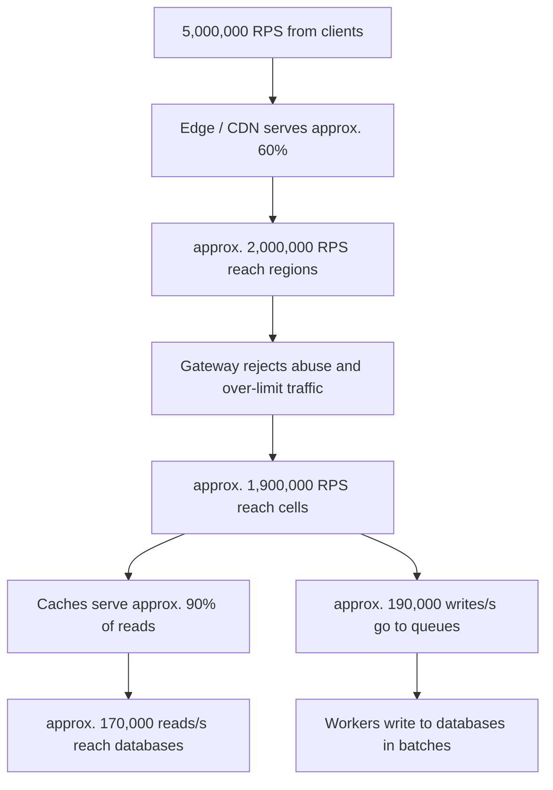
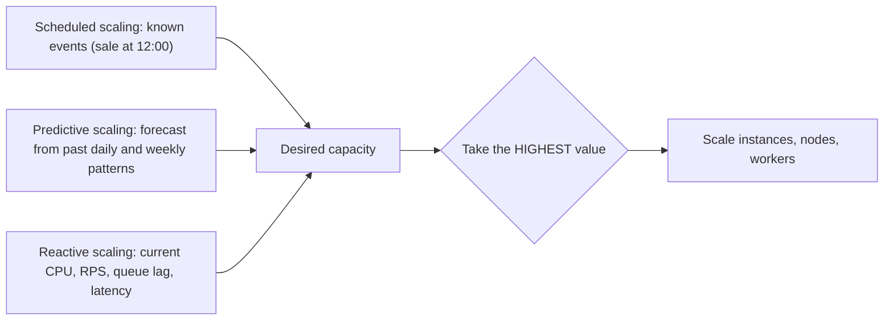
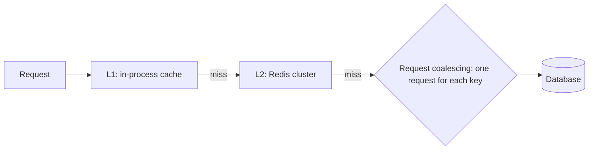
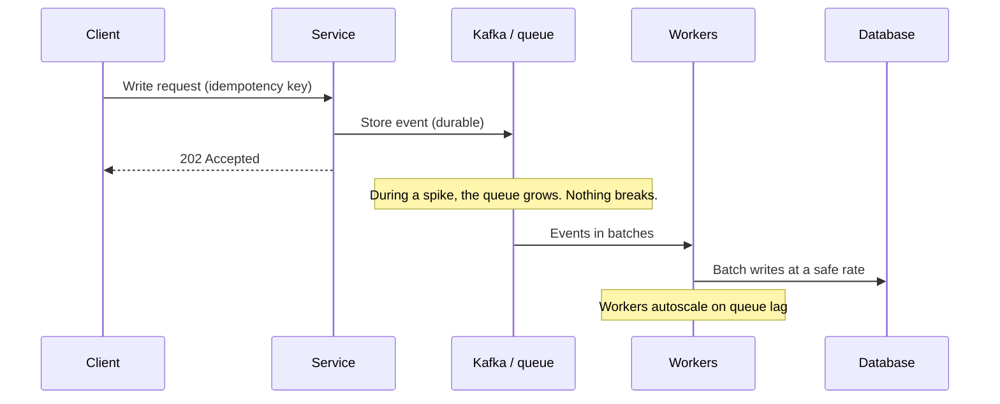
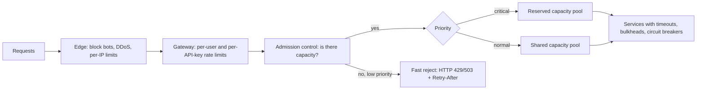
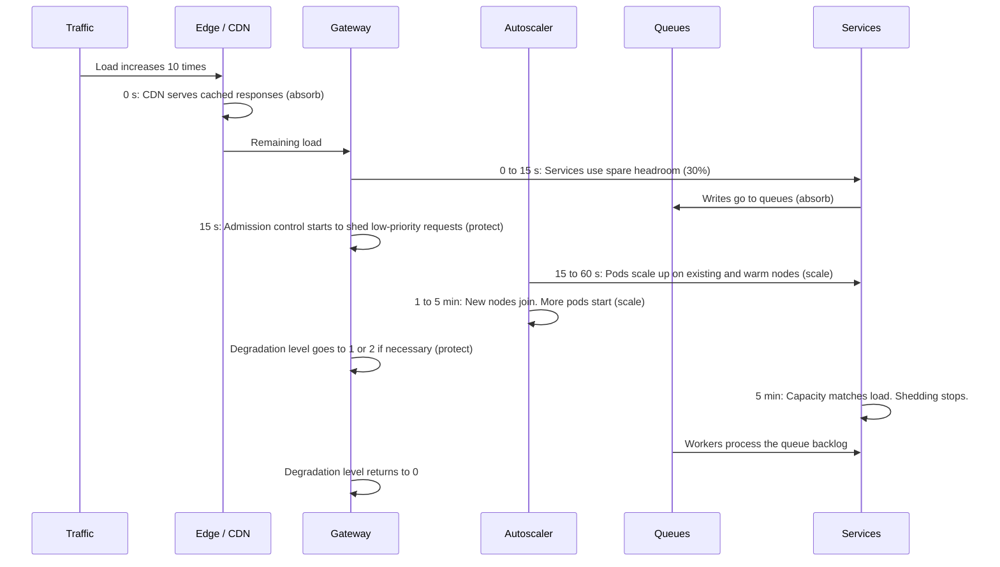
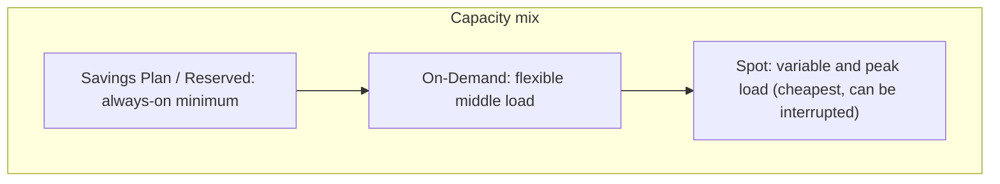

# Design an Elastic System That Scales up to 5 Million Requests Without Breaking

## 1. Summary

The system must handle a load that changes all the time. At night, the load can be a few thousand requests. During a sale or a live event, the load can increase to 5 million requests. The system must not break at any load level.

"Not breaking" does not mean "serve every request at any cost." It means:

- The system scales up when the load increases.
- The system scales down when the load decreases. Then the cost stays low.
- When the load increases faster than the system can scale, the system stays alive. It serves the most important requests and rejects or delays the others in a controlled way.
- The system recovers automatically when the load becomes normal.

The design uses three principles:

| Principle | Meaning | Main tools |
|-----------|---------|------------|
| **1. Scale** | Add capacity when the load increases. Remove capacity when the load decreases. | Autoscaling, cells, serverless, on-demand databases |
| **2. Absorb** | Hold or serve extra load at cheap layers while the system scales. | CDN, cache, queues, request coalescing |
| **3. Protect** | Keep the core system alive when the load is more than the capacity. | Rate limits, load shedding, backpressure, circuit breakers, degradation |

## 2. Clarify the load

In an interview, ask for the time unit. This document uses **5 million requests per second (RPS) as the maximum peak**. The same design works for "5 million per minute" (approx. 83,000 RPS) with fewer cells.

| Requirement | Peak RPS | Design size |
|-------------|----------|-------------|
| 5 million per day | approx. 175 | Small. Autoscaling of a few servers is sufficient. |
| 5 million per hour | approx. 4,000 | Medium. See `12-scaling-5-million-users.md`. |
| 5 million per minute | approx. 83,000 to 250,000 | Large. One region, 2 to 3 cells. |
| 5 million per second | 5,000,000 | Very large. Many regions, many cells. |

Ask also:

1. What is the minimum load? (This decides the minimum cost.)
2. How fast can the load increase? (For example, from 500,000 to 5 million RPS in 1 minute.)
3. Are the peaks known in advance (a sale, a match), or are they random (viral content)?
4. Which requests must never fail (payment, login)? Which requests can wait or fail (recommendations, analytics)?

## 3. Requirements

### Functional requirements

- Serve normal API traffic (90% reads, 10% writes).

### Non-functional requirements

| Requirement | Target |
|-------------|--------|
| Load range | From approx. 10,000 RPS to 5,000,000 RPS |
| Spike speed | 10 times the current load within 60 seconds |
| Availability | 99.99% for critical requests |
| Latency | p99 less than 200 ms during normal operation |
| Behavior at overload | No crash. No cascading failure. Critical requests continue. |
| Cost | Cost follows the load. Low cost at low load. |

## 4. Load levels and system behavior

The system has a defined behavior for each load level.



| Level | Load | What the system does |
|-------|------|----------------------|
| Low | 10K to 100K RPS | Runs at minimum capacity. Uses committed (cheap) capacity. Some cells scale in. |
| Normal | 100K to 1M RPS | Reactive autoscaling adds and removes instances. |
| High | 1M to 5M RPS | All cells are active. Scheduled and predictive scaling add capacity before the peak. |
| Overload | More than current capacity | Admission control and load shedding protect the core. Non-critical features stop. Queues hold writes. |

## 5. High-level architecture



### Request funnel at peak

Each layer removes load before the next layer. The database never gets the full client load.



## 6. Principle 1: Scale

### 6.1 Each layer scales at a different speed

This is the most important point of the design. A spike can come in seconds. Some layers need minutes or hours to scale.

| Layer | Time to add capacity | Strategy |
|-------|----------------------|----------|
| CDN / edge | Immediate (provider capacity) | Cache as much as possible. |
| Serverless functions | Seconds (with concurrency limits) | Use for spiky, short tasks. Request higher limits before events. |
| Containers on existing nodes | 10 to 60 seconds | Reactive autoscaling. |
| New nodes (VMs) | 1 to 5 minutes | Keep a warm pool and spare nodes. |
| Cache cluster | Minutes; resharding is slow | Size for peak. Keep headroom. |
| Database read replicas | 5 to 20 minutes | Scale before known peaks. |
| Database shards / write capacity | Hours to days | Plan for peak. Use on-demand modes where possible. |
| Cloud quotas and limits | Days (support request) | Request higher limits in advance. |

**Rule:** If a layer scales slowly, give it **headroom** (spare capacity) or put a **buffer** in front of it.

### 6.2 Cells: the unit of scale

A **cell** is a complete, independent copy of the stack. One cell serves a fixed group of users.

| Item | Value |
|------|-------|
| Tested capacity of one cell | approx. 100,000 RPS |
| Cells at low load | 2 to 4 (minimum for availability) |
| Cells at peak | approx. 20 to 26 (2 million RPS after the edge + 30% spare) |

### Why cells help elasticity

- **Known capacity.** You test one cell to its limit. Then capacity planning is simple: required RPS ÷ cell capacity = number of cells.
- **Linear growth.** To support more load, add more cells. You do not make one big system bigger.
- **Small blast radius.** A failure in one cell affects only approx. 5% of users.
- **Cost control.** At low load, the cells run with few instances. Their minimum size is small.

### 6.3 Autoscaling methods

Use three methods together.



| Method | When it works | Example tools |
|--------|---------------|---------------|
| Scheduled | Known peaks (sales, matches, product launches, 9:00 AM traffic) | Kubernetes CronJobs, AWS scheduled scaling |
| Predictive | Regular daily or weekly patterns | AWS Predictive Scaling, custom forecast models |
| Reactive | Unknown or random changes | Kubernetes HPA, KEDA, Cluster Autoscaler, Karpenter |

### Reactive scaling signals

| Component | Scale on | Reason |
|-----------|----------|--------|
| API services | RPS per instance and CPU | CPU alone reacts late for I/O-heavy services. |
| Workers | Queue lag (messages waiting) | Lag shows directly that workers are too slow. |
| WebSocket gateways | Open connections | Connections use memory, not CPU. |
| Database replicas | CPU and replica lag | Lag shows the replica cannot follow the primary. |

### 6.4 Scale up fast, scale down slowly

| Rule | Value | Reason |
|------|-------|--------|
| Scale-up step | Large (for example, +50% or +100%) | A spike needs capacity now. Small steps are too slow. |
| Scale-up delay | Short (15 to 30 seconds) | Act quickly. |
| Scale-down step | Small (for example, -10%) | The load can come back. |
| Scale-down delay | Long (5 to 10 minutes stabilization window) | Prevents "flapping" (up and down many times). |
| Scale-down action | Drain connections. Finish current requests. Then stop. | Prevents errors for users. |

```yaml
apiVersion: autoscaling/v2
kind: HorizontalPodAutoscaler
metadata:
  name: api-service
spec:
  scaleTargetRef: { apiVersion: apps/v1, kind: Deployment, name: api-service }
  minReplicas: 6            # Low load: small and cheap, but available in 3 zones
  maxReplicas: 600          # Cost and safety limit
  metrics:
    - type: Pods
      pods:
        metric: { name: http_requests_per_second }
        target: { type: AverageValue, averageValue: "800" }
  behavior:
    scaleUp:
      stabilizationWindowSeconds: 15
      policies:
        - { type: Percent, value: 100, periodSeconds: 15 }   # Double quickly
    scaleDown:
      stabilizationWindowSeconds: 600
      policies:
        - { type: Percent, value: 10, periodSeconds: 60 }    # Decrease slowly
```

### 6.5 Make new capacity ready faster

- **Small container images.** A small image downloads faster on a new node.
- **Fast startup.** The service must be ready in seconds. Load configuration and warm connections at startup.
- **Warm pools.** Keep some stopped or idle nodes ready. They start faster than new nodes.
- **Over-provisioning pods.** Run low-priority "placeholder" pods. When real pods need space, Kubernetes removes the placeholders immediately. Then the cluster autoscaler adds nodes in the background.
- **Cloud quotas.** Check instance, IP address, and API limits. Request higher limits before peak events. An autoscaler cannot pass a quota.

### 6.6 Databases with variable load

| Need | Elastic option |
|------|----------------|
| Key-value with unpredictable load | DynamoDB on-demand mode, or provisioned mode with autoscaling |
| Relational with variable load | Aurora Serverless v2, Aurora replica autoscaling |
| Very large write scale | Pre-sharded Cassandra / ScyllaDB / Vitess, sized for peak |
| Read spikes | Caches + autoscaling read replicas |

Important rules:

1. **Use connection pooling** (PgBouncer, RDS Proxy). When 500 new app instances start, they must not open 50,000 new database connections. A "connection storm" can stop the database.
2. **Create more shards than you need** at the start (for example, 1,024 logical shards on 16 physical nodes). Later, move logical shards to new nodes. You do not need to split data.
3. **Plan write capacity for peak.** Writes are the most difficult part to scale quickly. Put a queue in front of non-critical writes.

## 7. Principle 2: Absorb

Absorb layers give the system time to scale.

### 7.1 CDN and edge

- Cache static files and public API responses at the edge.
- Use short TTLs (1 to 10 seconds) for data that changes often. Even a 1-second TTL removes most of the load for very popular data.
- Use "stale-while-revalidate." The edge serves old data while it gets new data in the background.
- Use "stale-if-error." The edge serves old data if the origin fails.

### 7.2 Caches



- **Request coalescing:** If 10,000 requests ask for the same missing key, send one request to the database.
- **Hot-key replication:** Copy a very popular key to many cache nodes. Read from a random copy.
- **Cache warming:** Load popular data before a known peak.

### 7.3 Queues for writes



- The queue takes the spike. The database gets a steady rate.
- Workers scale on queue lag. When the spike ends, the queue becomes empty and workers scale down.
- Use idempotency keys. A retry must not write the same change two times.
- Keep critical writes (payments, stock changes) on a separate synchronous path with reserved capacity.

## 8. Principle 3: Protect

When the load is more than the capacity, the system must not try to serve everything. If it does, all requests become slow, timeouts occur, clients retry, and the system crashes. Protection keeps the system alive.

### 8.1 Protection layers



### 8.2 Controls

| Control | Function |
|---------|----------|
| Rate limiting | Limits each client, user, API key, and IP address. See `06-rate-limiter.md`. |
| Admission control | Accepts a request only if the service has capacity (for example, concurrent requests less than the limit). |
| Load shedding | Rejects new low-priority requests quickly when the system is full. A fast rejection is better than a slow timeout. |
| Priority classes | Critical (login, checkout) > Normal (browse) > Low (recommendations, analytics, prefetch). |
| Bulkheads | Separate thread pools and connection pools for each dependency and priority. One slow part cannot use all resources. |
| Timeouts | Each call has a time limit. No request waits without limit. |
| Circuit breakers | Stop calls to a failing dependency. See `10-circuit-breaker.md`. |
| Backpressure | When a queue is full, tell producers to slow down. |
| Retry budget | Retries are limited to approx. 10% of requests. This prevents a "retry storm." |
| Client jitter and backoff | Clients wait a random time before a retry. This prevents synchronized waves. |

### 8.3 Graceful degradation levels

Define the levels in advance. The system moves between levels automatically, based on load and error rate. Engineers can also change the level manually.

| Level | Trigger | Action |
|-------|---------|--------|
| 0: Normal | Load less than 70% of capacity | All features on. |
| 1: Reduced | Load more than 80% | Turn off personal recommendations. Increase cache TTLs. Stop background prefetch. |
| 2: Essential | Load more than 95% or high error rate | Serve cached pages only for browsing. Queue all non-critical writes. Show simplified pages. |
| 3: Critical only | Severe overload | Allow only login, checkout, and payment. Show a "busy" page or a virtual waiting room for others. |

Use **feature flags** to turn features off quickly with no deployment.

### 8.4 Virtual waiting room

For extreme known events (ticket sales, limited product drops):

1. Put users in a queue at the edge.
2. Let users into the system at a rate the system can serve.
3. Show each user their position and the estimated wait time.

This changes an uncontrolled spike into a controlled flow.

## 9. Spike timeline: from 500,000 to 5,000,000 RPS in 60 seconds



**Result:** Some low-priority requests fail for a short time. Critical requests continue. The system does not crash. It returns to normal automatically.

## 10. Low load: keep the cost low

| Method | Description |
|--------|-------------|
| Small minimum capacity | Keep only enough for availability (for example, 2 instances in each of 3 zones in each cell). |
| Committed pricing for the base | Use Savings Plans or Reserved Instances for the minimum load only. |
| Spot instances for the variable part | Stateless services and workers can use Spot. Keep a base of On-Demand capacity. |
| Scale cells in | At very low load, route users to fewer active cells. Keep the other cells at minimum size. |
| Serverless for spiky or rare work | Pay only when the code runs. |
| On-demand databases | DynamoDB on-demand or Aurora Serverless v2 for variable database load. |
| Turn off non-production at night | Development and test environments do not need to run 24 hours. |



## 11. Failures caused by scaling

Scaling itself can cause failures. Plan for these.

| Failure | Cause | Prevention |
|---------|-------|------------|
| Connection storm | Hundreds of new instances connect to the database at the same time. | Connection pooler. Slow start with jitter. |
| Cold cache stampede | A cache restart or a new cell sends all reads to the database. | Cache warming. Request coalescing. Gradual traffic shift to new cells. |
| Quota limit | The cloud account reaches its instance or IP limit. | Request higher quotas in advance. Alert at 70% of quota. |
| Slow new instances | Large images or slow startup. | Small images. Warm pools. Fast readiness. |
| Flapping | The autoscaler adds and removes capacity many times. | Long scale-down stabilization window. |
| Hot shard | One key or shard gets most of the load. | Good shard key. Hot-key replication. Split hot partitions. |
| Retry storm after recovery | All clients retry at the same time. | Retry budgets. Exponential backoff with jitter. |
| Dependency limit | A third-party API cannot scale with you. | Rate limit calls to it. Cache its results. Queue requests. Use a circuit breaker. |

## 12. Capacity plan by load level

| Item | 100K RPS | 1M RPS | 5M RPS (peak) |
|------|----------|--------|---------------|
| Load after CDN (approx. 40%) | 40K | 400K | 2M |
| Active cells | 2 | 5 to 6 | 20 to 26 |
| API instances (approx. 8,000 RPS each) | 6 to 10 | 50 to 70 | 250 to 330 |
| Redis nodes | 6 | 20 to 30 | 80 to 120 |
| Database reads after cache | approx. 4K/s | approx. 35K/s | approx. 170K/s |
| Writes into queues | approx. 4K/s | approx. 40K/s | approx. 190K/s |
| Regions | 1 to 2 | 2 to 3 | 3+ |

These numbers are approximate. Real values come from load tests of one cell.

## 13. Testing

You must prove that the system does not break. Test each behavior.

| Test | Purpose |
|------|---------|
| Load test | Find the real capacity of one instance and one cell. |
| Step test | Increase the load in steps. Find where latency starts to increase. |
| Spike test | Increase the load 10 times in 60 seconds. Check absorb, shed, and scale behavior. |
| Soak test | Run high load for several hours. Find memory leaks and slow degradation. |
| Scale-down test | Decrease the load. Check that instances drain with no user errors. |
| Chaos test | Stop instances, a zone, a cache node, or a dependency during load. |
| Game day | Practice a peak event with the full team before the real event. |

Tools: k6, Gatling, Locust, JMeter, AWS Distributed Load Testing, Chaos Mesh, AWS Fault Injection Service.

## 14. Monitoring

| Signal | Examples |
|--------|----------|
| Traffic | RPS by cell, region, endpoint, and priority class |
| Latency | p50, p99, p99.9 |
| Errors | Error rate, shed rate (requests rejected on purpose) |
| Saturation | CPU, memory, connections, cache hit rate, queue lag, replica lag |
| Scaling | Desired vs actual instances, time to scale, pending pods, quota use |
| Degradation | Current degradation level and active feature flags |
| Cost | Cost per million requests, cost per cell |

Alert on user symptoms (errors and latency). Show the shed rate separately from real errors. A controlled rejection is not a failure of the system.

## 15. Trade-offs

- **Headroom vs cost:** Spare capacity handles spikes immediately. But it costs money at low load.
- **Asynchronous writes vs consistency:** Queues absorb spikes. But the data becomes eventually consistent.
- **Load shedding vs user experience:** Rejecting some requests keeps the system alive. But some users get errors.
- **Cells vs simplicity:** Cells give known capacity and a small blast radius. But they add routing and operations work.
- **Predictive scaling vs accuracy:** Forecasts add capacity early. But a wrong forecast adds cost or misses a spike. Always combine it with reactive scaling.
- **Spot vs reliability:** Spot is cheap. But it can be interrupted. Use it only for stateless and retryable work.

## 16. Interview follow-up questions

1. The load increases 10 times in 30 seconds, but autoscaling needs 3 minutes. What happens in those 3 minutes?
2. Which parts of the system cannot scale quickly, and how do you protect them?
3. How do you decide which requests to reject during overload?
4. How do you scale down without errors for users?
5. How do you prevent a database connection storm when 500 new instances start?
6. How do you keep the cost low at night when the load is only 2% of the peak?
7. How do you prove that the system can handle 5 million RPS before the real event?
