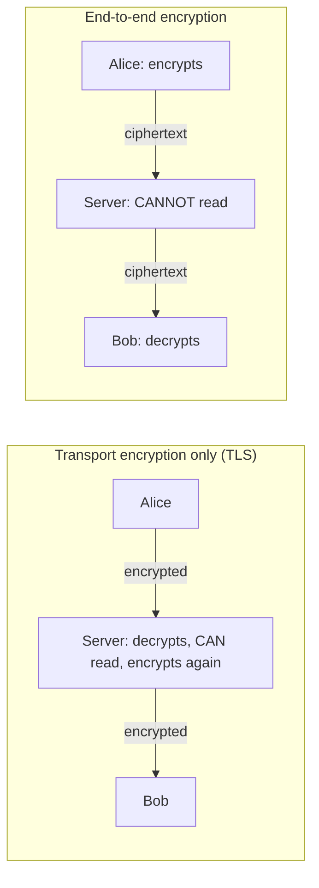
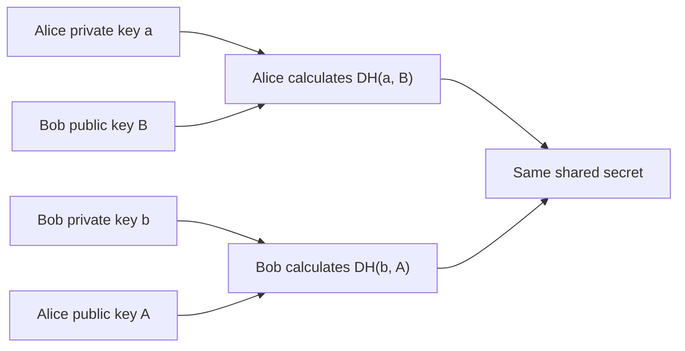
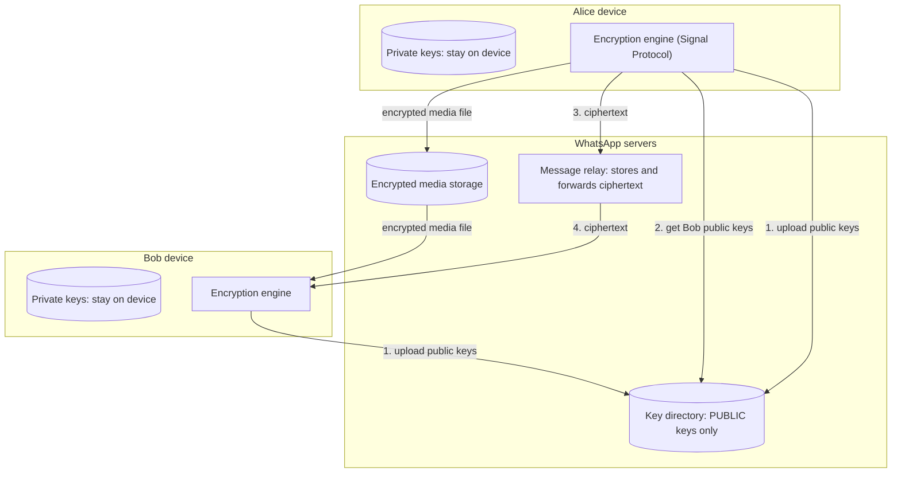
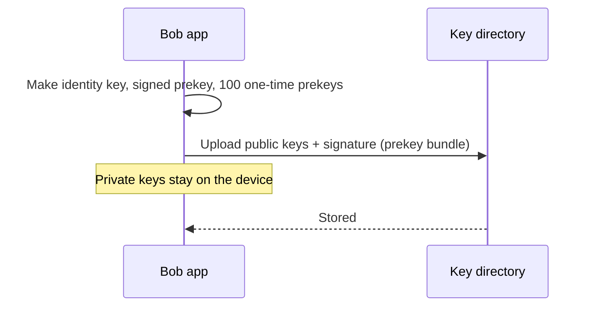
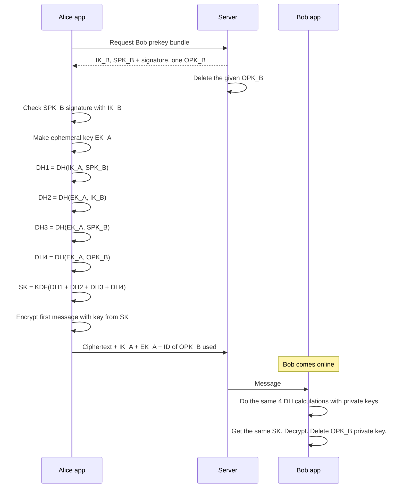
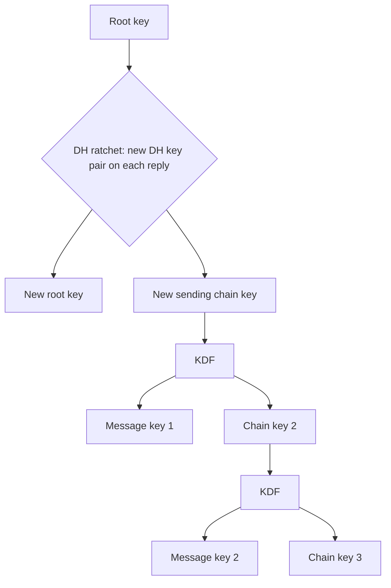
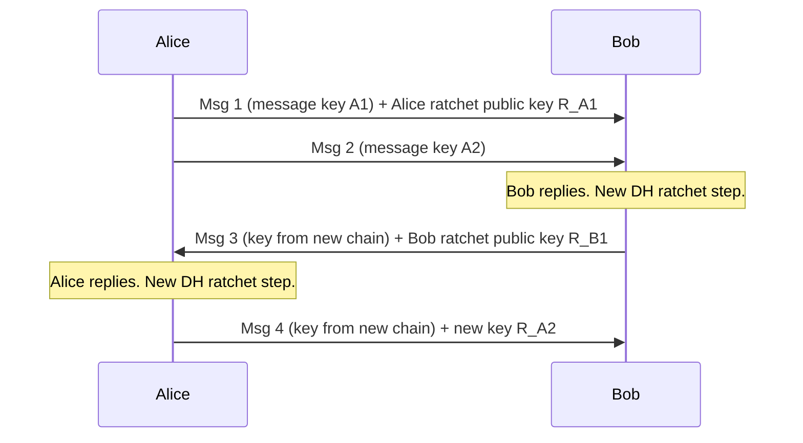
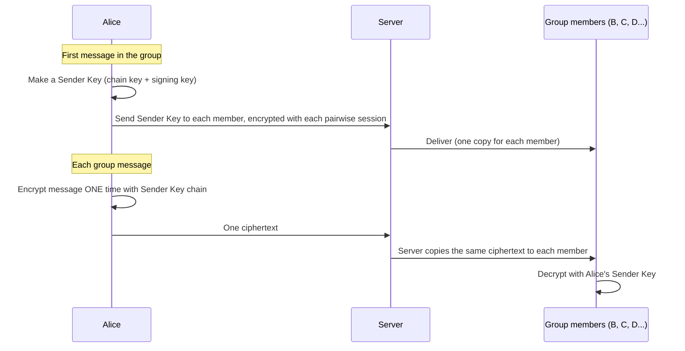
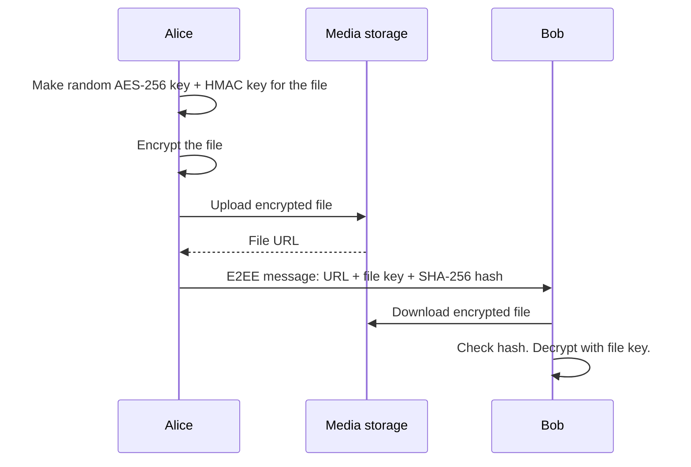
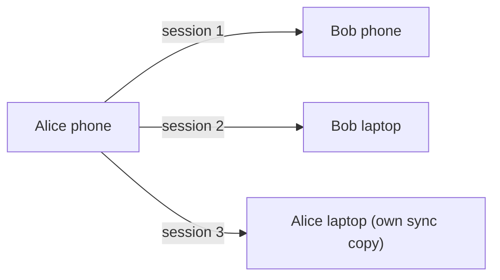

# How End-to-End Encryption Works (WhatsApp and the Signal Protocol)

## 1. Summary

End-to-end encryption (E2EE) makes sure that only the sender and the receiver can read a message. The server sends the message, but the server cannot read it. The encryption keys stay on the user devices. They never go to the server.

WhatsApp uses the **Signal Protocol**. This protocol has three main parts:

1. **X3DH** (Extended Triple Diffie-Hellman): two devices agree on a shared secret key, also when the receiver is offline.
2. **Double Ratchet**: each message gets a new encryption key.
3. **Sender Keys**: group messages are encrypted efficiently.

This document extends `01-chat-service-whatsapp.md`.

## 2. Transport encryption vs end-to-end encryption



| Item | Transport encryption (TLS) | End-to-end encryption |
|------|----------------------------|------------------------|
| Who can read the message | Sender, server, receiver | Sender and receiver only |
| Where keys are | Server and client | User devices only |
| Protects against | Network attackers | Network attackers, server operators, server data leaks |

WhatsApp uses **both**. E2EE protects the message content. A transport layer (based on the Noise Protocol) also protects the connection between the app and the server.

## 3. Basic cryptography concepts

| Concept | Simple description |
|---------|--------------------|
| Symmetric encryption (AES-256) | One key encrypts and decrypts. Very fast. Used for message content. |
| Public/private key pair (Curve25519) | The public key can be shared. The private key stays secret on the device. |
| Diffie-Hellman (DH) key agreement | Two parties combine their own private key with the public key of the other party. Both get the same shared secret. An observer cannot calculate it. |
| Key derivation function (HKDF) | Makes new strong keys from a shared secret. |
| HMAC (HMAC-SHA256) | Proves that nobody changed the message. |
| Digital signature | Proves that a key belongs to the correct owner. |

### Diffie-Hellman in one picture



The private keys never leave the devices. Only the public keys go over the network.

## 4. Keys on each device

| Key | Lifetime | Function |
|-----|----------|----------|
| Identity key pair (IK) | Long-term (the app installation) | Identifies the device. Used for verification ("security code"). |
| Signed prekey (SPK) | Medium-term (changed regularly) | Signed with the identity key. Used to start new sessions. |
| One-time prekeys (OPK) | Used one time | A batch of keys. Each new session uses one key and then the server deletes it. |
| Ephemeral key (EK) | One session setup | Made by the sender for each new session. |
| Root key, chain keys, message keys | Change continuously | Made by the Double Ratchet. Each message uses a new message key. |

## 5. Architecture



The server has two functions only:

1. Keep and distribute **public** keys.
2. Store and forward **encrypted** messages and files.

## 6. Step 1: registration

### Procedure

1. Install the app. The app makes the identity key pair on the device.
2. The app makes one signed prekey. It signs it with the identity private key.
3. The app makes a batch of one-time prekeys (for example, 100).
4. The app uploads only the **public** keys to the key directory.
5. The app keeps all **private** keys in secure local storage.
6. When the server has few one-time prekeys left, the app uploads more.



## 7. Step 2: start a session with X3DH

Alice wants to send her first message to Bob. Bob can be offline. X3DH lets Alice make a shared secret with no reply from Bob.



### What each DH calculation gives

| Calculation | Purpose |
|-------------|---------|
| DH1 (Alice identity + Bob signed prekey) | Proves Alice's identity to Bob. |
| DH2 (Alice ephemeral + Bob identity) | Proves Bob's identity to Alice. |
| DH3 (Alice ephemeral + Bob signed prekey) | Adds a fresh secret for this session. |
| DH4 (Alice ephemeral + Bob one-time prekey) | Adds a one-time secret. This improves forward secrecy. |

The server sees only public keys. Thus, the server cannot calculate SK.

## 8. Step 3: Double Ratchet

After X3DH, both devices use the **Double Ratchet** algorithm. It changes the keys continuously. A "ratchet" moves forward only. You cannot use it to go back.

### Two ratchets



1. **Symmetric-key ratchet (KDF chain):** For each message, a KDF makes a new message key and a new chain key from the old chain key. The device then deletes the old keys.
2. **DH ratchet:** Each time a user replies, the device makes a new DH key pair. It sends the new public key with the message. Both sides then make a new root key and new chain keys.

### Message flow with the ratchet



### Security properties

| Property | Meaning | Which part gives it |
|----------|---------|---------------------|
| **Forward secrecy** | If an attacker steals the current keys, the attacker cannot decrypt old messages. | The KDF chain. Old keys are deleted. |
| **Post-compromise security (break-in recovery)** | If an attacker steals the keys, the attacker loses access after the next DH ratchet step. | The DH ratchet. New random keys. |
| **Out-of-order messages** | Messages that arrive late can still be decrypted. | Each message has a counter. The receiver keeps skipped message keys for a short time. |

## 9. Message encryption format

Each message key makes three values with HKDF:

- An AES-256 key for encryption.
- An HMAC-SHA256 key for integrity.
- An IV (initialization vector).

The WhatsApp security whitepaper describes AES-256 in CBC mode with HMAC-SHA256.

```text
Message on the wire:
+----------------------+-------------------+---------------+-------------------+
| Ratchet public key   | Message counter   | Ciphertext    | HMAC (MAC)        |
+----------------------+-------------------+---------------+-------------------+
```

The receiver checks the HMAC first. If the HMAC is not correct, the receiver discards the message.

## 10. Group messages: Sender Keys

A group with 200 members needs efficient encryption. Encrypting each message 200 times (one time for each member) is slow.



### Procedure

1. Each member makes its own Sender Key for the group.
2. The member sends its Sender Key to each other member through the existing one-to-one encrypted sessions.
3. For each group message, the sender encrypts one time.
4. The server copies the ciphertext to all members (server-side fan-out).
5. When a member leaves the group, all members make new Sender Keys. Then the old member cannot read new messages.

## 11. Media files (images, video, documents)



The media storage has only encrypted files. The key travels inside the normal E2EE message.

## 12. Multi-device

Each device (phone, laptop, web) has its **own identity key**. The devices do not share private keys.



- The sender encrypts each message one time for **each device** of the receiver and for its own other devices (client-side fan-out).
- The primary device signs the identity keys of the linked devices. Other users can check that a new device belongs to the correct account.
- More devices means more encryption work for each message.

## 13. Verification: protection against a malicious server

The server distributes public keys. A malicious server could give Alice a false key for Bob ("man-in-the-middle" attack). The protocol uses these controls:

| Control | How it works |
|---------|--------------|
| Security code (safety number) | Each chat shows a 60-digit number or a QR code made from the identity keys of both users. Users compare it in person or on a call. If the numbers are the same, there is no man-in-the-middle. |
| Key change notification | The app can show a message when a contact's security code changes. |
| Key transparency | WhatsApp publishes an auditable key directory. Clients and auditors can check that the server gives the same key to all users. |

## 14. Encrypted backups

A backup to the cloud must not break E2EE.

1. The user sets a password or uses a 64-digit encryption key.
2. The app encrypts the backup on the device.
3. If the user chooses a password, a hardware security module (HSM) vault protects the backup key. The vault limits password attempts.
4. The cloud provider stores only encrypted data.

## 15. What E2EE does NOT protect

Explain these limits in an interview. They show a good understanding.

| Not protected | Reason |
|---------------|--------|
| Metadata | The server must know who sends to whom, when, from which IP address, and message sizes. |
| A compromised device | Malware or a person with access to an unlocked phone can read the messages. |
| The receiver | The receiver can take a screenshot or forward the message. |
| Unencrypted backups | If the user turns off backup encryption, the cloud provider can have readable copies. |
| Fake apps | A modified app can send messages or keys to an attacker. |

## 16. System design impact

E2EE changes the server design:

| Feature | Impact | Common solution |
|---------|--------|-----------------|
| Server-side search | Not possible. The server cannot read messages. | Search on the device only. |
| Spam and abuse detection | The server cannot check content. | Use metadata signals, rate limits, and user reports (the reporter sends the messages). |
| Message history on a new device | The server cannot decrypt the history. | Transfer from the old device, or use an encrypted backup. |
| Link previews | The server must not fetch URLs for the user. | The sender device makes the preview. |
| Key directory load | Each new session requests a prekey bundle. | Cache bundles. Make clients upload prekeys in batches. |
| Message size | Each device needs a separate copy in multi-device chats. | Use Sender Keys for groups. |

## 17. Trade-offs

- **Privacy vs features:** E2EE gives strong privacy. But server-side search, moderation, and cloud history become difficult.
- **Security vs usability:** Key verification is strong. But most users never compare security codes.
- **Multi-device vs simplicity:** Separate keys for each device are safer. But each message needs more encryption work and more copies.
- **Forward secrecy vs recovery:** Deleting old keys protects old messages. But the user cannot recover messages if the device is lost and no backup exists.

## 18. Interview follow-up questions

1. How can Alice send an encrypted message to Bob when Bob is offline?
2. What is the difference between forward secrecy and post-compromise security?
3. How does a group chat with 1,000 members stay efficient with E2EE?
4. How do you stop the server from doing a man-in-the-middle attack?
5. What happens to the keys when a member leaves a group?
6. How do you report spam if the server cannot read messages?
7. What information can the server still see?
