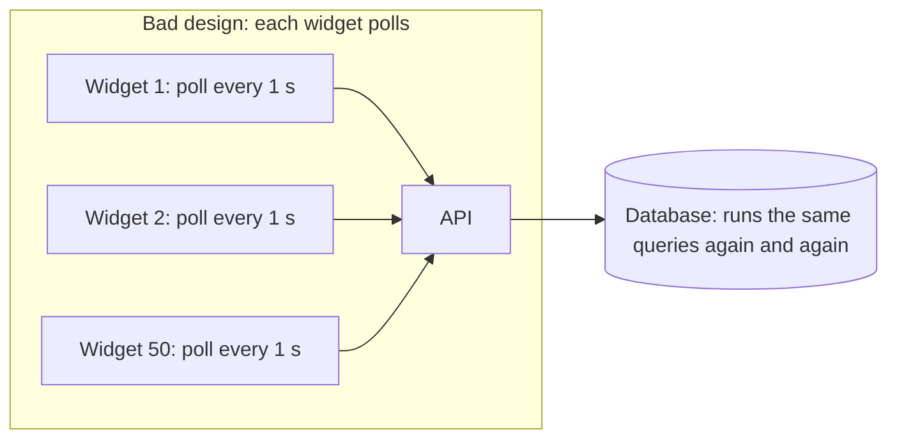
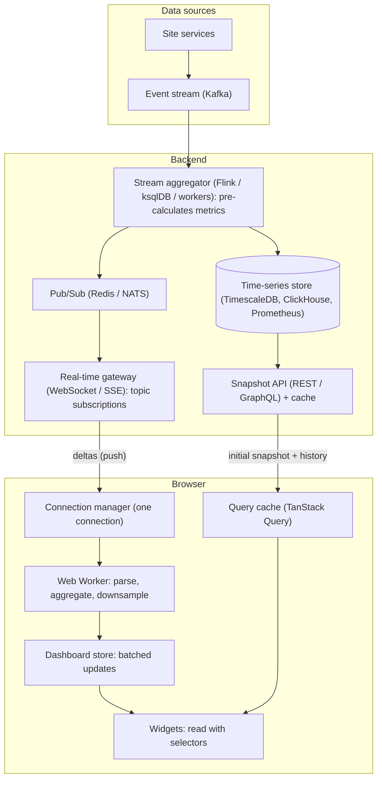
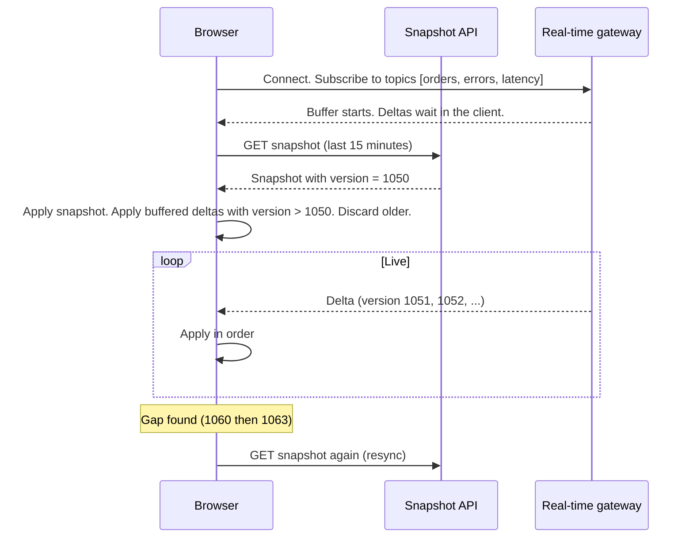
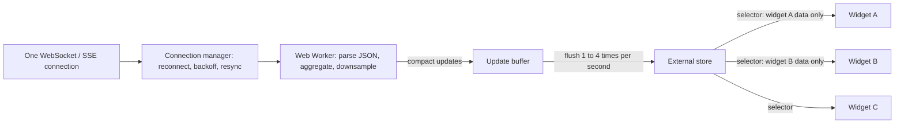
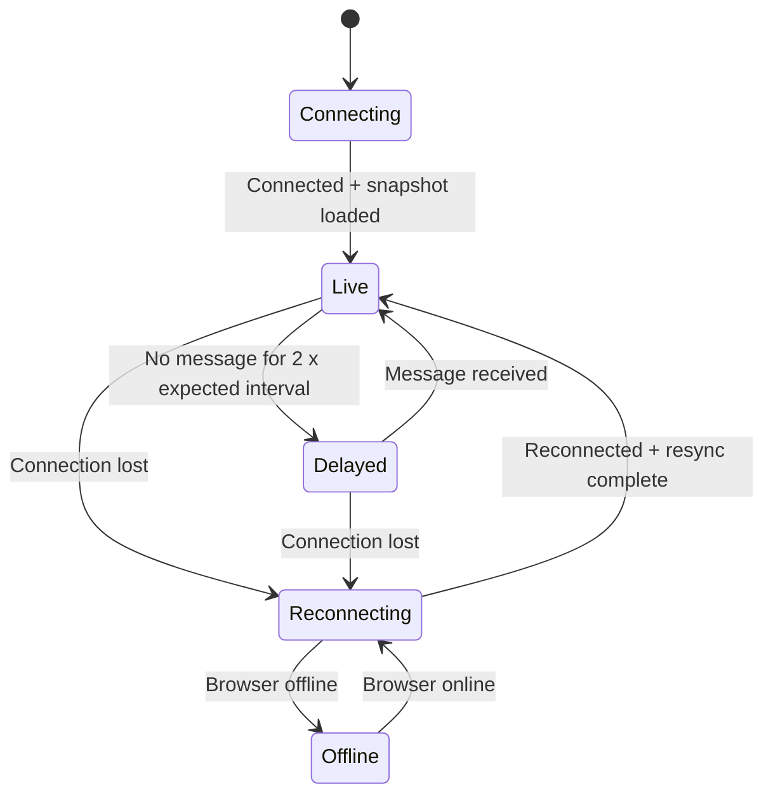
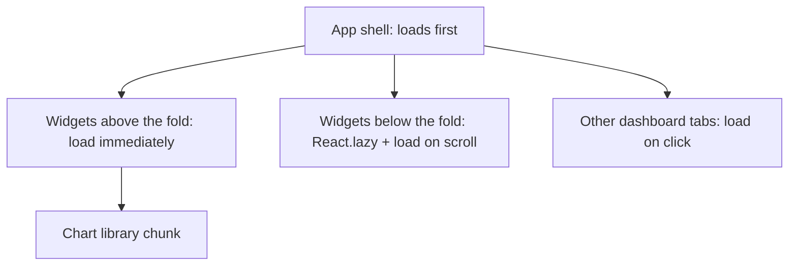

# Design a Large Real-Time Dashboard in React

## 1. Summary

A real-time dashboard shows live data from a site: traffic, orders, errors, server health, and business metrics. The data changes every second. A large dashboard can have 30 to 100 widgets, tables with thousands of rows, and charts with thousands of points.

The main risks are:

- The browser becomes slow or crashes because of too many re-renders or too much memory.
- The backend becomes overloaded because many dashboards send many requests.
- The data becomes old or wrong after a network failure, and the user does not know.

The design uses four principles:

| Principle | Meaning |
|-----------|---------|
| **1. Push, do not pull** | The server sends changes to the browser. Each widget does not poll separately. |
| **2. One pipe, many readers** | One connection and one data store for the full dashboard. Widgets read only the data they need. |
| **3. Render at human speed** | Data can arrive 100 times each second. The screen updates at a controlled rate (for example, 1 to 4 times each second). |
| **4. Limit everything** | Limit memory, rows, chart points, requests, and retries. Isolate failures to one widget. |

## 2. Requirements

### Functional requirements

- Show 30 to 100 widgets: KPI cards, line charts, tables, maps, alerts.
- Update data within 1 to 5 seconds of the event.
- Let users filter by time range, region, and service.
- Show the data status: live, delayed, or disconnected.

### Non-functional requirements

| Requirement | Target |
|-------------|--------|
| Browser stability | Runs for 24 hours or more (for example, on a wall TV) with no memory growth. |
| Responsiveness | User input responds in less than 200 ms (good INP). |
| Frame rate | No long freezes. Main thread tasks shorter than 50 ms. |
| Backend load | Supports thousands of open dashboards with no overload. |
| Failure handling | One failed widget does not stop the dashboard. Network loss does not crash the page. |

## 3. Why many polling requests break the system



**Calculation:** 50 widgets × 1 request each second × 2,000 open dashboards = **100,000 requests each second**. Most responses contain the same data as the previous response.

Problems:

- The backend and the database get very high load.
- The browser has 50 timers, 50 requests, and 50 separate re-renders each second.
- A slow response can arrive after a newer response. Then the widget shows older data.
- When the network returns after a failure, all widgets send requests at the same time.

## 4. High-level architecture



### Backend rules

- **Pre-aggregate on the server.** Calculate "orders per minute" one time in the stream aggregator. Do not calculate it in each browser or each request.
- **Send deltas, not full data.** After the first snapshot, send only changed values.
- **Fan out with pub/sub.** One calculated update goes to all subscribed dashboards. The database does not get one query for each dashboard.
- **Topic subscriptions.** Each browser subscribes only to the topics of its visible widgets.

## 5. Transport: choose the correct method

| Method | Direction | Latency | Backend cost | Use for |
|--------|-----------|---------|--------------|---------|
| Short polling | Client asks | Interval delay | High | Slow data (every 30 to 60 s). Simple widgets. |
| Long polling | Client asks, server waits | Low | Medium | Fallback when WebSocket is blocked. |
| **Server-Sent Events (SSE)** | Server to client | Low | Low | Most dashboards. Data flows one way. Uses normal HTTP. Auto-reconnect is built in. |
| **WebSocket** | Both directions | Low | Low | Dashboards that also send commands, or need binary data. |

**Recommendation:** Use SSE or WebSocket for live data. Use REST or GraphQL for the first snapshot and for history. Use polling only for slow, low-priority data.

### Snapshot + delta flow



Each message has a **version** or **sequence number**. The client uses it to find gaps, discard duplicates, and keep the correct order.

## 6. Browser architecture



### 6.1 One connection for the full dashboard

- Open **one** connection for all widgets. Do not open one connection for each widget.
- The connection manager keeps a list of active topics. It subscribes when the first widget needs a topic. It unsubscribes when the last widget leaves.
- For many tabs of the same dashboard, use a **SharedWorker** or **BroadcastChannel**. Then all tabs share one connection.

### 6.2 Move heavy work off the main thread

The main thread runs React and handles user input. Heavy work on the main thread makes the page freeze.

Move this work to a **Web Worker**:

- Parse large JSON messages.
- Calculate aggregates (sum, average, percentiles).
- Downsample chart data.
- Sort and filter large tables.

### 6.3 Batch updates

Data can arrive 100 times each second. Do not re-render 100 times each second.

1. Put each incoming update in a buffer.
2. Combine updates for the same key. Keep only the newest value.
3. Apply the buffer to the store at a fixed rate (for example, every 250 ms to 1,000 ms).
4. Notify only the widgets with changed data.

### 6.4 Use an external store with selectors

Do not put live data in a high-level React Context. A change in Context re-renders all consumers.

Use an external store (Zustand, Redux Toolkit, Jotai, or a custom store) with `useSyncExternalStore`. Each widget subscribes to its own slice of data. A change in "errors" does not re-render the "orders" widget.

## 7. Code examples (TypeScript)

### 7.1 Connection manager with reconnect and backoff

```typescript
type Listener = (msg: LiveMessage) => void;
type Status = 'connecting' | 'live' | 'reconnecting' | 'offline';

export class ConnectionManager {
  private ws?: WebSocket;
  private attempt = 0;
  private topics = new Map<string, number>(); // topic -> number of widgets
  private listeners = new Set<Listener>();
  private statusListeners = new Set<(s: Status) => void>();

  constructor(private url: string) {}

  connect() {
    this.setStatus(this.attempt === 0 ? 'connecting' : 'reconnecting');
    this.ws = new WebSocket(this.url);

    this.ws.onopen = () => {
      this.attempt = 0;
      this.setStatus('live');
      // Subscribe again to all active topics after a reconnect
      this.send({ type: 'subscribe', topics: [...this.topics.keys()] });
      this.listeners.forEach((l) => l({ type: 'resync' } as LiveMessage));
    };

    this.ws.onmessage = (e) => {
      const msg = JSON.parse(e.data) as LiveMessage;
      this.listeners.forEach((l) => l(msg));
    };

    this.ws.onclose = () => this.scheduleReconnect();
    this.ws.onerror = () => this.ws?.close();
  }

  private scheduleReconnect() {
    this.attempt++;
    // Exponential backoff with jitter: 1 s, 2 s, 4 s ... max 30 s
    const base = Math.min(30_000, 1_000 * 2 ** (this.attempt - 1));
    const delay = base / 2 + Math.random() * (base / 2);
    this.setStatus(navigator.onLine ? 'reconnecting' : 'offline');
    setTimeout(() => this.connect(), delay);
  }

  subscribe(topic: string) {
    const count = this.topics.get(topic) ?? 0;
    this.topics.set(topic, count + 1);
    if (count === 0) this.send({ type: 'subscribe', topics: [topic] });
  }

  unsubscribe(topic: string) {
    const count = (this.topics.get(topic) ?? 1) - 1;
    if (count <= 0) {
      this.topics.delete(topic);
      this.send({ type: 'unsubscribe', topics: [topic] });
    } else {
      this.topics.set(topic, count);
    }
  }

  onMessage(l: Listener) { this.listeners.add(l); return () => this.listeners.delete(l); }
  onStatus(l: (s: Status) => void) { this.statusListeners.add(l); return () => this.statusListeners.delete(l); }
  private setStatus(s: Status) { this.statusListeners.forEach((l) => l(s)); }
  private send(data: unknown) {
    if (this.ws?.readyState === WebSocket.OPEN) this.ws.send(JSON.stringify(data));
  }
}
```

### 7.2 Store with batched flush

```typescript
type State = Record<string, MetricValue>;

export function createLiveStore(flushMs = 500) {
  let state: State = {};
  let pending: State = {};
  let timer: ReturnType<typeof setTimeout> | null = null;
  const subscribers = new Set<() => void>();

  function flush() {
    timer = null;
    if (Object.keys(pending).length === 0) return;
    state = { ...state, ...pending };   // New object: changed keys only
    pending = {};
    subscribers.forEach((s) => s());
  }

  return {
    // Called for every incoming message. Very cheap. No render here.
    push(key: string, value: MetricValue) {
      pending[key] = value;            // Newest value wins
      if (!timer) timer = setTimeout(flush, flushMs);
    },
    getState: () => state,
    subscribe(cb: () => void) {
      subscribers.add(cb);
      return () => subscribers.delete(cb);
    },
  };
}
```

### 7.3 Widget hook with a selector

```typescript
import { useEffect, useSyncExternalStore } from 'react';

export function useLiveMetric(topic: string) {
  useEffect(() => {
    connection.subscribe(topic);
    return () => connection.unsubscribe(topic);   // Cleanup prevents leaks
  }, [topic]);

  // Re-renders only when THIS key changes (same reference = no render)
  return useSyncExternalStore(
    liveStore.subscribe,
    () => liveStore.getState()[topic],
  );
}
```

### 7.4 Subscribe only when the widget is visible

```typescript
import { useEffect, useRef, useState } from 'react';

export function useIsVisible<T extends Element>() {
  const ref = useRef<T>(null);
  const [visible, setVisible] = useState(false);
  useEffect(() => {
    if (!ref.current) return;
    const io = new IntersectionObserver(([e]) => setVisible(e.isIntersecting), {
      rootMargin: '200px',               // Start a little before it is on screen
    });
    io.observe(ref.current);
    return () => io.disconnect();
  }, []);
  return { ref, visible };
}

function OrdersWidget() {
  const { ref, visible } = useIsVisible<HTMLDivElement>();
  return (
    <div ref={ref} className="widget">
      {visible ? <LiveOrdersChart /> : <WidgetPlaceholder />}
    </div>
  );
}
```

A widget that is not on the screen does not subscribe, does not render, and does not use memory for live data.

### 7.5 Ring buffer for chart data

A chart that adds a point each second for 24 hours gets 86,400 points. Memory grows and rendering becomes slow. Use a fixed-size buffer.

```typescript
export class RingBuffer<T> {
  private items: (T | undefined)[];
  private start = 0;
  private size = 0;

  constructor(private capacity: number) {
    this.items = new Array(capacity);
  }

  push(item: T) {
    const index = (this.start + this.size) % this.capacity;
    this.items[index] = item;
    if (this.size < this.capacity) this.size++;
    else this.start = (this.start + 1) % this.capacity; // Overwrite oldest
  }

  toArray(): T[] {
    return Array.from({ length: this.size }, (_, i) =>
      this.items[(this.start + i) % this.capacity] as T);
  }
}

// Keep only the last 15 minutes at 1 point per second
const latencySeries = new RingBuffer<Point>(900);
```

### 7.6 Polling for slow data (TanStack Query)

```typescript
const { data } = useQuery({
  queryKey: ['daily-revenue', region],
  queryFn: ({ signal }) => fetchJson(`/api/revenue?region=${region}`, { signal }),
  refetchInterval: 60_000,              // Slow data: every 60 s
  refetchIntervalInBackground: false,   // Stop when the tab is hidden
  staleTime: 30_000,
  retry: 3,
  retryDelay: (n) => Math.min(30_000, 1_000 * 2 ** n),
});
```

TanStack Query removes duplicate requests, cancels old requests with `AbortSignal`, and keeps the last good data during an error.

## 8. Rendering large data

### 8.1 Tables

- Use **virtualization** (TanStack Virtual, react-window). Render only the visible rows. A table with 50,000 rows renders approximately 30 rows.
- Use stable row keys. Do not use the array index as the key.
- Memoize row components with `React.memo`.
- Do sorting and filtering in the Web Worker or on the server.
- Use server-side pagination for very large data sets.

### 8.2 Charts

| Number of points | Renderer | Example libraries |
|------------------|----------|-------------------|
| Less than approx. 1,000 | SVG | Recharts, Nivo, Victory |
| 1,000 to 100,000+ | Canvas | uPlot, Apache ECharts (canvas mode), Chart.js |
| Very large (millions) | WebGL | deck.gl, regl-based charts, ECharts GL |

- **Downsample** before you draw. A chart 800 pixels wide cannot show more than approx. 800 x-values. Use the LTTB (Largest-Triangle-Three-Buckets) algorithm. It keeps the visual shape with fewer points.
- **Update the chart directly** with the library API (for example, `chart.setData()`). Do not re-create the chart component on each update.
- **Pause animations** for live updates. Animations use CPU on each update.

### 8.3 Use React concurrent features

```typescript
const deferredRows = useDeferredValue(rows);   // Typing in a filter stays fast
const [isPending, startTransition] = useTransition();

function onRangeChange(range: TimeRange) {
  startTransition(() => setRange(range));      // Heavy update is not urgent
}
```

`useTransition` and `useDeferredValue` let React keep user input fast while it renders heavy updates in the background.

## 9. Isolate failures

### 9.1 Error boundary for each widget

```tsx
<ErrorBoundary
  FallbackComponent={WidgetError}          // "This widget failed. Retry."
  resetKeys={[filters]}
  onError={(err) => reportError(err, { widget: 'orders-chart' })}
>
  <Suspense fallback={<WidgetSkeleton />}>
    <OrdersChart />
  </Suspense>
</ErrorBoundary>
```

A bad message or a code error in one widget stops only that widget. The other widgets continue.

### 9.2 Validate incoming data

- Check each message with a schema (for example, Zod) in the Web Worker.
- Discard messages that are not valid. Record an error.
- Do not let one bad message stop the update pipeline.

### 9.3 Show data status



- Show a status badge: **Live**, **Delayed**, **Reconnecting**, or **Offline**.
- Show "Last updated: 10:42:15" on each widget.
- Keep the last good data on the screen during a failure. Mark it as old (for example, grey color). Do not show an empty widget.

## 10. Prevent browser crashes

| Cause | Prevention |
|-------|------------|
| Memory grows over hours | Ring buffers. Limit history. Clean up subscriptions, timers, and listeners in `useEffect` cleanup. |
| Too many re-renders | Batch updates. Selectors. `React.memo`. Do not use live data in a high-level Context. |
| Long main-thread tasks | Web Workers for parsing and calculation. Split large work into small parts. |
| Too many DOM nodes | Virtualization. Lazy-load widgets below the screen. |
| Heavy charts | Canvas or WebGL. Downsampling. No animations for live updates. |
| Requests from a hidden tab | Page Visibility API: pause or slow updates when the tab is hidden. |
| Old responses overwrite new data | Version numbers. `AbortController` to cancel old requests. |
| Request storm after network return | One connection. Backoff with jitter. One resync, not one request for each widget. |
| Third-party chart library leaks | Call the library `destroy()` method on unmount. |

### Page Visibility example

```typescript
useEffect(() => {
  const onChange = () => {
    if (document.hidden) connection.pause();       // Unsubscribe from fast topics
    else connection.resumeAndResync();             // Get a fresh snapshot
  };
  document.addEventListener('visibilitychange', onChange);
  return () => document.removeEventListener('visibilitychange', onChange);
}, []);
```

## 11. Protect the backend

| Control | Description |
|---------|-------------|
| Pre-aggregation | Calculate metrics one time on the server for all users. |
| Pub/sub fan-out | One update goes to many dashboards. No database query for each dashboard. |
| Cached snapshots | Cache the snapshot API response for 1 to 5 seconds. Many users get the same response. |
| Server-side throttling | The gateway sends a maximum number of updates for each topic each second. It combines updates. |
| Connection limits | Limit open connections for each user. |
| Rate limits | Limit snapshot and history requests for each user. |
| Backpressure | If a client is slow, the gateway drops old updates for that client and sends only the newest value. |
| Jitter on reconnect | Clients do not reconnect at the same time after a server restart. |

## 12. Dashboard layout and code splitting



- Use `React.lazy` for each widget type. The first page load is smaller.
- Load heavy libraries (maps, WebGL charts) only for the widgets that need them.
- Use a widget registry. A JSON configuration defines the layout. Then users can configure dashboards with no code change.

## 13. Monitoring the dashboard

Measure the dashboard in production:

| Metric | Tool |
|--------|------|
| INP, LCP, CLS | `web-vitals` library, Real User Monitoring |
| Long tasks (more than 50 ms) | `PerformanceObserver` with type `longtask` |
| Memory use over time | `performance.memory` (Chrome) or periodic heap snapshots in tests |
| Render count and time | React Profiler, React DevTools |
| Message rate and lag | Custom metrics: messages per second, time from event to screen |
| Reconnects and errors | Error tracking (Sentry, Datadog RUM) |

## 14. Testing

| Test | Purpose |
|------|---------|
| Message flood test | Send 1,000 messages each second to the browser. Check that the frame rate and INP stay good. |
| Soak test | Run the dashboard for 24 hours. Check that memory does not grow. |
| Network test | Disconnect and reconnect many times. Check status badges and correct resync. |
| Bad data test | Send messages that are not valid. Check that only one widget shows an error. |
| Load test on the gateway | Open thousands of connections. Check server CPU, memory, and fan-out latency. |
| Visual regression | Check widgets with Playwright screenshots. |

## 15. Trade-offs

- **Push vs polling:** Push gives fresh data with low backend load. But it needs a stateful gateway and reconnect logic.
- **Update rate vs performance:** Faster screen updates look more "live." But they use more CPU. Most people cannot read numbers that change more than 2 to 4 times each second.
- **Pre-aggregation vs flexibility:** Server aggregates are cheap to serve. But new custom metrics need backend changes.
- **Canvas vs SVG charts:** Canvas is much faster for large data. But it is less accessible and harder to style.
- **Keep history vs memory:** More history in the browser lets users zoom without requests. But it uses more memory. Load old history from the server on demand.

## 16. Interview follow-up questions

1. Why is one WebSocket better than 50 polling widgets?
2. How do you prevent the dashboard from re-rendering 100 times each second?
3. How does the dashboard recover correct data after a 2-minute network failure?
4. How do you show a chart with 1 million points?
5. How do you make sure that the dashboard runs on a wall TV for a week with no crash?
6. What happens on the backend when 10,000 users open the dashboard at 9:00 AM?
7. How do you stop one broken widget from breaking the full dashboard?
