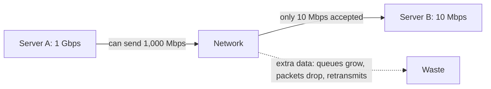
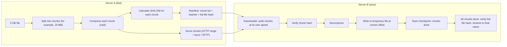
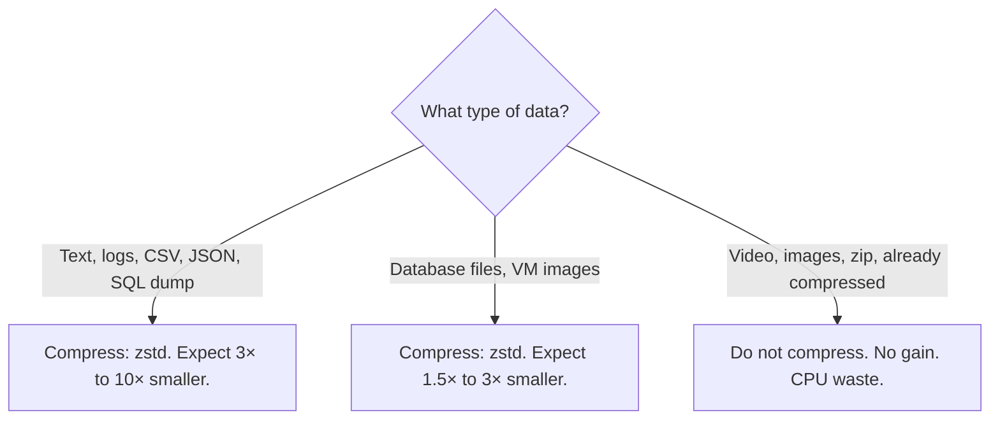
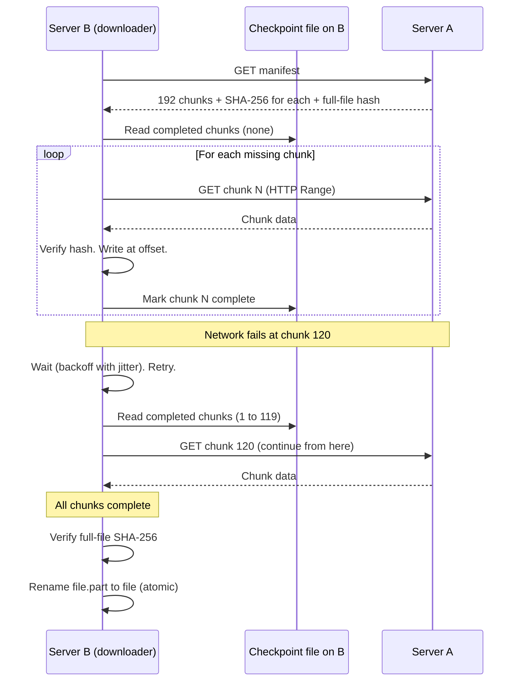
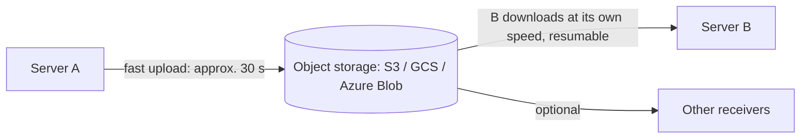
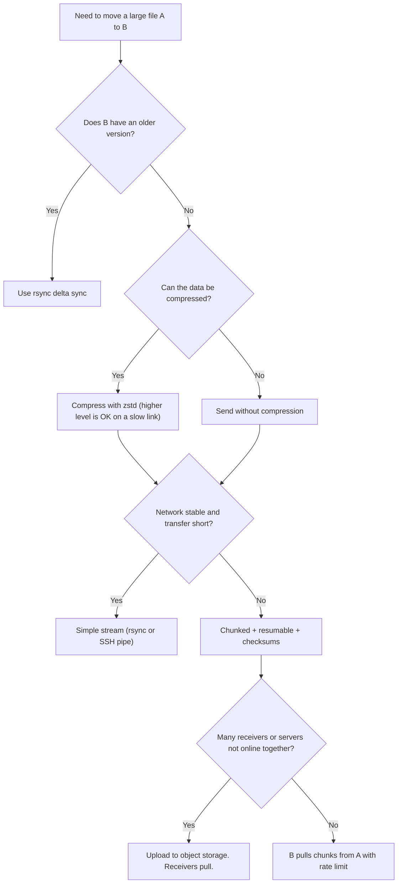

# Transfer a Large File from a Fast Server to a Slow Server

## 1. Summary

Server A has a capacity of 1 Gbps. Server B has a capacity of 10 Mbps. The task is to transfer a 3 GB file from A to B.

**The slowest part decides the speed.** The transfer cannot be faster than 10 Mbps. If A sends faster, the extra data waits in buffers or the network drops it. A powerful sender does not make a slow receiver faster.

Thus, an effective transfer does four things:

| No. | Goal | Method |
|-----|------|--------|
| 1 | **Send fewer bytes** | Compression, delta sync, deduplication |
| 2 | **Let the slow side control the speed** | Flow control, backpressure, receiver pulls data |
| 3 | **Do not start again after a failure** | Chunks, resume, checkpoints |
| 4 | **Make sure that the file is correct** | Checksums for each chunk and for the full file |

## 2. Clarify the units first

In an interview, check the units. A small mistake changes the answer by 8 times.

| Unit | Meaning |
|------|---------|
| Mbps (megabits per second) | Network speed. 1 byte = 8 bits. |
| MB/s (megabytes per second) | Disk or file speed. |
| 10 Mbps | Approximately 1.25 MB/s |
| 1 Gbps | Approximately 125 MB/s |

Also ask: is the 10 Mbps limit on the **network** of B or on the **disk** of B? The method is the same. The bottleneck is different.

## 3. Calculate the minimum time

```text
File size      : 3 GB = 3 × 1,024 MB = 3,072 MB
In megabits    : 3,072 × 8 = 24,576 Mb
Bottleneck     : 10 Mbps
Ideal time     : 24,576 / 10 = 2,458 s ≈ 41 minutes
Real time      : approx. 45 to 50 minutes (protocol overhead, TCP, encryption, retries)
```

| Method | Time |
|--------|------|
| Transfer at the speed of A (1 Gbps) | approx. 25 seconds (not possible, B is the limit) |
| Transfer at the speed of B (10 Mbps), no compression | approx. 41 to 50 minutes |
| With 3× compression (for example, logs, CSV, JSON) | approx. 14 to 17 minutes |
| With 10× compression (very repetitive text) | approx. 4 to 5 minutes |
| With delta sync (B has an old version, 5% changed) | approx. 2 to 3 minutes |

**Conclusion:** The only way to finish faster is to **send fewer bytes**. Pushing harder from A does not help.

## 4. The bottleneck



If A sends too fast with no control:

- Buffers fill on routers and on B.
- The network drops packets. TCP sends them again. This wastes capacity.
- Memory on B or on an application buffer can grow until the process crashes.
- Other services on B become slow, because the transfer uses all its capacity.

## 5. Recommended architecture



### Why B pulls the data

- **B knows its own capacity.** B requests the next chunk only when it is ready. This is natural backpressure.
- **A does not need to know the speed of B.**
- **Resume is simple.** B knows which chunks it has. After a failure, B requests only the missing chunks.

## 6. Step 1: send fewer bytes

### 6.1 Compression



**Important point:** The network is very slow. Thus, you can use a **higher** compression level. Compression only needs to be faster than 10 Mbps (1.25 MB/s). zstd at medium levels compresses at tens to hundreds of MB/s. Choose the level that gives the smallest output while it is still faster than the link.

| Tool | Speed | Ratio | Note |
|------|-------|-------|------|
| zstd (level 3 to 19) | Fast | Good to very good | Recommended. Multi-thread with `-T0`. |
| gzip | Medium | Good | Available everywhere. |
| xz | Slow | Very good | Use if CPU time is not a problem. |
| lz4 | Very fast | Low | Use for fast networks, not for this case. |

Decompression on B is also fast. It uses little CPU and does not slow B.

### 6.2 Delta sync

If B already has an older version of the file, send only the changed parts.

- **rsync** splits the file into blocks. It calculates checksums on both sides. It sends only the blocks that are different.
- For a 3 GB file with 5% changes, rsync sends approximately 150 MB plus a small checksum overhead.

### 6.3 Deduplication

For repeated transfers (for example, daily backups), use content-defined chunking. Tools such as restic or borg send only new chunks.

## 7. Step 2: let the slow side control the speed

### 7.1 TCP flow control

TCP already has flow control. The receiver tells the sender how much data it can accept (the "receive window"). If B reads slowly, the window becomes small, and A sends less. Thus, a normal TCP stream does not overload B by itself.

Problems occur when the **application** ignores this. Example: the app on A reads the full 3 GB into memory, or the app on B reads from the network faster than it writes to disk and keeps the data in memory.

### 7.2 Backpressure in the application (Node.js example)

`stream.pipeline` respects backpressure. It reads from the source only when the destination is ready.

```typescript
import { createWriteStream } from 'node:fs';
import { pipeline } from 'node:stream/promises';
import { createZstdDecompress } from 'node:zlib'; // Node 22+; or use a zstd package
import { createHash } from 'node:crypto';
import { Transform } from 'node:stream';

async function downloadChunk(url: string, start: number, end: number, out: string, expected: string) {
  const res = await fetch(url, { headers: { Range: `bytes=${start}-${end}` } });
  if (res.status !== 206 || !res.body) throw new Error(`Bad response ${res.status}`);

  const hash = createHash('sha256');
  const hashStream = new Transform({
    transform(chunk, _enc, cb) { hash.update(chunk); cb(null, chunk); },
  });

  // Backpressure: the network is read only as fast as the disk can write
  await pipeline(res.body, hashStream, createZstdDecompress(), createWriteStream(out));

  if (hash.digest('hex') !== expected) throw new Error('Checksum failed: download again');
}
```

**Do not** do this:

```typescript
const data = await (await fetch(url)).arrayBuffer(); // Loads 3 GB into memory
```

### 7.3 Rate limit on purpose

Server B also has other work (for example, it serves users). Do not use 100% of its capacity.

- Limit the transfer to approximately 70% to 80% of the capacity of B (for example, 7 to 8 Mbps).
- Schedule the transfer at a time of low use (for example, at night).
- Use QoS or traffic shaping (`tc` on Linux) if necessary.

### 7.4 Parallel connections do not help here

| Situation | Do parallel streams help? |
|-----------|---------------------------|
| Receiver capacity is the bottleneck (this case) | **No.** All streams share the same 10 Mbps. They add overhead. |
| High latency network with a large bandwidth (for example, 1 Gbps between continents) | Yes. One TCP stream cannot fill a large bandwidth-delay product. |
| Many small files | Yes. Parallel transfers hide the per-file overhead. |

Use one stream, or a maximum of 2 to keep the link full during chunk changes.

## 8. Step 3: make the transfer resumable

A 45-minute transfer has a real chance of a network failure. Without resume, a failure at 44 minutes means a restart from zero.

### Chunk size

| Chunk size | Number of chunks for 3 GB | Time for each chunk at 10 Mbps | Note |
|------------|---------------------------|--------------------------------|------|
| 1 MB | 3,072 | approx. 1 s | Too many requests and checkpoints. |
| **16 MB** | **192** | **approx. 13 s** | **Good balance.** A failure loses a maximum of approx. 13 s of work. |
| 256 MB | 12 | approx. 3.5 min | A failure loses too much work. |

### Resume flow



### Procedure

1. On A, create a manifest with the chunk list, chunk hashes, and the full-file hash.
2. On B, check free disk space before the transfer. Pre-allocate the file (for example, with `fallocate`).
3. Download each chunk. Verify its hash.
4. Write each chunk to a temporary file (`file.part`) at its offset.
5. Record each completed chunk in a checkpoint file.
6. After a failure, read the checkpoint. Download only the missing chunks.
7. After the last chunk, verify the full-file hash.
8. Rename `file.part` to the final name. The rename is atomic, so no process reads a half-written file.

## 9. Step 4: verify the data

| Check | Purpose |
|-------|---------|
| Hash for each chunk (SHA-256 or xxHash) | Finds a bad chunk. Only that chunk is downloaded again. |
| Hash for the full file | Confirms that the final file is the same as the source. |
| Size check | Fast first check before the hash. |
| Encryption in transit (SSH, TLS) | Protects the data on the network. TLS and SSH also detect changes in transit. |

## 10. Practical tools and commands

### Option 1: rsync over SSH (simple and good for most cases)

```bash
# Run on server B (pull) or server A (push).
#   --partial / --partial-dir : keep partial data for resume
#   --compress-choice=zstd    : compress in transit (rsync 3.2+)
#   --bwlimit=1000            : approx. 1,000 KiB/s, which is approx. 8 Mbps
#   --checksum                : compare files by checksum
rsync -av \
  --partial --partial-dir=.rsync-partial \
  --compress --compress-choice=zstd \
  --bwlimit=1000 \
  --checksum \
  --progress \
  userA@serverA:/data/bigfile.bin /data/
```

- rsync does compression, delta sync, resume, and checksums.
- Run it again after a failure. It continues from the partial data.

### Option 2: HTTP with range requests (resumable download)

```bash
# On server B.
#   --continue-at -  : resume from the current file size
#   --limit-rate 1M  : approx. 8 Mbps
curl --continue-at - \
     --limit-rate 1M \
     --retry 10 --retry-delay 5 \
     -o bigfile.bin.zst.part \
     https://serverA.internal/files/bigfile.bin.zst
```

### Option 3: Compressed stream over SSH (fast setup, NOT resumable)

```bash
# On server A. pv -L 1m limits the rate to 1 MB/s.
zstd -T0 -10 -c /data/bigfile.bin \
  | pv -L 1m \
  | ssh userB@serverB 'zstd -d -o /data/bigfile.bin.part'
```

Use this only on a stable network. If the connection fails, the transfer starts again from zero.

### Option 4: Object storage in the middle



- A uploads quickly and is free immediately.
- B downloads with resume and range requests at its own speed.
- This decouples the two servers. It is good when more than one server needs the file, or when A and B are not online at the same time.

## 11. Disk write performance on B

If the 10 Mbps limit is the **disk** of B (not the network):

- Write in large sequential blocks (for example, 1 MB or more). Many small random writes are slow.
- Do not call `fsync` after each small write. Call it after each chunk.
- Decompress on B before the write. Then B writes the final data one time only. (If disk is the limit and network is not, compression does not decrease the disk writes. Delta sync still helps.)
- Pre-allocate the file to decrease fragmentation.
- Use `ionice` (Linux) to give the transfer a low disk priority, so other services on B stay fast.

## 12. Decision flow



## 13. Common mistakes

| Mistake | Result |
|---------|--------|
| Expecting the speed of A | Wrong time estimate. The limit is B. |
| Mbps and MB/s confusion | Estimate wrong by 8 times. |
| Loading the full file into memory | Memory error or crash on A or B. |
| Many parallel connections to a slow receiver | More overhead, more packet loss, no speed gain. |
| No resume support | A failure at 95% means a restart from 0%. |
| No checksum | A damaged file is not found until it is used. |
| Writing directly to the final file name | Other processes read a half-written file. |
| Using 100% of the capacity of B | Other services on B become slow or fail. |
| Compressing video or zip files | CPU waste with no size decrease. |

## 14. Interview answer in short

1. "The transfer speed is limited by B at 10 Mbps. The minimum time for 3 GB is approximately 41 minutes, and approximately 45 to 50 minutes in practice."
2. "Sending faster from A does not help. It only fills buffers and causes packet loss."
3. "To finish faster, I send fewer bytes: compression with zstd, or rsync delta sync if B has an old version."
4. "B pulls the data, so B controls the speed. I rate-limit to about 80% so other services on B stay healthy."
5. "I split the file into chunks of about 16 MB with a checksum for each chunk. Then the transfer can resume after a failure and I can verify each part."
6. "I write to a temporary file, verify the full-file hash, and then rename it atomically."

## 15. Interview follow-up questions

1. How does the answer change if you must transfer 3 TB instead of 3 GB? (Consider physical transfer services such as AWS Snowball for very large data on slow links.)
2. How does the answer change if the link is fast but has high latency (for example, India to the US)?
3. How do you send the same file to 1,000 slow servers? (Consider object storage, a CDN, or peer-to-peer distribution such as BitTorrent.)
4. What is the bandwidth-delay product, and why does it matter for TCP?
5. How does TCP flow control prevent a fast sender from overloading a slow receiver?
6. How do you make sure the file on B is exactly the same as the file on A?
