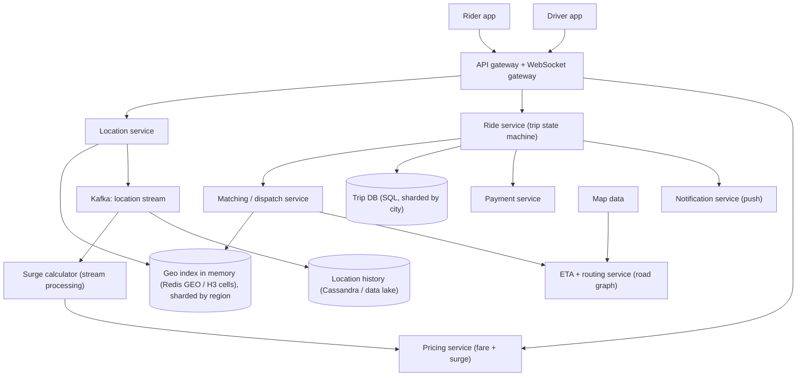
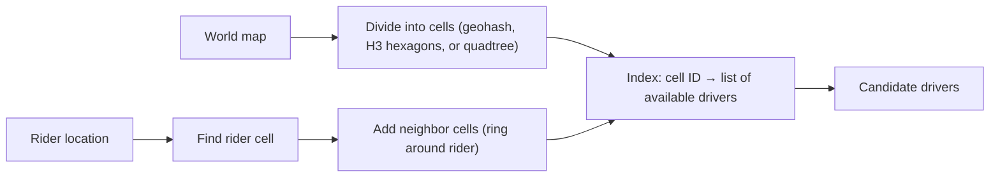
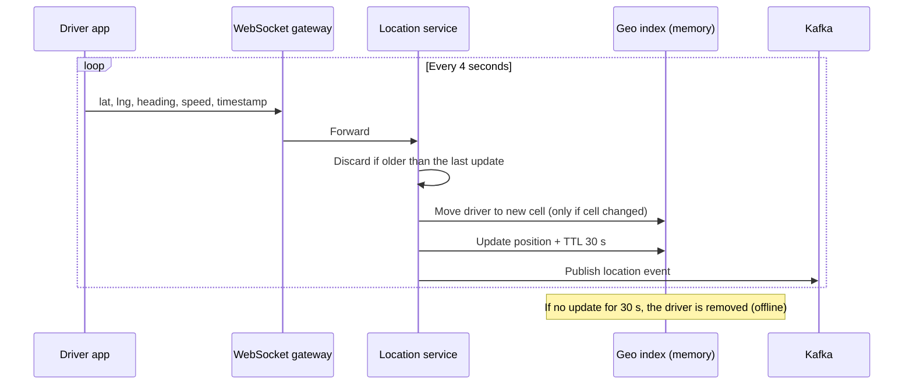
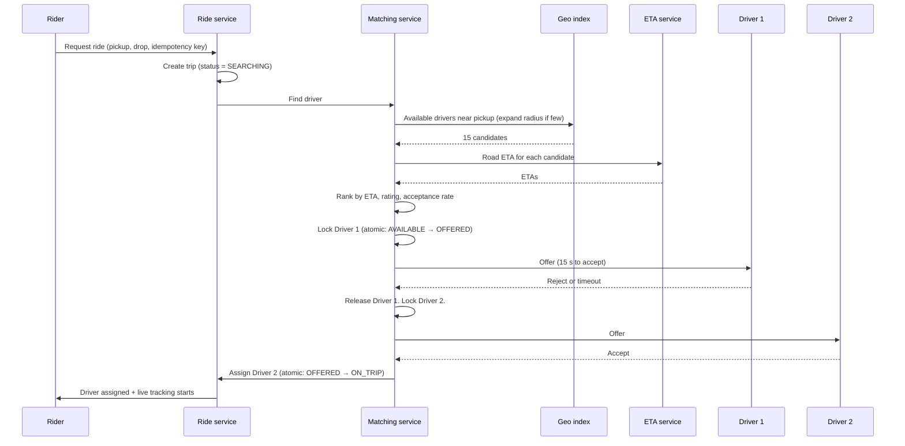
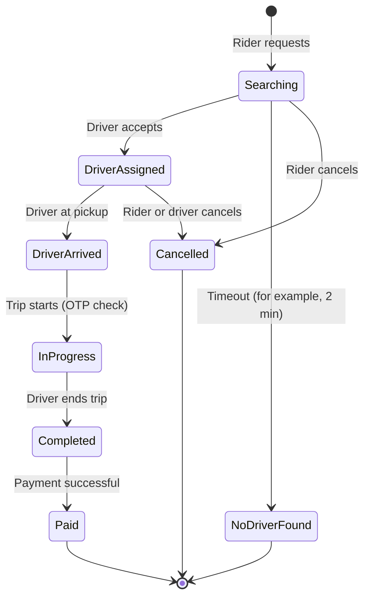
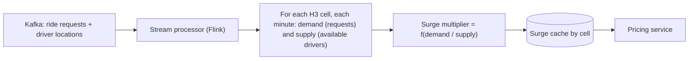

# Design a Ride-Hailing Service (Uber, Ola)

## 1. Summary

A ride-hailing service connects riders with nearby drivers in real time. The main problems are:

1. **Location at scale.** Drivers send their location every few seconds. The system must store and search millions of moving points.
2. **Matching.** The system must find the best nearby driver quickly. One driver must never get two rides at the same time.
3. **Live trip tracking.** The rider sees the driver move on the map.
4. **Dynamic pricing.** The price changes with supply and demand in each area.

## 2. Requirements

### Functional requirements

- The rider sees nearby drivers on a map.
- The rider requests a ride from a pickup point to a drop point.
- The system shows an estimated price and an ETA.
- The system matches the rider with a driver. The driver accepts or rejects.
- The rider tracks the driver live. Both see the trip status.
- The rider pays at the end of the trip. Both give ratings.

### Non-functional requirements

| Requirement | Target |
|-------------|--------|
| Match time | Less than 10 seconds in most cases |
| Location freshness | Driver position not older than 5 seconds |
| Availability | 99.99% for ride request and matching |
| Consistency | Strong for driver assignment and payment. Eventual for map display. |

## 3. Load estimate

| Item | Value |
|------|-------|
| Active drivers at peak | 1 million |
| Location update interval | 4 seconds |
| Location updates per second | 1M / 4 = **250,000 writes/s** |
| Daily rides | 20 million |
| Ride requests per second (peak) | approx. 1,000 to 2,000 |
| "Nearby drivers" map queries per second | approx. 50,000+ |

**Conclusion:** Location writes are the largest load. Do not write each location update to a disk-based database. Keep current locations in memory.

## 4. High-level architecture



## 5. Components

| Component | Function |
|-----------|----------|
| WebSocket gateway | Keeps a persistent connection with each driver app and with each rider during a trip. Sends offers and live locations. |
| Location service | Receives driver locations. Updates the in-memory geo index. Publishes the stream to Kafka. |
| Geo index | Answers "Which available drivers are within 2 km of this point?" in milliseconds. |
| Matching service | Finds candidate drivers. Ranks them. Sends offers. Assigns one driver. |
| ETA and routing service | Calculates travel time on the road network, not straight-line distance. |
| Pricing service | Calculates the fare and the surge multiplier. |
| Ride service | Owns the trip and its state machine. |
| Payment service | Charges the rider. Pays the driver. Uses idempotency keys. |

## 6. Geospatial indexing

A normal database index cannot answer "find points near this point" efficiently. Use a spatial index.



| Method | Description | Note |
|--------|-------------|------|
| Geohash | Encodes latitude and longitude as a string. Nearby points share a prefix. | Simple. Cells at boundaries need neighbor checks. |
| Quadtree | Splits an area into 4 parts until each part has few points. | Adapts to density (cities vs villages). |
| **H3 (Uber)** | Covers the earth with hexagons at many resolutions. | All neighbors are at the same distance. Good for surge zones and analytics. |
| Redis GEO | Built-in `GEOADD` and `GEOSEARCH` commands (uses geohash). | Fast and simple to implement. |

### Location update flow



### Rules

- Keep only the **current** location in the geo index. Write history to Kafka and a cheap store.
- Set a **TTL** on each driver entry. A driver that loses network disappears from search automatically.
- **Shard by region or city.** Riders in Bengaluru never need drivers in Mumbai.
- Decrease the update rate when the driver is not moving or is offline. This saves battery and server load.

## 7. Ride request and matching



### Prevent double assignment

One driver must not get two rides. Use an **atomic state change** on the driver record:

```text
UPDATE drivers
SET status = 'OFFERED', offer_trip_id = :trip_id, offer_expires_at = now() + 15s
WHERE driver_id = :driver_id AND status = 'AVAILABLE';
-- If 0 rows changed, another request took this driver. Try the next candidate.
```

The same works with a Redis `SET driver:42:lock trip_99 NX PX 15000` lock.

### Matching strategies

| Strategy | Description |
|----------|-------------|
| Nearest driver (greedy) | Simple. Fast. Not optimal for the full city. |
| Batch matching | Collect requests for 2 to 5 seconds. Solve an assignment problem for all riders and drivers together. Better total ETA. Uber uses this approach. |
| Broadcast to many drivers | First driver to accept gets the ride. Fast, but drivers compete and many offers are wasted. |

## 8. Trip state machine



- The ride service is the **only** owner of the trip state.
- Each state change is a database transaction with a version check (optimistic locking).
- Each state change publishes an event. Other services (notifications, payments, analytics) react to the event.

## 9. Live tracking

1. The driver app sends its location to the location service.
2. The location service publishes the location to a topic for that trip (for example, `trip:99:location`).
3. The WebSocket gateway of the rider subscribes to that topic.
4. The rider app receives the location and animates the car between points.

Send updates only to the rider of that trip. Do not broadcast all driver locations to all riders.

## 10. Surge pricing



- Calculate supply and demand for each hexagon cell every 1 to 2 minutes.
- Smooth the value. Do not change the price too often or too much.
- Show the price to the rider **before** the request. Lock the quoted price for a short time.

## 11. ETA and routing

- Straight-line distance is not correct in a city. Use the road graph.
- Use fast routing algorithms (Contraction Hierarchies, A*). Tools: OSRM, GraphHopper, Valhalla.
- Adjust times with live traffic data from the driver location stream.
- Cache ETAs between common cell pairs.

## 12. Data model

```text
drivers (SQL or key-value)
  driver_id, name, vehicle, rating, status (OFFLINE | AVAILABLE | OFFERED | ON_TRIP),
  current_trip_id, city_id, version

geo index (Redis, per city)
  key: drivers:available:<city>  → GEO set of driver_id with lat/lng

trips (SQL, sharded by city_id)
  trip_id, rider_id, driver_id, status, pickup, drop,
  quoted_fare, surge_multiplier, final_fare, created_at, version

location_history (Cassandra / object storage)
  partition: (driver_id, date), clustering: timestamp
```

## 13. Failure handling

| Failure | Action |
|---------|--------|
| Driver app loses network | TTL removes the driver from search. An active trip continues. The app sends buffered locations later. |
| Offer is not answered | Offer expires after 15 s. The lock is released. The next driver gets the offer. |
| Matching service crashes | Locks have a TTL. Trips in "Searching" are picked up again by another instance. |
| Geo index node fails | Rebuild from the next location updates (all drivers send again within 4 s). Use replicas. |
| Payment fails | Retry with the same idempotency key. Mark the trip as "payment pending". |
| Region fails | Each city is served by one cell. Fail the city over to another region. |

## 14. Trade-offs

- **Update frequency vs cost:** More updates give a better map. But they increase load and battery use.
- **Greedy vs batch matching:** Greedy is faster. Batch gives better overall results.
- **Strong vs eventual consistency:** Driver assignment needs strong consistency. The map of nearby cars can be a few seconds old.
- **Geohash vs H3:** Geohash is simpler. H3 gives equal neighbor distances and better zone analytics.

## 15. Interview follow-up questions

1. How do you store and search 1 million moving drivers?
2. How do you stop one driver from getting two rides?
3. What happens at the boundary between two geohash cells?
4. How do you handle a large concert ending, with 20,000 requests in one area?
5. How do you calculate surge pricing?
6. How do you support ride sharing (pool), with many riders in one car?
