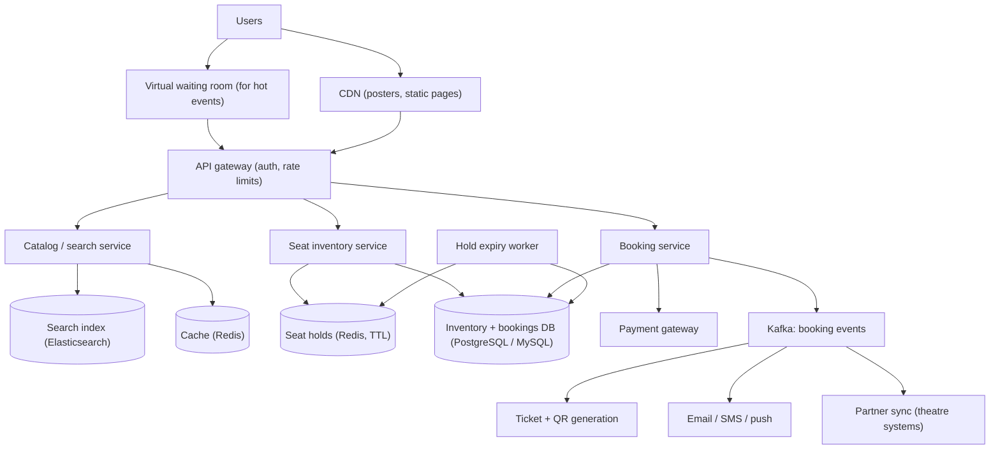
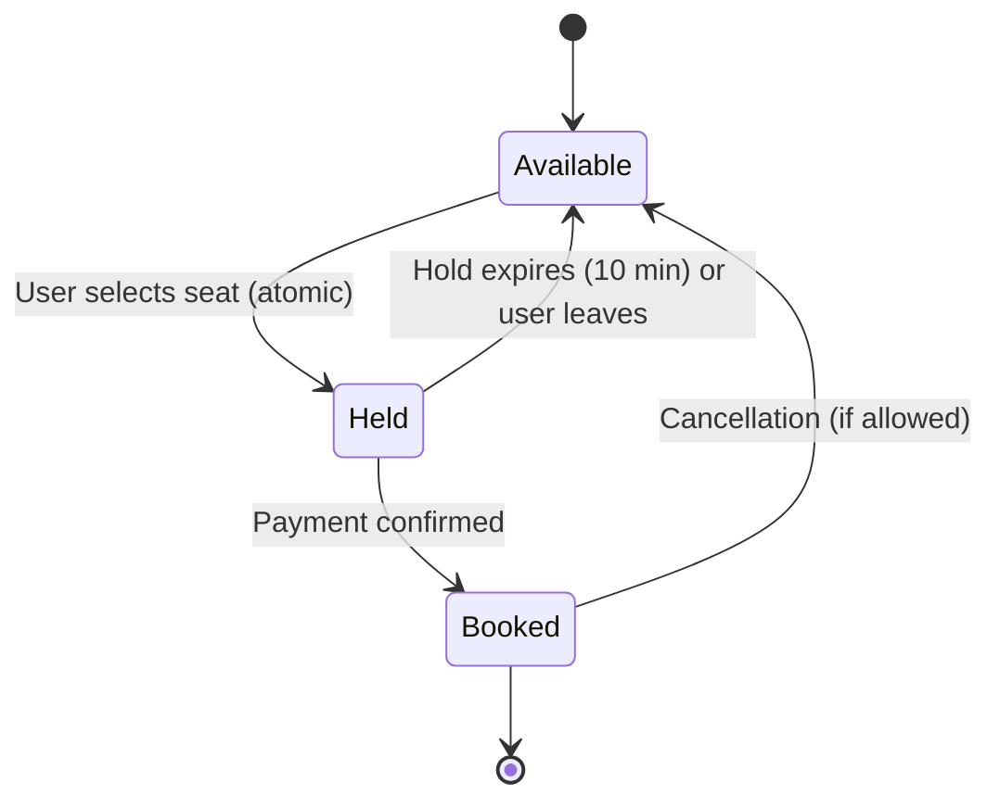
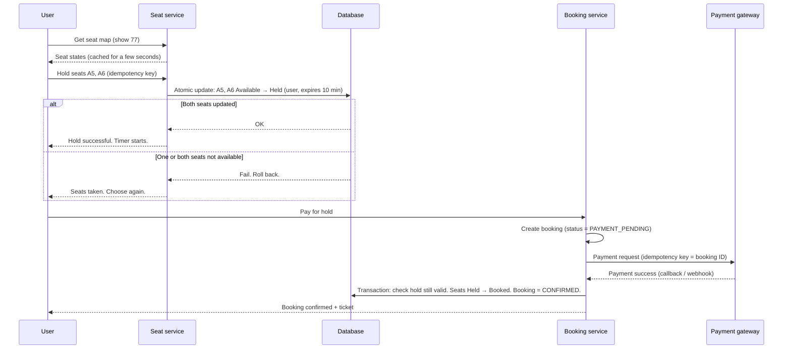
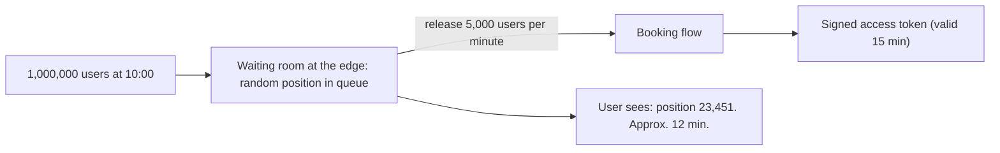

# Design a Ticket Booking System (BookMyShow)

## 1. Summary

A ticket booking system sells seats for movies, concerts, and sports events. Its most important rule is: **one seat is sold to one person only.** The system must also handle very large spikes, for example when tickets for a popular concert go on sale.

The main design ideas:

- Put a **temporary hold** on selected seats while the user pays.
- Use **atomic operations** so that two users cannot hold the same seat.
- **Release** the hold automatically if the user does not pay in time.
- Use a **virtual waiting room** for very popular events.

## 2. Requirements

### Functional requirements

- Search movies and events by city, date, and venue.
- See the seat map with available seats.
- Select seats and hold them for a limited time (for example, 10 minutes).
- Pay. Get a confirmed booking and a ticket.
- Cancel a booking (according to the policy).

### Non-functional requirements

| Requirement | Target |
|-------------|--------|
| Correctness | No double booking. Ever. |
| Browse latency | Less than 200 ms (cached) |
| Booking availability | 99.99% |
| Spike handling | Millions of users at the start of a popular sale |
| Fairness | Users get access in a fair order during a spike |

## 3. Load estimate

| Item | Value |
|------|-------|
| Daily active users | 5 million |
| Bookings per day | 1 million |
| Browse-to-book ratio | 50:1 or more |
| Normal booking rate | approx. 12 per second (average) |
| Popular concert sale | 1 million users try to book 50,000 seats in the first minutes |

**Conclusion:** Normal traffic is easy. The real problem is **contention** (many users want the same seats at the same time) during spikes.

## 4. High-level architecture



## 5. Seat state machine



Each seat for each show has one state. The system must change the state **atomically**. Two users must never move the same seat from "Available" to "Held".

## 6. Booking flow



## 7. How to prevent double booking

### Option A: atomic conditional update (recommended)

```sql
BEGIN;

UPDATE show_seats
SET status = 'HELD', held_by = :user_id, hold_expires_at = now() + interval '10 minutes'
WHERE show_id = :show_id
  AND seat_id IN ('A5', 'A6')
  AND (status = 'AVAILABLE'
       OR (status = 'HELD' AND hold_expires_at < now()));   -- expired holds are free

-- If the number of updated rows is not 2, ROLLBACK. Some seats are taken.
COMMIT;
```

- The `WHERE status = 'AVAILABLE'` condition makes the update safe. If two users run it at the same time, the database lets only one change each row.
- All seats in one request are held together, or none are held (all-or-nothing).

### Option B: pessimistic lock

```sql
SELECT * FROM show_seats
WHERE show_id = :show_id AND seat_id IN ('A5','A6')
FOR UPDATE NOWAIT;      -- Fail immediately if another transaction has the lock
```

Simple, but locks can wait or block under high contention. Use `NOWAIT` or `SKIP LOCKED`.

### Option C: Redis hold with TTL

```text
SET hold:show77:A5 user_123 NX EX 600
```

- `NX` = set only if the key does not exist. `EX 600` = expire after 10 minutes.
- Very fast for hot events. Use a Lua script to hold many seats all-or-nothing.
- The final booking must still be written to the database with a constraint. Redis is the fast first gate. The database is the source of truth.

### Final safety net: unique constraint

```sql
CREATE UNIQUE INDEX one_booking_per_seat
ON booked_seats (show_id, seat_id)
WHERE status = 'CONFIRMED';
```

If any bug passes the other checks, the database rejects the second booking.

### Comparison

| Method | Speed | Complexity | Use for |
|--------|-------|------------|---------|
| Conditional update | Good | Low | Most shows |
| Pessimistic lock | Medium | Low | Low contention |
| Redis hold + DB confirm | Very fast | Medium | Hot events with spikes |
| Unique constraint | — | Low | Always, as a final check |

## 8. Hold expiry

- Each hold has an expiry time.
- **Lazy expiry:** The hold query treats an expired hold as available (see Option A). No timer is needed for correctness.
- **Active cleanup:** A worker scans for expired holds every few seconds and sets them to "Available". This keeps the seat map correct for other users.
- With Redis, the key expires by itself.

## 9. Payment edge cases

| Case | Action |
|------|--------|
| Payment succeeds before hold expiry | Confirm the booking. |
| Payment succeeds **after** hold expiry, seat still free | Confirm the booking (re-hold atomically). |
| Payment succeeds after hold expiry, seat now sold to another user | Refund automatically. Tell the user. Log the event. |
| Payment gateway does not reply | Keep status "PAYMENT_PENDING". Check the status with the gateway API. Do not charge two times. |
| User clicks "Pay" two times | Idempotency key = booking ID. The second request returns the first result. |

To decrease the "paid after expiry" case, **extend the hold** when the user enters the payment page (one extension only).

## 10. Handling spikes: virtual waiting room



### Procedure

1. Before the sale, put all users into the waiting room.
2. At the sale start, give each user a random queue position. This is fairer than "fastest click."
3. Let users into the booking flow at a rate the system can handle.
4. Give each admitted user a signed token. The booking APIs accept only requests with a valid token.
5. When all seats are sold, stop the queue and show "Sold out."

### Other spike controls

- Limit tickets per user (for example, 6) and per payment card.
- Use bot detection (CAPTCHA, device checks).
- Cache seat maps for 1 to 2 seconds. Users accept that a seat can become taken between view and click.
- Pre-scale servers and warm caches before the sale.

## 11. Data model

```text
venues        (venue_id, name, city_id, address)
screens       (screen_id, venue_id, name, seat_layout_json)
events        (event_id, title, type, duration, language, metadata)
shows         (show_id, event_id, screen_id, start_time, status)

show_seats    (show_id, seat_id, category, price, status,
               held_by, hold_expires_at, booking_id, version)
               PRIMARY KEY (show_id, seat_id)

bookings      (booking_id, user_id, show_id, status, total_amount,
               payment_id, idempotency_key, created_at)
booked_seats  (booking_id, show_id, seat_id, status)
               UNIQUE (show_id, seat_id) WHERE status = 'CONFIRMED'
```

- Shard by `show_id` (or by venue/city). All seats of one show are in one shard. Then the hold transaction stays on one database node.

## 12. Search and browse

- Browse traffic is 50 times the booking traffic. Serve it from caches and the search index.
- Use Elasticsearch for search by title, city, language, and genre.
- Cache show lists by city and date. Invalidate when shows change.
- Seat availability counts ("Few seats left") can be slightly old. The exact check happens at hold time.

## 13. Trade-offs

- **Hold time:** A long hold gives users time to pay. But seats stay blocked for other users.
- **Redis vs database holds:** Redis is faster under spikes. But it adds a second source of state that must stay consistent with the database.
- **Waiting room vs direct access:** The waiting room protects the system and is fair. But users must wait.
- **Fresh seat map vs load:** A real-time seat map is more accurate. But it costs much more under spikes.

## 14. Interview follow-up questions

1. Two users click the same seat at the same millisecond. What happens?
2. What happens if the payment succeeds after the hold expires?
3. How do you sell 50,000 tickets to 1 million users fairly?
4. Why not lock the seat only after payment?
5. How do you sync seats with a theatre that also sells tickets at its counter?
6. How do you stop bots from buying all tickets?
