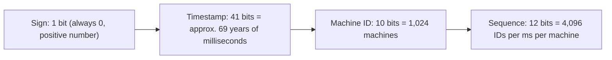
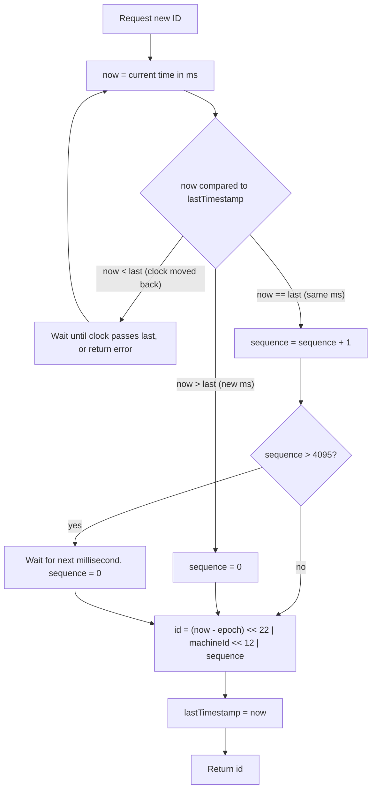
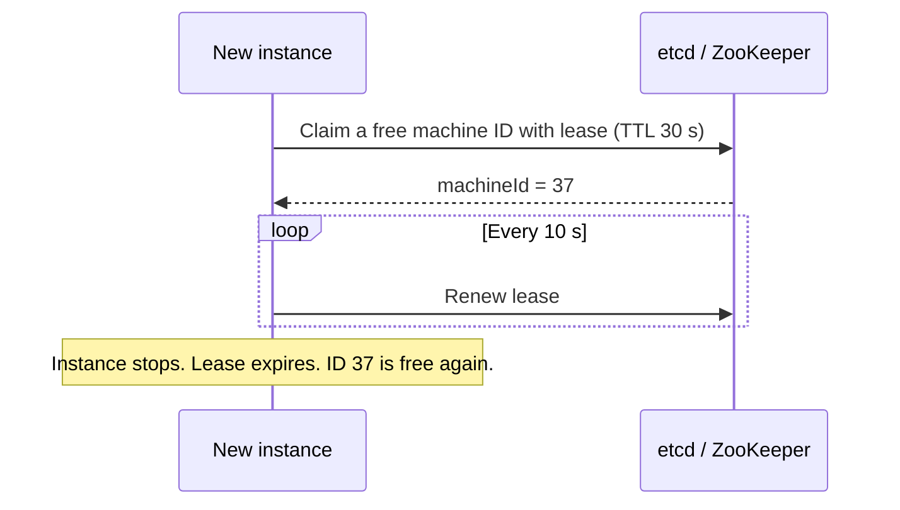
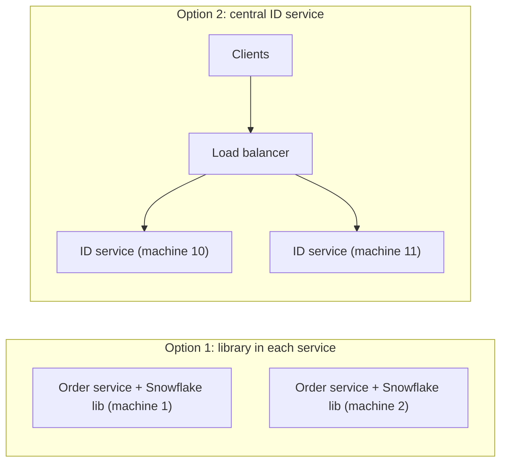
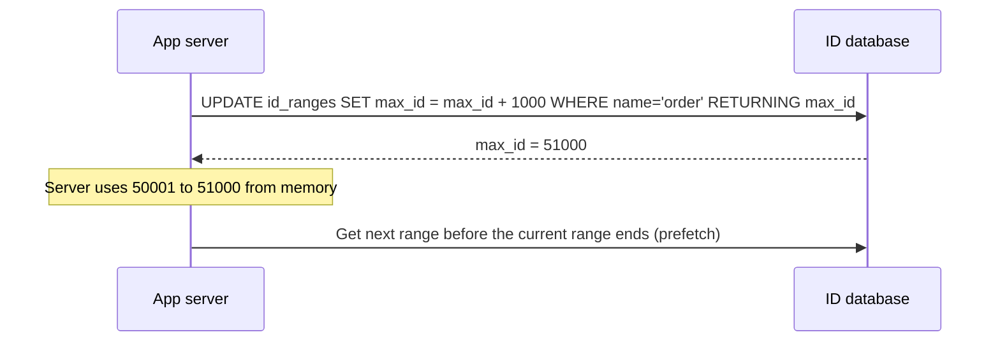

# Design a Distributed Unique ID Generator

## 1. Summary

Many systems need unique IDs for orders, messages, users, and events. In a single database, an auto-increment column is enough. In a distributed system with many servers and many databases, the IDs must be unique **without** a central bottleneck.

The most common interview answer is **Twitter Snowflake**: a 64-bit ID made from a timestamp, a machine ID, and a sequence number. This document explains Snowflake and compares it with other methods.

## 2. Requirements

Ask which of these are necessary:

| Requirement | Question |
|-------------|----------|
| Uniqueness | Must IDs be unique across all servers and all time? (Always yes.) |
| Size | Must the ID fit in 64 bits (a `BIGINT`)? |
| Ordering | Must IDs sort by creation time? Strictly, or approximately? |
| Throughput | How many IDs per second? (For example, 10,000+ per second per server.) |
| Availability | Can the system create IDs if a central service is down? |
| Privacy | Can the ID show the creation time or the number of orders? |

Typical answer: unique, 64-bit, roughly time-sorted, very high throughput, no single point of failure.

## 3. Options

| Method | Size | Sorted by time | Needs coordination | Main problem |
|--------|------|----------------|--------------------|--------------|
| Database auto-increment | 64-bit | Yes | Yes (one DB) | Single point of failure. Write bottleneck. |
| Auto-increment with step (DB1: 1, 3, 5; DB2: 2, 4, 6) | 64-bit | Roughly | At setup | Hard to add servers. |
| Ticket server (Flickr) | 64-bit | Yes | Yes | Central service. Needs high availability. |
| Range allocation (segment) | 64-bit | Roughly | Sometimes | IDs have gaps after a restart. |
| UUID v4 (random) | 128-bit | No | No | Large. Random inserts slow down B-tree indexes. |
| **UUID v7** | 128-bit | Yes (ms) | No | 128-bit. Good modern default if size is not a problem. |
| ULID / KSUID | 128 / 160-bit | Yes | No | Larger than 64-bit. |
| **Snowflake** | 64-bit | Yes (k-sorted) | Only for machine ID | Clock problems. Machine ID management. |

## 4. Snowflake ID layout

```text
| 1 bit  |            41 bits             |   10 bits    |   12 bits   |
|  sign  |  timestamp (ms since epoch)    |  machine ID  |  sequence   |
|   0    |                                |  0 – 1,023   |  0 – 4,095  |
```



| Part | Bits | Capacity |
|------|------|----------|
| Timestamp | 41 | 2^41 ms ≈ 69 years from a custom epoch (for example, 2024-01-01) |
| Machine ID | 10 | 1,024 generators (often split: 5 bits data center + 5 bits machine) |
| Sequence | 12 | 4,096 IDs each millisecond on each machine = **4 million IDs/s per machine** |

### Why use a custom epoch

The timestamp counts from a date you choose, not from 1970. Then the 69 years start from your launch date.

## 5. Generation flow



## 6. Implementation (TypeScript)

```typescript
const EPOCH = 1704067200000n;          // 2024-01-01T00:00:00Z
const MACHINE_BITS = 10n;
const SEQUENCE_BITS = 12n;
const MAX_MACHINE = (1n << MACHINE_BITS) - 1n;   // 1023
const MAX_SEQUENCE = (1n << SEQUENCE_BITS) - 1n; // 4095

export class Snowflake {
  private lastTs = -1n;
  private sequence = 0n;
  private readonly machineId: bigint;

  constructor(machineId: number) {
    this.machineId = BigInt(machineId);
    if (this.machineId < 0n || this.machineId > MAX_MACHINE) {
      throw new Error(`machineId must be 0..${MAX_MACHINE}`);
    }
  }

  nextId(): bigint {
    let ts = BigInt(Date.now());

    if (ts < this.lastTs) {
      const drift = this.lastTs - ts;
      if (drift > 5n) throw new Error(`Clock moved back ${drift} ms. Refusing to create IDs.`);
      ts = this.waitUntil(this.lastTs);           // Small drift: wait
    }

    if (ts === this.lastTs) {
      this.sequence = (this.sequence + 1n) & MAX_SEQUENCE;
      if (this.sequence === 0n) ts = this.waitUntil(this.lastTs + 1n); // 4,096 used in this ms
    } else {
      this.sequence = 0n;
    }

    this.lastTs = ts;
    return ((ts - EPOCH) << (MACHINE_BITS + SEQUENCE_BITS))
         | (this.machineId << SEQUENCE_BITS)
         | this.sequence;
  }

  private waitUntil(target: bigint): bigint {
    let ts = BigInt(Date.now());
    while (ts < target) ts = BigInt(Date.now());
    return ts;
  }

  static parse(id: bigint) {
    return {
      timestamp: new Date(Number((id >> 22n) + EPOCH)),
      machineId: Number((id >> 12n) & MAX_MACHINE),
      sequence: Number(id & MAX_SEQUENCE),
    };
  }
}
```

### Important for JavaScript and JSON

A JavaScript `number` is safe only up to 2^53 − 1. A Snowflake ID uses up to 63 bits. If you send the ID as a JSON number, the browser **changes the last digits** without an error.

- Use `BigInt` on the server.
- **Send IDs as strings in JSON** (for example, `"id": "1849302948573921280"`). Twitter, Discord, and many other APIs do this.

## 7. Assigning machine IDs

Two generators with the same machine ID can create the same ID. Each generator must have a unique machine ID.

| Method | Description |
|--------|-------------|
| Static configuration | Set the ID in config for each server. Simple, but mistakes cause duplicates. |
| Kubernetes StatefulSet | Use the pod ordinal (`id-gen-0`, `id-gen-1`) as the machine ID. |
| ZooKeeper / etcd lease | Each instance takes a free ID with a lease at startup. The lease is renewed. If the instance dies, the ID returns to the pool after the lease ends. |
| Database table | Each instance claims a row with a heartbeat. |



**Safety rule:** Wait a short time before reusing a released machine ID, so the old instance cannot still be creating IDs.

## 8. Clock problems

Snowflake depends on the system clock. Clocks can jump backward (NTP correction, VM migration, leap seconds).

| Problem | Effect | Action |
|---------|--------|--------|
| Small backward jump (few ms) | Possible duplicate IDs | Wait until the clock passes the last timestamp. |
| Large backward jump | Long wait or duplicates | Refuse to create IDs. Raise an alert. Take the instance out of service. |
| Clocks differ between machines | IDs from different machines are not in exact order | Accept "k-sorted" order (approximately sorted). Use NTP/chrony. |

Configure NTP to **slew** (adjust slowly), not **step** (jump), on ID generator hosts.

## 9. Deployment options



| Option | Advantage | Disadvantage |
|--------|-----------|--------------|
| Library inside each service | No network call. No extra service to fail. | Many machine IDs to manage. |
| Central ID service | Few machine IDs. One place to monitor. | Network call for each ID. Must be highly available. Clients can request IDs in batches. |

## 10. Range allocation (alternative)



- Each server gets a block of IDs (for example, 1,000) from the database.
- The server creates IDs from memory. The database gets one request for each 1,000 IDs.
- Get the next block when 20% of the current block remains, so there is no wait.
- IDs are unique and mostly increasing. A restart leaves a gap. Meituan Leaf uses this "segment" mode.

## 11. Security and privacy

- Sequential or time-based IDs show information: creation time and approximate volume (for example, "this shop got 500 orders today").
- Do not use them as **secret** or **unguessable** values (for example, password-reset tokens or private share links). Use cryptographically random values for those.
- For public URLs, you can show a different public ID (random or encoded) and keep the Snowflake ID internal.

## 12. Database impact

- **Sorted IDs are good for B-tree indexes.** New rows go to the end of the index. Random UUID v4 values go to random positions, which causes page splits and slower inserts.
- With time-sorted IDs, you can sort by ID instead of `created_at`, and you can use the ID for cursor pagination.
- A very hot "always increasing" key can create a hot spot in some distributed databases (for example, the last range in HBase or Spanner). In those systems, add a hash prefix or use a different key.

## 13. Trade-offs

- **64-bit vs 128-bit:** 64-bit is smaller and faster in indexes. 128-bit (UUID v7, ULID) needs no machine ID management.
- **Strict order vs scale:** Strict global order needs one central counter, which limits scale. Snowflake gives approximate order and scales well.
- **Library vs service:** A library has no network call. A service is simpler to manage.
- **Time in the ID:** Useful for sorting and debugging. But it shows information to anyone who sees the ID.

## 14. Interview follow-up questions

1. What happens if the clock moves backward by 2 seconds?
2. What happens if two machines get the same machine ID?
3. How many IDs per second can one Snowflake generator create?
4. Why can a 64-bit ID break in JavaScript?
5. When would you choose UUID v7 instead of Snowflake?
6. Why are random UUIDs slow as primary keys in MySQL or PostgreSQL?
